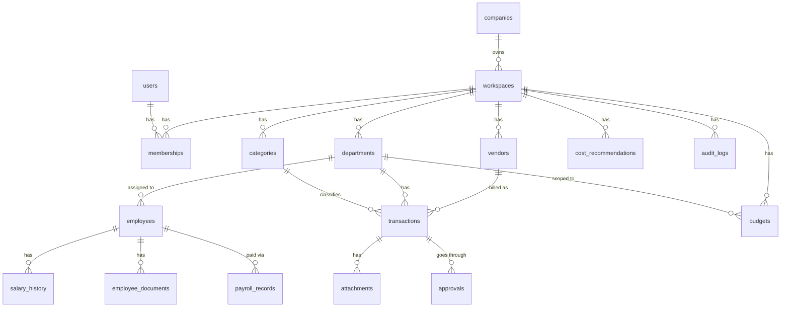
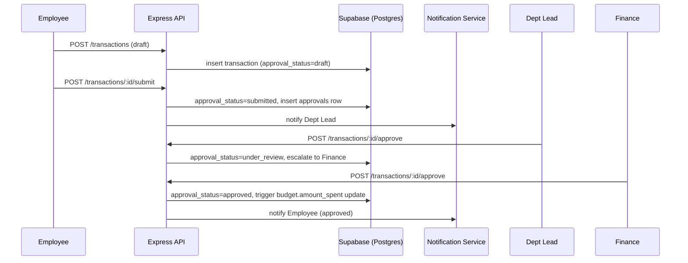
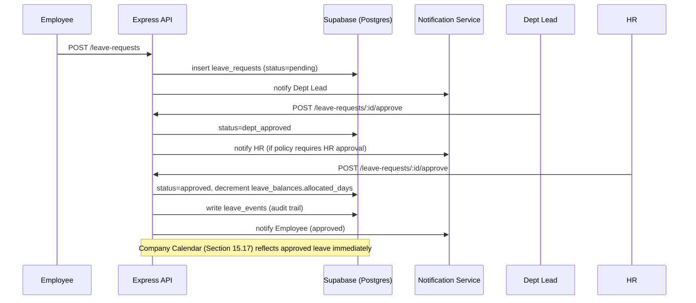

# FinFlow ERP — Product Requirements Document

**Status:** v2.4 — Specification-Complete, Ready for Engineering Handover
**Owner:** Product / Platform Engineering
**Last Updated:** July 30, 2026
**Supersedes:** v2.3 (Platform Maturity release) — v2.2 (ERP Repositioning & Administration Model) — v2.1 (Product & Business Layer) — v2.0 (Business Ops Platform restructure) — v1.0 (Finance-only platform)
**Audience:** Founders, Product, Engineering, Finance, HR, Operations, Investors/Diligence Readers

---

## 0-PRE. Version History & What Changed in v2.3

v2.2 introduced formal multi-tenancy administration (Platform Super Admin / Organization Admin), Leave Management, Company Calendar, expanded dashboards, and a Notification Center. v2.3 is a **depth and platform-maturity release**: it takes FinFlow ERP from "the right module set" to "the module set built the way a production SaaS ERP competing with ERPNext, Odoo, Zoho One, or Rippling is actually built" — three new business modules, and a set of cross-cutting platform capabilities (search, bulk operations, workflow/approval engines, security, billing, integrations, engineering standards) that every module now shares.

**Three new modules (Section 15.20–15.22):**
- **Team Management** — Teams graduate from "mentioned" to a fully specified module: CRUD, Team Lead assignment, membership, budget, analytics, leave calendar, hierarchy, reporting (Section 15.20)
- **Asset Management** — full company-asset lifecycle: assignment, return, condition, warranty, maintenance, lost-asset handling (Section 15.21)
- **Procurement** — purchase request → approval → PO → vendor → invoice → payment workflow, integrated with existing Vendor Management and the new Approval Engine (Section 15.22)

**Cross-cutting platform capabilities (Sections 28–45):**
- Global Search (RBAC-scoped, cross-module) — Section 28
- Bulk Operations (import/export across Employees, Payroll, Transactions, Vendors, Departments, Teams, Leave) — Section 29
- Expanded Invitation Management (resend, cancel, expiry, bulk/CSV invite, history) — Section 30
- Expanded User Profile (tabbed: Overview, Employment, Salary, Leave, Assets, Documents, Timeline, Notifications, Preferences, Security) — Section 31
- User Preferences (language, timezone, theme, notifications, accessibility, default dashboard) — Section 31
- Expanded Organization Branding (favicon, brand colors, email branding, banner, brand assets) — Section 32
- Security Center (login history, sessions, devices, password, MFA-future, API tokens, security logs) — Section 33
- Activity Feed (organization-wide event stream) — Section 34
- Data Management standards (soft delete, archive, restore, retention, permanent delete) — Section 35
- Approval Engine — a single reusable approval primitive underlying Expense, Leave, Purchase, Payroll, and Budget approvals — Section 36
- Workflow Engine — Organization-Admin-configurable approval steps, conditions, approvers, escalation, timeout — Section 36
- Custom Fields (Employees, Vendors, Assets, Departments, Transactions) — Section 37
- Dashboard Customization (move/hide/resize widgets, save/reset layout) — Section 38
- Organization Analytics (platform-facing organization health/usage dashboard) — Section 39
- Expanded Billing & Subscriptions (plans, invoices, payments, seat usage, trials, renewals) — Section 40
- Document Center (centralized, versioned, permissioned document repository) — Section 41
- Expanded Integrations (Slack, Teams, Google Workspace, GitHub, Jira, QuickBooks, Outlook, Zapier, Webhooks, Public API) — Section 42
- System Status (version, maintenance mode, incident banner, service health) — Section 43
- Engineering Improvements (background jobs, queues, caching/Redis, rate limiting, API versioning, event-driven architecture) — Section 44
- Database, API, and UI Improvement Standards — the baseline every module (existing and new) now follows — Section 45

Every capability below extends the existing architecture (React/Vite/Tailwind, Node/Express, Repository Pattern, Service Layer, Supabase/Postgres, RBAC, workspace isolation, multi-tenancy) without altering it. No existing module, workflow, table, or endpoint is removed, renamed (beyond the v2.2 Admin→Organization Admin rename, unchanged here), or reduced in scope.

---

## 0B. Version History & What Changed in v2.4

v2.3 delivered the module set and cross-cutting platform capabilities of a mature SaaS ERP but left several of those capabilities named-and-summarized rather than fully specified as buildable services, and left individual module specs uneven in depth (some modules had full DB/API/edge-case treatment, others were summarized). v2.4 is a **specification-completeness release**: it does not add product scope, it closes gaps so that every module and every shared service reaches the same bar — enough for an engineering team to implement without needing to ask the PM anything not already answered here.

**What's new in v2.4:**
- **Section 46 — Shared Platform Services**: the 13 services referenced throughout v2.2/v2.3 (Auth, Authorization, Workflow, Approval, Notification, Audit, Search, Analytics, AI, Integration, Billing, Storage, Event Bus) are now each fully specified as internal services with clear responsibilities, interfaces, and consumers — not just named.
- **Section 47 — Event Catalog**: the full canonical list of domain events, their producers, consumers, and payload shape, formalizing the event-driven architecture described in Section 44.
- **Module gap-fill (Sections 15.1–15.22, 28–43)**: every module now has an explicit Non-Functional Requirements subsection, explicit Edge Cases subsection, explicit Indexes subsection, and explicit KPI subsection where previously implicit or absent. Diffs are marked `[v2.4 ADD]` inline in the merged document.
- **Section 48 — Cross-Module Consistency Matrix**: a single table mapping every module to its Approval Engine usage, Workflow Engine usage, Event Bus participation, Custom Fields support, and Bulk Operations support, so gaps are visible at a glance rather than needing to be inferred from 45 sections of prose.

---

---

## 0. Version History & What Changed in v2.2

v2.1 added the product/business layer (positioning, KPIs, decision intelligence, BI module) on top of the v2.0 technical foundation without changing scope or architecture. v2.2 is a **scope-extending release**: it introduces a formal multi-tenant administration hierarchy above the existing single-Admin model, and adds four new modules (Leave Management, Company Calendar, expanded Role-Specific Dashboards, and a consolidated Notification Center). It also repositions the product from an "Internal Operating System" to a full **Enterprise Resource Planning (ERP) platform** purpose-built for technology companies — a positioning expansion, not a scope departure, since every capability described below extends the same workspace/department/RBAC data model already in place.

**What's new in v2.2:**

- **Product Positioning** — repositioned from "Internal Operating System for IT Startups" to **"FinFlow ERP — a modern Enterprise Resource Planning platform purpose-built for IT Startups, SaaS Companies, AI Companies, and Technology Businesses"** (Section 1)
- **Hierarchical Administration Model** — Platform Super Admin → Organization Admin → Organization Members, replacing the single flat Admin role (Section 5A)
- **Platform Super Admin** — a new, non-customer-facing role that operates FinFlow at the SaaS-provider level: organization lifecycle, billing, subscriptions, platform analytics, platform audit logs, feature flags (Section 5A.1)
- **Organization Admin** — the existing Admin role, renamed and scoped explicitly to a single organization, with all prior authority preserved (Section 5A.2)
- **Organization Creation Flow & Setup Wizard** — sign-up now provisions a user account first, then an organization, with the creator auto-promoted to Organization Admin, followed by a 12-step guided setup wizard (Section 5B)
- **Organization Settings Module** — a dedicated settings surface consolidating company profile, branding, policies, roles/permissions, security, billing, and integrations (Section 5C)
- **FinFlow Access Map by Role** — a role-by-role access map layered on top of the existing RBAC matrix (Section 13.4)
- **Leave Management module** — full leave lifecycle: types, balances, requests, approvals, calendar integration, half-day/WFH requests, audit trail (Section 15.16)
- **Company Calendar module** — unified calendar surfacing holidays, approved leave, birthdays, anniversaries, payroll dates, and vendor renewals, with role-aware visibility (Section 15.17)
- **Expanded Role-Specific Dashboards** — HR Dashboard and Finance Dashboard (already specified) are joined by a formalized Operations Dashboard, Department Dashboard, and Employee Dashboard, each with purpose, widgets, KPIs, quick actions, alerts, and decision support (Section 15.18)
- **Notification Center** — a consolidated in-app/email notification surface spanning budget alerts, approvals, leave, payroll, vendor renewals, and document expiry (Section 15.19)
- **Role-Based Navigation** — sidebar/navigation generation is now formally specified as permission-driven per role (Section 19)
- **Sprint Roadmap** — the Phase-based roadmap (Section 20) is joined by an execution-level Sprint Roadmap tracking the same work in shippable two-week increments (Section 20A)

Everything in v2.1 — product positioning rationale, business objectives, personas, user stories, differentiators, MVP line, functional requirements, non-functional requirements, database design, API inventory, the original RBAC matrix, system architecture, all fourteen original module specifications plus Business Intelligence, decision intelligence, the KPI dictionary, workflows, UI guidelines, the phased roadmap, success metrics, risks, assumptions, constraints, future integrations, future enhancements, and deployment strategy — is preserved unchanged below and extended, not replaced, by v2.2.

---

## 0A. Version History & What Changed in v2.1

v2.0 restructured FinFlow from a finance tool into a multi-module Business Operations Platform and correctly scoped Employee Management, Payroll Records, and Vendor Management as new modules. It was engineering-complete but under-argued as a *product*: it didn't say why a company would choose this over the incumbents, didn't connect modules to business outcomes, and left KPIs implicit inside dashboard widget lists rather than defined as a first-class asset.

v2.1 does not change scope, architecture, or module boundaries. It adds the product and business layer on top of the same technical foundation:

- **Product Positioning** — reframed as an Internal Operating System, with explicit differentiation from SAP, Oracle, Zoho, Freshworks, Darwinbox, Keka, Rippling, Notion, and spreadsheets
- **Business Objective / Problem / Outcome / KPIs** added to every module spec
- **Decision Intelligence** section — what decision each dashboard enables, per role
- **Executive KPI Dictionary** — 15 KPIs with formulas and owners
- **Business Intelligence** module added (rules-based recommendations/alerts/insights layer — distinct from, and sitting above, both Analytics and AI Insights)
- **Assumptions** and **Constraints** made explicit rather than implied
- **Risks** expanded across seven categories
- **Success Metrics** split into Business / Technical / Product / Operational
- **Roadmap** rewritten as Completed / In Progress / Upcoming / Future / Stretch
- **MVP Definition** — explicit v1.0 line
- **Product Differentiators** vs. Excel, Notion, Zoho, FreshBooks, generic HRMS, expense trackers

Everything from v2.0 that was already correct — the full database design, API inventory, RBAC matrix, architecture, workflows, and the phased implementation sequencing tied to actual shipped code — is preserved unchanged. This is an addition and reframing pass, not a rewrite.

---

## 1. Product Positioning

**FinFlow ERP is a modern Enterprise Resource Planning platform purpose-built for IT Startups, SaaS Companies, AI Companies, and Technology Businesses.** As of v2.2, this supersedes the earlier "Internal Operating System" framing — not because the product changed shape, but because the addition of a formal multi-tenant administration hierarchy (Section 5A), organization lifecycle management, and a growing set of first-class operational modules (Leave, Calendar, Notifications, role-specific dashboards) means "Internal Operating System" undersold what the platform now does across an organization's full operational surface.

FinFlow ERP remains, by design, lighter than SAP or Oracle and significantly more capable than a finance tracker or spreadsheet stack. It does not chase the configurability or implementation overhead of a legacy enterprise suite; it keeps the modular, operationally-simple philosophy that has defined the product since v1.0, while now formally supporting many organizations on one platform (multi-tenancy), each with its own isolated workspace, admin, and data.

FinFlow ERP is the layer that sits above whatever point tools a startup already uses and answers the questions that require pulling from more than one of them at once: *is our burn sustainable given current headcount, which departments are actually over budget once payroll is included, which vendors are we paying for that nobody uses, who's on leave this week, and does anything need my approval right now.*

### Why a company adopts this instead of doing nothing
Between roughly 20 and 500 employees, a tech company is too large for one founder to hold the whole operational picture in their head, and too small to justify running a full HRIS + FP&A + spend-management stack with the headcount to administer it. That gap is currently filled with spreadsheets, Slack threads, and whoever happens to remember a contract renewal date. FinFlow is sized for exactly that gap.

### Why not the obvious alternatives

| Alternative | Why it's not a fit for this segment |
|---|---|
| **SAP / Oracle** | Built for enterprises with dedicated finance/IT operations teams to configure and run them. Multi-year implementation timelines and cost structures are a mismatch for a 20–500 person company. |
| **Zoho / Freshworks suites** | Broad horizontal suites that require assembling and licensing multiple separate products (Books, People, Expense) to approximate what FinFlow does natively as one workspace with one data model. |
| **Darwinbox / Keka** | Strong HRMS/payroll depth but finance-blind — no budgets, vendor spend, or cost optimization. A company adopting one of these still needs a separate finance stack. |
| **Rippling** | Closest philosophical match (unified employee + IT + finance data), but priced and packaged for a US-centric, compliance-heavy payroll-processing model. FinFlow deliberately does not process payroll — it is lighter-weight and cheaper for a startup that already has a payroll vendor and just needs visibility. |
| **Notion** | Infinitely flexible, which is the problem — it has no real data model, no RBAC enforcement, no computed budgets/burn/runway. What Notion calls a "finance tracker" is a set of manually-updated tables with no guarantees. |
| **Spreadsheets** | No access control, no audit trail, no automatic computation, breaks silently at scale, and is the status quo FinFlow is explicitly built to replace. |

**The positioning in one line:** FinFlow doesn't compete with payroll processors, ATS platforms, or accounting software — it is the operational visibility layer above them, purpose-built for companies too big for spreadsheets and too small for an enterprise suite.

---

## 2. Vision

Give founders and functional leads at a growing tech company one workspace that answers *who works here, what are we paying them, what are we spending on, is it under control, and what needs a decision this week* — without stitching together spreadsheets, Slack threads, and five disconnected SaaS tools to get there.

---

## 3. Problem Statement

Early- and growth-stage IT startups (20–500 people) accumulate operational complexity faster than their tooling matures:

- Headcount, org structure, and reporting lines live in spreadsheets or in someone's head; there's no single source of truth for "who works here and for whom."
- Payroll numbers exist in the payroll processor, but nobody outside Finance can see payroll trends, cost-per-department, or how compensation is growing relative to revenue.
- Spend is scattered across a founder's personal cards, company cards, reimbursed employee expenses, and 20–100+ SaaS/cloud subscriptions with no single ledger.
- Vendor relationships, contracts, and renewal dates live with whoever originally signed up — no visibility when that person leaves.
- Department leads have no visibility into their own budget or headcount cost until someone flags an overrun after the fact.
- Founders assemble a "state of the company" view manually before every board meeting or investor update.

**Goal:** Give founders, HR, Finance, Operations, and Department Heads a single workspace for the operational side of running the company — org structure, people, payroll records, spend, vendors, and budgets — with role-appropriate dashboards and proactive recommendations, without trying to become a full ERP.

---

## 4. Business Objectives

1. Become the default "company OS" a technical founder sets up in their first 20–50 employees, before they can justify a dedicated HRIS + FP&A stack.
2. Reduce time-to-answer for common leadership questions (burn, runway, headcount cost, budget status) from "ask three people and wait" to "open the dashboard."
3. Surface avoidable recurring cost (unused SaaS, duplicate tools, budget overruns) proactively rather than reactively.
4. Give department leads self-service visibility into their own spend and headcount cost, reducing Finance's role to exception-handling rather than being the only source of truth.
5. Keep the product achievable by a small engineering team — depth in a bounded set of modules beats shallow breadth across a full ERP surface.
6. Preserve everything already built; every phase of new work extends existing schema/RBAC rather than replacing it.

Each business objective maps to specific module-level objectives and KPIs — see Section 15 (Module Specifications) and Section 17 (Executive KPI Dictionary).

---

## 5. Target Users, Personas & Target Companies

### 5.1 Primary Users
| Role | Description |
|---|---|
| **Founder / CEO** | Company-wide visibility, final financial/organizational authority |
| **Finance Team** | Owns budgets, transactions, vendor payments, financial reporting |
| **HR Team** | Owns employee records, org structure, payroll record-keeping |
| **Operations Team** | Owns vendor relationships, SaaS subscriptions, cost optimization |
| **Department Heads** | Own their department's people, budget, and spend |
| **Employees** | Self-service: profile, payslips, expense submission |

### 5.2 Target Companies
IT startups, SaaS companies, software agencies, AI startups, and technology consulting firms — 20 to 500 employees, single legal entity, past the "spreadsheet is fine" stage but not yet large enough to run a dedicated HRIS + FP&A stack.

### 5.3 Personas

**Aditi — Founder/CEO, 45-person SaaS company.** Wants a five-minute answer to "how are we doing" before every investor call: burn, runway, headcount growth, any budget fires. Doesn't want to learn a new tool's full surface — wants the executive dashboard to just work.

**Rohan — Head of Finance, 45-person company.** Owns budgets and vendor payments. Currently reconstructs monthly reports from bank exports and a shared sheet. Wants transaction-level detail with department attribution and an approval trail he can point to in due diligence.

**Meera — HR Lead, joined at 30 people.** Owns the employee directory and comp history, which currently live in Google Sheets with version-control problems. Wants a system of record for who's employed, their designation/reporting line, and salary history — without owning payroll processing itself.

**Karan — Engineering Department Lead.** Wants to know, without asking Finance, how much his department has spent this quarter against budget and how many open headcount requests he has.

**Priya — Software Engineer, individual contributor.** Wants to see her own payslips, submit an expense for a conference ticket, and check her department's remaining budget before asking for a new laptop.

---

## 5A. Administration Model

v2.2 replaces the prior flat, single-tier Admin concept with a hierarchical administration model that reflects FinFlow ERP's move to formal multi-tenancy. This does not change any underlying RBAC permission already granted to the former Admin role (Section 13) — it clarifies *where* that authority sits relative to the platform itself, and introduces a new tier above it.

**Hierarchy:**

```
Platform Super Admin        (FinFlow SaaS — operates the platform itself)
        ↓
Organization Admin          (Customer — highest authority inside one organization)
        ↓
Organization Members        (Employees — belong to exactly one organization)
```

- **Platform Super Admin** belongs to FinFlow SaaS itself, not to any customer.
- **Organization Admin** belongs to exactly one company/organization (this is the renamed former "Admin" role from Section 13.1).
- **Organization Members (Employees)** belong to exactly one organization, joining only via invitation (Section 5B).

### 5A.1 Platform Super Admin

A new role, introduced in v2.2, operating at the FinFlow SaaS provider level. **Platform Super Admin is not a customer** and never belongs to, or is counted as a member of, any customer workspace/organization.

**Responsibilities and capabilities:**
- View every organization on the platform
- Create organizations (optional SaaS-managed onboarding mode, alongside the standard self-serve flow in Section 5B)
- Suspend organizations (e.g. for billing delinquency or policy violation)
- Delete organizations
- Manage subscriptions (plan tier, seats, billing cycle) across all organizations
- Manage platform billing
- View platform-wide analytics (organizations active, workspace growth, module adoption)
- View platform-wide audit logs (distinct from an organization's own audit log — see Section 5A.2)
- View platform health (uptime, error rates, queue depth — surfaces the Section 10 non-functional monitoring targets at the platform level)
- Impersonate an Organization Admin for support purposes *(future — requires explicit consent/audit-logging design before build; not in v2.2 scope)*
- Manage platform-wide feature flags (staged rollout of new modules per organization or plan tier)
- Manage platform-wide settings (default policies, plan definitions, global integrations)

**Data isolation:** Platform Super Admin access is enforced at a layer above standard workspace RLS — it is a platform-level role stored outside any single organization's `memberships` table, distinct from and not reachable through the existing per-workspace RBAC (Section 13). This keeps the guarantee from Section 21 ("Zero cross-tenant RLS isolation incidents") intact: Platform Super Admin visibility across organizations is an explicit, audited, separate access path, not a bypass of tenant isolation.

### 5A.2 Organization Admin

The former "Admin" role (Section 13.1) is renamed **Organization Admin** and is now explicitly scoped to mean "highest authority inside one organization," to disambiguate it from Platform Super Admin. Every permission and capability previously documented for Admin in Sections 13.2–13.3 is preserved unchanged and now understood as Organization Admin's authority.

**Organization Admin can:**
- Configure the organization (Section 5C, Organization Settings)
- Invite employees (Section 5B)
- Manage departments and teams
- Manage budgets
- Manage vendors
- Manage payroll
- Configure leave policies (Section 15.16)
- Configure expense policies
- Configure approval workflows
- Configure organization branding
- Manage integrations
- View the Executive Dashboard (Section 15.9)
- View reports (Section 15.13)
- View audit logs (organization-scoped, not platform-wide)
- Manage roles and permissions within the organization

**Important — salary visibility is unchanged:** Organization Admin does **not** get an implicit exemption from the salary-access restriction in Section 13.3. Salary/CTC visibility still requires the explicit, separately-grantable `salary.read_department` permission, even for Organization Admin. This preserves the v2.1 security model exactly as specified — the administration hierarchy changes reporting/authority structure, not the salary access control.

---

## 5B. Organization Creation Flow

v2.2 replaces the implicit "any employee can create a workspace" assumption with an explicit, sequenced creation flow. Employees can no longer create organizations directly — they join only through invitation from an Organization Admin.

```
Sign Up
   ↓
Create User Account (Supabase Auth)
   ↓
Create Organization
   ↓
Creator automatically becomes Organization Admin
   ↓
Organization Setup Wizard
   ↓
Invite Employees
```

### Organization Setup Wizard

A new 12-step guided onboarding experience presented to a freshly-created Organization Admin immediately after organization creation. Each step writes to the same tables already specified in Section 11 (departments, budgets, vendors, memberships) — the wizard is a guided UI sequence over existing schema, not new data model.

| Step | Action |
|---|---|
| 1 | Create Organization |
| 2 | Upload Logo |
| 3 | Configure Company Details (time zone, currency, financial year, working days) |
| 4 | Create Departments |
| 5 | Create Teams |
| 6 | Configure Leave Policies (Section 15.16) |
| 7 | Configure Expense Policies |
| 8 | Configure Approval Workflow |
| 9 | Create Initial Budget |
| 10 | Add Vendors |
| 11 | Invite Employees |
| 12 | Finish Setup |

Each step is individually skippable and re-visitable from Organization Settings (Section 5C) after initial setup — the wizard accelerates first-run configuration, it does not gate access to the product if a step is deferred.

---

## 5C. Organization Settings Module

A dedicated settings module, consolidating configuration surfaces that previously existed only as scattered per-module settings screens. This is a UI/navigation consolidation over existing and new data (Sections 11, 15) — it does not introduce a competing data model.

**Organization Settings includes:**
- Company Profile
- Company Logo
- Branding
- Time Zone
- Currency
- Financial Year
- Working Days
- Leave Policies (Section 15.16)
- Expense Policies (Section 15.5)
- Approval Policies (Section 15.5)
- Departments
- Teams
- Roles
- Permissions
- Security
- Billing
- Subscription
- Integrations (Section 25)
- API Keys *(future)*
- Audit Logs (organization-scoped)

Organization Settings is visible only to Organization Admin, per the Access Map in Section 13.4 — Organization Members never see this module, consistent with the role-based navigation principle in Section 19.

---

## 6. User Stories

**Founder**
- As a founder, I want a single dashboard showing burn, runway, and department spend so I don't have to assemble it manually before board meetings.
- As a founder, I want to see upcoming SaaS renewals and flagged wasteful spend so I can act before money is wasted.

**HR**
- As HR, I want an employee directory with designation, department, and reporting manager so org structure is queryable, not tribal knowledge.
- As HR, I want to record salary history and CTC components per employee so revisions are auditable over time.
- As HR, I want a payroll records view (not processing) so I can report on payroll trends without re-entering data from the payroll processor.

**Finance**
- As Finance, I want to approve or reject submitted expenses with a visible audit trail so spend is governed and defensible in diligence.
- As Finance, I want department-level budgets with overspend alerts so I'm not the last to know about an overrun.

**Operations**
- As Operations, I want a vendor directory with renewal dates and owners so nothing auto-renews unnoticed when the original owner leaves.
- As Operations, I want the system to flag unused subscriptions and duplicate tools so I have a concrete list to act on monthly.

**Department Lead**
- As a department lead, I want to see my department's budget utilization and pending approvals so I know my numbers without asking Finance.

**Employee**
- As an employee, I want to see my payslips and salary history so I don't have to email HR for basic records.
- As an employee, I want to submit an expense and track its approval status so I know when I'll be reimbursed.

---

## 7. Product Differentiators

| Instead of... | A company using this for ops ends up with... | FinFlow gives them... |
|---|---|---|
| **Excel / Google Sheets** | No access control, no audit trail, manual formula errors, breaks at scale, single point of failure if the owner leaves | RBAC-enforced access, immutable audit trail, computed budgets/burn/runway, survives personnel turnover |
| **Notion** | Flexible tables masquerading as a system of record — no real data model, no computation, no enforcement | A real relational data model with workspace isolation, RLS, and role-scoped permissions |
| **Zoho (Books + People + Expense)** | Three separately licensed products with three separate data models that don't share department/employee context | One workspace, one department/employee model shared across finance, HR, and vendor data |
| **FreshBooks / generic expense tracker** | Solves expense tracking only — no headcount, no payroll records, no vendor management, no org structure | Expense tracking is one of fourteen modules sharing the same organizational data |
| **Generic HRMS (Darwinbox, Keka)** | Strong on people data, blind to spend — a separate finance tool is still required | Employee and financial data live in the same workspace; department budget already reflects headcount cost |

---

## 8. MVP Definition (v1.0 Line)

**Must exist before v1.0 ships (non-negotiable):**
- Workspace & Organization (shipped)
- Finance — corrected schema (transactions/budgets/categories properly workspace/department-scoped; this is the current blocking bug, not new scope)
- Employee Management (directory, salary history, timeline)
- Expense Approval workflow end-to-end
- Executive Dashboard (Founder view) and Finance Dashboard

**Optional for v1.0, acceptable to ship without:**
- Payroll Records (companies can continue using their existing payroll processor's own reports in the interim)
- Vendor Management / SaaS Subscription tracking
- HR Dashboard, Employee Portal
- Reporting exports (CSV/PDF) beyond what's needed for the Executive Dashboard

**Explicitly deferred to v2.0+ (do not build for v1.0):**
- Cost Optimization rule engine
- Business Intelligence module (Section 18)
- AI Insights (monthly summary / explain endpoints)
- Any integration beyond CSV import (Section 26)

This line exists so that scope discussions during Phase 2.2–4 have a clear answer to "does this need to be in v1.0" — see Section 21 for how it maps onto the phased roadmap.

---

## 9. Functional Requirements Overview

Functional requirements are organized by module; each is specified in full technical and business depth in Section 15.

| # | Module | Scope |
|---|---|---|
| 1 | Workspace & Organization | Companies, workspaces, departments, teams, directory, RBAC, membership |
| 2 | Employee Management | Profiles, designation, reporting lines, salary history, documents, timeline |
| 3 | Payroll Records | Store and report monthly payroll, payslips, history/analytics — **not** processing |
| 4 | Finance | Expense/income tracking, budgets, transactions, categories, cost centers, reports |
| 5 | Expense Approval | Submit → dept lead review → finance approve → reimburse → history |
| 6 | Vendor Management | Vendor directory, contracts, renewals, payment schedule |
| 7 | SaaS Subscription Management | Cost, renewal date, owner, department, usage status tracking |
| 8 | Cost Optimization | Rule-based detection of waste, overspend, and spend anomalies |
| 9 | Executive Dashboard | Founder-level view: burn, runway, spend, payroll, renewals, approvals |
| 10 | HR Dashboard | Headcount, department distribution, payroll summary, pending reviews |
| 11 | Finance Dashboard | Pending approvals, budget status, cash flow, vendor payments |
| 12 | Employee Portal | Self-service profile, payslips, expenses, department budget visibility |
| 13 | Reporting | Department/vendor/payroll/budget/expense reports; CSV/PDF export |
| 14 | AI Insights | Narrow, explanation-focused assistance — not a chatbot |
| 15 | Business Intelligence | Rules-based recommendations, alerts, trend detection, executive summaries |
| 16 | Leave Management *(new, v2.2)* | Leave types, balances, requests, approvals, calendar sync, audit trail |
| 17 | Company Calendar *(new, v2.2)* | Unified holidays/leave/birthdays/anniversaries/payroll/renewal calendar |
| 18 | Notification Center *(new, v2.2)* | Consolidated in-app/email notification surface across all modules |
| 19 | Organization & Platform Administration *(new, v2.2)* | Platform Super Admin, Organization Admin, org lifecycle, setup wizard, settings |
| 20 | Team Management *(new, v2.3)* | Team CRUD, Team Lead, members, budget, analytics, hierarchy |
| 21 | Asset Management *(new, v2.3)* | Company asset lifecycle: assignment, return, condition, warranty, maintenance |
| 22 | Procurement *(new, v2.3)* | Purchase request → PO → invoice → payment, built on the Approval Engine |

Out of scope (unchanged): native payroll *processing*, customer invoicing/billing beyond internal revenue tracking, direct bank/card feed integrations, ML-based anomaly detection, multi-currency consolidation, native mobile apps.

---

## 10. Non-Functional Requirements

| Category | Requirement |
|---|---|
| Security | RBAC enforced server-side + Postgres RLS as defense-in-depth; workspace isolation on every table; audit logs on all state-changing financial and HR actions |
| Performance | Dashboard endpoints p95 < 500ms (cached/aggregated views); writes p95 < 300ms |
| Scalability | Support 500 workspaces × 500 employees × 10k transactions/year without schema redesign |
| Availability | 99.9% uptime target for API |
| Data sensitivity | Salary/CTC data is the most sensitive class in the system — access restricted beyond standard RBAC (Section 13.3) |
| Monitoring | APM (Sentry/Datadog) on backend; error rate + latency dashboards per route |
| Backups | Supabase automated daily backups + point-in-time recovery |
| Recovery | RTO 4 hours, RPO 1 hour |
| Accessibility | WCAG 2.1 AA for core flows (forms, dashboards, approvals, employee portal) |
| Testing | Unit tests on services, integration tests on API routes, RLS isolation tests against seeded multi-tenant fixtures |
| API standards | REST, JSON, versioned under `/api/v1`, consistent error envelope |

---

## 11. Database Design

*(Unchanged from v2.0 — preserved in full; not a section that needed product/business improvement.)*

### 11.1 Entity Relationship Overview



### 11.2 Existing Tables (shipped — Phase 1 & 2.1, unchanged)
`companies`, `workspaces`, `memberships`, `departments`, `permissions`, `roles`, `role_permissions`.

### 11.3 Existing Tables Requiring Migration (legacy → workspace/department-scoped)

| Table | Current state | Required change |
|---|---|---|
| `transactions` | `user_id`-scoped only | Add `workspace_id`, `department_id` (not null after backfill) |
| `budgets` | `user_id`, `category_id`, `monthly_limit`, `month`, `year` — no workspace/department concept | Migrate to `workspace_id`, `department_id`/`category_id`, `period_type`, `period_start`, `amount_limit`, `amount_spent` |
| `categories` | `user_id`-scoped | Add `workspace_id`, optional `department_id` |
| `analytics` (service) | Non-functional in production; reads unscoped tables | Fixed once transactions/budgets/categories are migrated |

**Root cause note (unchanged from v2.0):** the Budgets bug traces to `attachSpendData()` in `budgetController.js` matching spend via a dual-key fallback (`category_id` OR lowercased category name) — a symptom of missing workspace/department scoping, not a bug to patch in isolation.

### 11.4 Deprecated / To Be Removed
`goalController.js`/`Goals.jsx` (personal-finance leftover, out of scope, pending product confirmation), `billService.js` (references nonexistent `bills` table), `AIAssistant.jsx`/`AIInsights.jsx` (frontend stubs with no backend, superseded by Section 18 Business Intelligence and Section 15.14 AI Insights).

### 11.5 New Tables — Employee Management

**`employees`**
| Column | Type | Constraints |
|---|---|---|
| id | uuid | PK |
| workspace_id | uuid | FK → workspaces.id, not null, on delete cascade |
| user_id | uuid | FK → users.id, nullable |
| employee_code | text | unique per workspace |
| full_name | text | not null |
| designation | text | not null |
| department_id | uuid | FK → departments.id, not null |
| reporting_manager_id | uuid | FK → employees.id, nullable |
| employment_status | text | check in ('active','on_leave','terminated'), default 'active' |
| date_of_joining | date | not null |
| date_of_exit | date | nullable |
| created_at | timestamptz | default now() |

**`salary_history`** — append-only; every revision is a new row (`employee_id`, `effective_date`, `ctc_annual`, `base_salary`, `allowances` jsonb, `bonus_amount`, `revision_reason`, `created_by`, `created_at`).

**`employee_documents`** — `employee_id`, `document_type`, `storage_path`, `uploaded_by`, `created_at`.

**`employee_events`** — system-generated timeline (`employee_id`, `event_type`, `description`, `metadata` jsonb, `created_at`), written by triggers on `employees` UPDATE and `salary_history` INSERT.

### 11.6 New Tables — Payroll Records

**`payroll_records`** — `workspace_id`, `employee_id`, `pay_period_month`, `pay_period_year`, `base_salary`, `allowances_total`, `bonus_total`, `tax_deducted`, `other_deductions`, `net_salary`, `payslip_storage_path`, `recorded_by`, `created_at`. Unique per `(employee_id, pay_period_month, pay_period_year)`. Record store only — no tax computation, no statutory logic, no bank integration.

### 11.7 New Tables — Vendor & Subscription Management
Adopt the existing `vendors` schema (`is_subscription`, `billing_cycle`, `auto_renew`, `license_count`/`license_used`, `last_used_at`, `functional_tag`) plus one addition: `owner_department_id` (so ownership survives an employee's exit). SaaS Subscription Management is a filtered view of `vendors` where `is_subscription = true` — not a separate table.

### 11.8 Tables Specified but Not Yet Built (adopt as-is)
`attachments`, `approvals`, `budgets` (target schema per 11.3), `revenue_sources`, `invoices`, `cost_recommendations`, `audit_logs`, `notifications`, `workspace_integrations`.

### 11.9 New Table — Business Intelligence (supports Section 18)

**`bi_signals`**
| Column | Type | Constraints |
|---|---|---|
| id | uuid | PK |
| workspace_id | uuid | FK → workspaces.id, not null |
| signal_type | text | e.g. 'burn_trend','headcount_cost_spike','renewal_risk','budget_risk' |
| severity | text | check in ('info','warning','critical') |
| subject_type | text | 'department'/'vendor'/'employee_cohort'/'workspace' |
| subject_id | uuid | nullable |
| summary | text | not null — plain-language statement of the signal |
| computed_metrics | jsonb | default '{}' — the underlying numbers the summary is derived from |
| status | text | check in ('open','acknowledged','dismissed'), default 'open' |
| detected_at | timestamptz | default now() |

This is deliberately a separate table from `cost_recommendations` (Section 15.8) — Cost Optimization flags *actionable waste* tied to a specific vendor/budget; Business Intelligence surfaces *trend-level* signals (e.g. "payroll has grown 18% faster than revenue over two quarters") that don't map to a single row anywhere else.

### 11.10 New Tables — Administration, Leave Management, Notifications *(v2.2)*

**Platform Administration** (supports Section 5A): `platform_admins` (`id`, `user_id`, `created_at` — stored outside any `workspace_id` scope, per the isolation note in Section 5A.1), `organizations` (formalizes the existing `companies` concept as the customer-facing term used from v2.2 onward — no structural change, `companies` remains the underlying table name for backward compatibility), `platform_audit_logs` (`id`, `actor_platform_admin_id`, `action`, `target_organization_id`, `metadata` jsonb, `created_at`), `feature_flags` (`id`, `flag_key`, `organization_id` nullable for platform-wide, `enabled`, `created_at`).

**Leave Management** (supports Section 15.16): `leave_types`, `leave_balances`, `leave_requests`, `wfh_requests`, `holiday_calendar`, `leave_policies`, `leave_events` — full column definitions in Section 15.16.

**Notifications** (supports Section 15.19): activates the `notifications` table already listed in Section 11.8 as specified-but-not-built.

All new tables follow the existing `workspace_id`-scoped, RLS-backed pattern (Section 10) except the platform-tier tables (`platform_admins`, `platform_audit_logs`, `feature_flags`), which are intentionally outside workspace scope per Section 5A.1's isolation design.

---

## 12. API Inventory

*(Unchanged from v2.0.)* Existing shipped routes: `authRoutes`, `companyRoutes`, `workspaceRoutes`, `departmentRoutes`, `roleRoutes`, `profileRoutes`. Requiring rework: `transactionRoutes`, `budgetRoutes`, `categoryRoutes`, `analyticsRoutes`, `dashboardRoutes`. New: Employees, Payroll, Vendors, Approvals, Cost Optimization, role-scoped Dashboards, Reports, AI Insights (as specified in v2.0 §10), plus:

| Route group | Endpoints |
|---|---|
| Business Intelligence | `GET /bi/signals` (role-scoped), `PATCH /bi/signals/:id` (acknowledge/dismiss), `GET /bi/executive-summary` |
| Leave Management *(v2.2)* | `GET/POST /leave-types`, `GET/POST /leave-balances`, `GET/POST /leave-requests`, `POST /leave-requests/:id/approve`, `POST /leave-requests/:id/reject`, `POST /leave-requests/:id/cancel`, `GET/POST /wfh-requests`, `GET/POST /holiday-calendar`, `GET/POST /leave-policies` |
| Company Calendar *(v2.2)* | `GET /calendar` (role-scoped aggregation across leave, holidays, payroll dates, vendor renewals) |
| Notifications *(v2.2)* | `GET /notifications`, `PATCH /notifications/:id/read`, `POST /notifications/mark-all-read` |
| Organization Administration *(v2.2)* | `POST /organizations`, `GET/PATCH /organizations/:id`, `POST /organizations/:id/setup-wizard/:step`, `POST /organizations/:id/invite` |
| Platform Administration *(v2.2)* | `GET /platform/organizations`, `PATCH /platform/organizations/:id/suspend`, `DELETE /platform/organizations/:id`, `GET /platform/analytics`, `GET /platform/audit-logs`, `GET/PATCH /platform/feature-flags` — restricted to Platform Super Admin only |

---

## 13. RBAC Matrix

*(Unchanged — the v2.0 matrix and salary-access restriction logic were already sound.)*

### 13.1 Roles
Platform Super Admin *(new, v2.2 — platform-level, outside any organization's membership table)*, Organization Admin *(renamed from Founder/Admin in v2.2 — see Section 5A.2; permissions unchanged)*, Finance, HR, Operations, Department Lead, Employee — role is a property of `membership`, not the user account.

### 13.2 Full Permission Matrix

*(Table below retains the original "Admin" column header for full backward compatibility with existing permission checks; "Admin" here refers to Organization Admin per Section 5A.2 — no permission changes.)*

| Resource | Action | Admin (Org Admin) | Finance | HR | Operations | Dept Lead | Employee |
|---|---|:---:|:---:|:---:|:---:|:---:|:---:|
| Workspace settings | Read/Update | ✅ | Read | Read | Read | ❌ | ❌ |
| Departments | Manage | ✅ | ❌ | ✅ | ❌ | ❌ | ❌ |
| Employees | Create/Edit | ✅ | ❌ | ✅ | ❌ | ❌ | ❌ |
| Employees | Read (all) | ✅ | ❌ | ✅ | ❌ | ❌ | ❌ |
| Employees | Read (own dept) | ✅ | ❌ | ✅ | ❌ | ✅ | ❌ |
| Salary history | Create/Edit | ✅ | ❌ | ✅ | ❌ | ❌ | ❌ |
| Payroll records | Create/Edit | ✅ | ❌ | ✅ | ❌ | ❌ | ❌ |
| Transactions | Create | ✅ | ✅ | ✅ | ✅ | ✅ (own dept) | ✅ (own, reimbursement only) |
| Budgets | Manage | ✅ | ✅ | ❌ | ❌ | Request only | ❌ |
| Vendors/Subscriptions | Manage | ✅ | ❌ | ❌ | ✅ | ❌ | ❌ |
| Cost recommendations | Read/Action | ✅ | ✅ | ❌ | ✅ | ❌ | ❌ |
| BI Signals | Read | ✅ | ✅ | ✅ (HR-relevant only) | ✅ (ops-relevant only) | ✅ (own dept only) | ❌ |
| Approvals | Approve | ✅ | ✅ | ❌ | ❌ | ✅ (own dept, within limit) | ❌ |
| Executive dashboard | Read | ✅ | ❌ | ❌ | ❌ | ❌ | ❌ |
| Audit logs | Read | ✅ | ✅ (financial only) | ✅ (HR only) | ❌ | ❌ | ❌ |

### 13.3 Salary/CTC Access — Additional Restriction Beyond Standard RBAC
Salary and CTC data requires an explicit, separately-grantable permission (`salary.read_department`) set per-membership by Admin/HR — it is not implied by role. Finance's payroll visibility is aggregate-only. All reads of `salary_history` and individual `payroll_records` rows are audit-logged regardless of role. This restriction applies identically to Organization Admin under the v2.2 administration model (Section 5A.2) — renaming the role grants no implicit salary exemption.

### 13.4 FinFlow Access Map by Role *(new, v2.2)*

The access map below is a role-by-role summary layered on top of the detailed permission matrix in Section 13.2 — it exists as a quick-reference artifact for onboarding, sales engineering, and diligence readers, and formally incorporates the two new administration tiers from Section 5A.

**🔴 Platform Super Admin**
- Platform owner
- Every organization
- Billing
- Platform analytics
- Platform logs
- Platform settings
- Subscription management
- Organization lifecycle

**🟠 Organization Admin**
- Full organization management
- Executive Dashboard
- Departments
- Employees
- Payroll
- Finance
- Budgets
- Reports
- Approvals
- Audit Logs
- Organization Settings
- Integrations
- Leave Policies
- Expense Policies
- Company Calendar

**🟢 Finance**
- Reads workspace settings
- Creates transactions
- Manages budgets
- Approves expenses only at the Finance stage (cannot approve at Department Lead stage)
- Cannot access Employees
- Cannot manage Salary
- Cannot edit Payroll
- Cannot manage Vendors
- Payroll visibility: aggregate only
- Reads financial audit logs only
- Reads BI
- Reads Cost Optimization

**🟡 HR**
- Employee CRUD
- Salary History CRUD
- Payroll CRUD
- Employee Documents
- Employee Timeline
- HR BI
- Leave Management
- Leave Approval Override
- Cannot manage budgets
- Cannot manage vendors
- Cannot approve expenses
- Cannot access Executive Dashboard
- Salary access still requires the `salary.read_department` grant (Section 13.3) — unchanged even for HR

**🔵 Operations**
- Transactions
- Vendor Management
- Subscription Management
- Cost Optimization
- Operations BI
- Cannot access employees
- Cannot access payroll
- Cannot access salary
- Cannot access budgets
- Cannot approve expenses

**🟣 Department Lead**
- Employees of own department
- Transactions of own department
- Budget requests only (cannot edit budgets)
- Department Leave Approval
- Expense first approval (Section 15.5 workflow)
- Department BI
- Cannot access payroll
- Cannot access vendors
- No Executive Dashboard access
- Approval limit configurable by Organization Admin

**⚪ Employee**
- Own Dashboard
- Own Profile
- Own Payslips
- Own Leave
- Own Expenses
- Own Documents
- Own Notifications
- Own Reimbursements
- No administrative functionality

---

## 14. System Architecture

*(Unchanged.)* React + Tailwind + Vite → Vercel. Node.js + Express → Railway/Render. PostgreSQL via Supabase, RLS-backed. Supabase Auth (JWT). Supabase Storage. Backend layering: `routes → middleware (resolveWorkspace, authenticate, authorize, validateRequest) → controllers → services → repositories → Supabase`. Employee Management, Payroll Records, Vendor Management, and Business Intelligence each get their own repository/controller/routes triplet following the existing pattern.

---

## 15. Module Specifications

Each module now states its business objective, the problem it solves, the expected outcome, and its KPIs, alongside the existing technical spec.

### 15.1 Workspace & Organization *(shipped)*
**Business Objective:** Give every other module a reliable, isolated foundation of company/workspace/department structure.
**Problem Solved:** Without a shared org model, every module would need its own notion of "who belongs where," duplicating and desynchronizing data.
**Outcome:** Any new module can trust `workspace_id`/`department_id` scoping without re-deriving it.
**KPIs:** Workspace setup time (signup → first department created); RLS isolation incidents (target: zero).

Technical spec unchanged from v2.0 — fully implemented.

### 15.2 Employee Management
**Business Objective:** Make org structure and compensation history a system of record instead of tribal knowledge or spreadsheets.
**Problem Solved:** HR currently cannot answer "who reports to whom" or "what was this person's salary in Q1" without manual reconstruction.
**Outcome:** Any HR or department-lead query about headcount or reporting lines is answerable in the product, with a defensible audit trail for diligence.
**KPIs:** % of employees with complete profiles; time to onboard a new hire in-system; salary revision audit completeness.

Technical spec (schema, append-only salary history, system-generated timeline, document storage) unchanged from v2.0.

### 15.3 Payroll Records
**Business Objective:** Give leadership payroll trend visibility without building or licensing a payroll processor.
**Problem Solved:** Payroll cost is invisible outside Finance/HR, and even they must go to the external payroll processor for basic trend questions.
**Outcome:** Payroll % of burn, headcount cost trend, and department payroll cost are queryable in the same workspace as everything else.
**KPIs:** Payroll % of total burn; headcount cost per department; payroll data freshness (days since last import).

Explicitly record-keeping only — no tax computation, no statutory logic, no bank integration. Unchanged from v2.0.

### 15.4 Finance
**Business Objective:** Replace scattered expense/budget spreadsheets with a governed, auditable ledger.
**Problem Solved:** No single source of truth for spend; budget overruns discovered after the fact.
**Outcome:** Real-time budget utilization per department; audit-ready transaction history.
**KPIs:** Budget adherence rate; days-to-close monthly financials; transaction categorization accuracy.

**Before any new Finance feature work:** complete the schema migration in Section 11.3 — this is the prerequisite for Analytics and the Finance Dashboard to function correctly.

### 15.5 Expense Approval Workflow
**Business Objective:** Replace informal (Slack/email) expense approval with a governed, auditable workflow.
**Problem Solved:** No audit trail on approvals — a compliance and fundraising-diligence risk.
**Outcome:** Every approval decision is attributable, timestamped, and defensible.
**KPIs:** Median approval time; % of expenses approved within SLA; rejection rate (proxy for policy clarity).

State machine unchanged: `draft → submitted → under_review → approved → reimbursed`, with `rejected` as a terminal branch.

### 15.6 Vendor Management
**Business Objective:** Ensure no vendor relationship or renewal is owned only in one person's head.
**Problem Solved:** Contracts auto-renew unnoticed when the owning employee leaves.
**Outcome:** Every vendor has a current owner and a visible renewal date; nothing silently auto-renews.
**KPIs:** % of vendors with an assigned owner; renewal reminders actioned before auto-renewal date; vendor concentration (spend share of top 5 vendors).

### 15.7 SaaS Subscription Management
**Business Objective:** Make recurring software spend visible and attributable by department.
**Problem Solved:** SaaS sprawl accumulates invisibly across 20–100+ tools.
**Outcome:** Every subscription has a known owner, cost, and usage status.
**KPIs:** SaaS spend as % of total opex; unused-subscription count; average subscription utilization.

Filtered view of `vendors` (`is_subscription = true`) — not a separate table.

### 15.8 Cost Optimization
**Business Objective:** Convert scattered SaaS/vendor waste into a concrete, prioritized action list.
**Problem Solved:** Waste (unused seats, duplicate tools, forgotten trials) accumulates because nobody is systematically looking for it.
**Outcome:** Operations has a standing, ranked list of actionable savings opportunities instead of discovering waste during an annual audit.
**KPIs:** $ flagged vs. $ actioned; average time-to-action a P1 recommendation; false-positive dismissal rate (tuning signal).

Rule set unchanged from v2.0/v1.0 §6 (unused subscription, duplicate SaaS, cloud cost spike, budget overrun, vendor concentration, low license utilization, etc.).

### 15.9 Executive Dashboard
**Business Objective:** Let a founder walk into a board meeting with an answer to "how are we doing" without assembling it manually.
**Problem Solved:** State-of-the-company reporting is currently a manual, ad hoc exercise before every investor update.
**Outcome:** Burn, runway, and department spend are always current, not reconstructed monthly.
**KPIs:** Weekly active usage by Founder/Admin role; time-to-board-deck (qualitative, tracked via user interviews).

### 15.10 HR Dashboard
**Business Objective:** Give HR a standing view of headcount, distribution, and payroll trend without pulling from three systems.
**Problem Solved:** Headcount reporting for leadership reviews is manually assembled each cycle.
**Outcome:** Headcount and payroll summary is always current and role-appropriately scoped (aggregate, not row-level salary).
**KPIs:** Headcount growth rate; department distribution balance; time-to-fill for flagged review cycles.

### 15.11 Finance Dashboard
**Business Objective:** Give Finance a single operational queue (approvals, budget status, vendor payments) instead of checking multiple views.
**Problem Solved:** Finance currently reconstructs "what needs my attention today" manually.
**Outcome:** Finance's daily workflow starts and ends in one screen.
**KPIs:** Approval queue age; days sales/payment outstanding equivalent for vendor payments; budget status refresh latency.

### 15.12 Employee Portal
**Business Objective:** Reduce HR's administrative load from repeated "what's my salary history / where's my payslip" requests.
**Problem Solved:** Employees have no self-service access to their own records.
**Outcome:** Employees resolve their own basic HR questions without opening a ticket to HR.
**KPIs:** Employee Portal adoption (% viewing profile/payslip within first month); reduction in HR-directed basic-info requests (qualitative, tracked via HR feedback).

### 15.13 Reporting
**Business Objective:** Give every role a defensible, exportable record for external use (board decks, diligence, audits).
**Problem Solved:** Reporting is currently manual spreadsheet assembly per request.
**Outcome:** Any standard report (department, vendor, payroll, budget, expense) is one click and export-ready.
**KPIs:** Report generation time; export usage frequency by report type.

### 15.14 AI Insights
**Business Objective:** Reduce the interpretive work of turning numbers into a decision-ready explanation — never replace the underlying data views.
**Problem Solved:** Dashboards show *what* happened; leadership still has to manually figure out *why* and *what to do about it*.
**Outcome:** A founder or department lead gets a plain-language explanation attached to any flagged metric, without needing a Finance analyst to translate it.
**KPIs:** % of flagged anomalies with an AI explanation viewed; time-to-understanding (qualitative).

Explicitly not a chatbot. AI's role is bounded to five functions: **explain, summarize, recommend, predict, highlight anomalies, generate reports** — never an open-ended assistant. No conversation state, no memory across requests, no general Q&A input field. Delivered as inline explanation cards attached to the widget they explain (Section 20).

### 15.15 Business Intelligence *(new module)*
**Business Objective:** Convert raw operational data into standing recommendations, alerts, and executive summaries — the layer above both Analytics (raw numbers) and AI Insights (per-widget explanation).
**Problem Solved:** Analytics answers "what are the numbers"; nothing currently answers "what should someone do about them" at the trend level (e.g., payroll growing faster than revenue across two quarters — a signal no single dashboard widget surfaces on its own).
**Outcome:** A standing, workspace-level feed of trend-level signals (risk indicators, cost monitoring, executive summaries) that persist and can be acknowledged or dismissed, distinct from the vendor/budget-specific Cost Optimization recommendations.
**KPIs:** Signals generated per week; % acknowledged vs. ignored; time-to-acknowledgment for `critical` severity signals.

Backed by `bi_signals` (Section 11.9). Initially rule-based (trend thresholds, ratio changes over time — e.g. payroll-to-revenue ratio, department efficiency drift); explicitly designed so rules can later be replaced or augmented by ML without a schema change, but v1.0–v2.1 scope is rules only, consistent with the Cost Optimization engine's approach. Role-scoped: Founder/Admin see all signals, HR see HR-relevant, Operations see ops-relevant, Department Leads see only their own department's.

### 15.16 Leave Management *(new module, v2.2)*

**Business Objective:** Replace informal (Slack/email/spreadsheet) leave tracking with a governed, auditable, calendar-integrated leave system.
**Problem Solved:** Leave balances, requests, and approvals currently live outside the system of record, so HR cannot answer "who's on leave" or "what's this person's remaining balance" without asking around, and department leads have no visibility into upcoming absences on their own team.
**Business Value:** Reduces HR administrative load, gives department leads self-service visibility into team availability, and produces an audit trail suitable for policy disputes and diligence.
**Outcome:** Every leave request, approval, and balance change is recorded, attributable, and reflected on the Company Calendar (Section 15.17) in real time.
**KPIs:** Median leave-request-to-decision time; leave balance accuracy (zero manual reconciliation incidents); % of leave requests submitted with adequate notice per policy.

**Functional Requirements:**
- Leave Types (configurable per organization: annual, sick, casual, unpaid, etc. — configured in Organization Setup Wizard Step 6 or Organization Settings)
- Leave Balance (per employee, per leave type, per policy period)
- Leave Requests (submit, edit while pending, cancel)
- Leave History (full historical record per employee)
- Leave Calendar (feeds into Company Calendar, Section 15.17)
- Leave Approval (workflow per Section 15.16 Workflow below)
- Leave Cancellation (with balance reversal)
- Holiday Calendar (organization-configured public/company holidays, excluded from leave-day counting)
- Leave Policies (accrual rules, notice periods, blackout dates — configured by Organization Admin)
- Half Day Leave (AM/PM granularity)
- Work From Home Request (tracked distinctly from leave — does not consume leave balance)
- Carry Forward *(future — policy-driven year-end balance rollover)*
- Leave Reports (Section 15.13 Reporting extension)
- Leave Notifications (Section 15.19 Notification Center integration)
- Leave Audit Trail (every state change logged, consistent with Section 10 audit requirements)

**Database Design:**

| Table | Key Columns |
|---|---|
| `leave_types` | `id`, `workspace_id`, `name`, `is_paid`, `default_annual_days`, `created_at` |
| `leave_balances` | `id`, `employee_id`, `leave_type_id`, `policy_period`, `allocated_days`, `used_days`, `carried_forward_days`, `updated_at` |
| `leave_requests` | `id`, `employee_id`, `leave_type_id`, `start_date`, `end_date`, `is_half_day`, `half_day_period`, `reason`, `status` (check in `'pending','dept_approved','approved','rejected','cancelled'`), `submitted_at`, `decided_at`, `decided_by` |
| `wfh_requests` | `id`, `employee_id`, `date`, `reason`, `status`, `decided_by` |
| `holiday_calendar` | `id`, `workspace_id`, `name`, `date`, `is_recurring_annual` |
| `leave_policies` | `id`, `workspace_id`, `leave_type_id`, `notice_period_days`, `max_consecutive_days`, `accrual_frequency` |
| `leave_events` | `id`, `leave_request_id`, `event_type`, `metadata` jsonb, `created_at` — audit trail, same pattern as `employee_events` (Section 11.5) |

**API Design:** `leaveRoutes` — `GET/POST /leave-types`, `GET/POST /leave-balances`, `GET/POST /leave-requests`, `POST /leave-requests/:id/approve`, `POST /leave-requests/:id/reject`, `POST /leave-requests/:id/cancel`, `GET/POST /wfh-requests`, `GET/POST /holiday-calendar`, `GET/POST /leave-policies`. Follows the existing `routes → middleware → controllers → services → repositories` layering (Section 14).

**RBAC:** Employee — own leave only (submit/view/cancel while pending). Department Lead — approve/reject leave for own department (first-stage approval, within configurable limits per Section 13.4). HR — approval override, full leave CRUD, policy configuration. Organization Admin — full configuration authority, per Section 5A.2. Finance/Operations — no leave access, consistent with Section 13.4.

**User Stories:**
- As an employee, I want to submit a leave request and see my remaining balance so I know before I ask.
- As a department lead, I want to see and approve/reject leave requests for my team without leaving the dashboard.
- As HR, I want an override capability on leave approvals so unusual cases don't block on an unavailable department lead.
- As an employee, I want to request WFH separately from leave so it doesn't consume my leave balance.

**Workflow:**

```
Employee
   ↓
Submit Leave Request
   ↓
Department Lead Approval
   ↓
HR Approval (optional, policy-dependent)
   ↓
Approved
   ↓
Company Calendar Updated (Section 15.17)
   ↓
Notifications Sent (Section 15.19)
```

**Reports:** Leave balance summary, leave utilization by department, leave trend over time, upcoming leave (next 30 days) — all exportable per Section 15.13.
**KPIs:** (see Business Objective above) plus leave approval SLA adherence, unplanned-leave rate.
**Future Enhancements:** Carry-forward automation, leave encashment, team leave calendar heatmap.

### 15.17 Company Calendar *(new module, v2.2)*

**Business Objective:** Give every role one place to see what's happening across the organization on a given day, without cross-referencing HR, Finance, and Operations systems separately.
**Problem Solved:** Holidays, approved leave, birthdays, payroll dates, and vendor renewals each currently live in their owning module with no unified view — a department lead planning a sprint has no easy way to see who's out.
**Outcome:** A single, role-aware calendar surface aggregating read-only views from Sections 15.6 (Vendor Management), 15.16 (Leave Management), and 11.5 (Employee Management).

**Includes:**
- Company Holidays (from `holiday_calendar`, Section 15.16)
- Public Holidays
- Approved Leave (from `leave_requests` where `status = 'approved'`)
- Birthdays (derived from employee profile data, Section 11.5)
- Work Anniversaries (derived from `date_of_joining`, Section 11.5)
- Payroll Dates (from `payroll_records`, Section 11.6)
- Vendor Renewals (from `vendors.next_billing_date`, Section 11.7)
- Budget Reviews (period boundaries from `budgets`, Section 11.3)
- Performance Reviews *(future)*
- Department Meetings *(future)*

**Role-aware visibility:** Employee sees company-wide holidays/birthdays/anniversaries plus their own leave; Department Lead additionally sees their department's approved leave; HR/Organization Admin see the full calendar including payroll dates; Finance/Operations see vendor renewals and budget review dates in addition to the company-wide items. This is a read aggregation layer — no new write path beyond what each source module already owns, so it introduces no new source-of-truth conflicts.

### 15.18 Role-Specific Dashboards *(expanded, v2.2)*

Sections 15.9–15.11 already specify the Executive, HR, and Finance Dashboards in full. v2.2 formalizes the remaining role-specific dashboards referenced implicitly elsewhere in this document, giving each the same purpose/widgets/KPIs/quick-actions/alerts/decision-support structure.

**Operations Dashboard**
- **Purpose:** Give Operations a single queue for vendor and subscription management without checking multiple views.
- **Widgets:** Upcoming renewals (30/60/90-day), Cost Optimization queue (Section 15.8), SaaS spend trend, license utilization.
- **KPIs:** Vendor concentration, SaaS spend %, unused-subscription count (Section 17).
- **Quick Actions:** Flag vendor for review, mark subscription unused, initiate renewal decision.
- **Alerts:** Renewal risk (Section 17), duplicate-tool detection.
- **Recent Activity:** Latest vendor/subscription changes.
- **Decision Support:** "Which renewal happening in the next 30 days needs a renew/cancel/renegotiate decision?" (already stated in Section 16 — this dashboard is where that decision is made.)

**Department Dashboard**
- **Purpose:** Give a Department Lead their own department's people, budget, and leave picture without asking Finance or HR.
- **Widgets:** Department budget utilization, headcount, pending approvals (expense + leave), team leave calendar.
- **KPIs:** Budget Utilization, Headcount Cost (Section 17).
- **Quick Actions:** Approve/reject expense, approve/reject leave, request budget increase.
- **Alerts:** Budget nearing limit, pending approvals aging past SLA.
- **Recent Activity:** Department transaction and leave history.
- **Decision Support:** "Can I approve this new spend request, or am I already close to my limit?" (Section 16).

**Employee Dashboard**
- **Purpose:** Give an individual employee a single self-service home screen (this is the Employee Portal's dashboard view, Section 15.12, made explicit as its own dashboard entry per the v2.2 dashboard taxonomy).
- **Widgets:** My leave balance, my recent payslips, my expense status, department budget (read-only), company calendar (own-relevant items).
- **KPIs:** N/A (individual, not organizational, view).
- **Quick Actions:** Submit expense, submit leave request, request WFH.
- **Alerts:** Expense approved/rejected, leave decided, payslip ready.
- **Recent Activity:** My submissions and their status.
- **Decision Support:** "Has my expense been approved, and when will I be reimbursed?" (Section 16).

### 15.19 Notification Center *(new module, v2.2)*

**Business Objective:** Give every role one consolidated place to see what needs their attention, instead of relying on module-specific banners or none at all.
**Problem Solved:** Approval requests, budget alerts, leave decisions, and renewal reminders currently surface (if at all) only within the module that generated them — nothing aggregates "what's waiting on me" across modules.
**Outcome:** A single notification feed per user, aggregating events from every module already specified, delivered in-app and via email.
**KPIs:** Notification-to-action time; % of critical notifications acknowledged within 24h.

**Notification types:**
- Budget Alerts (Section 15.4)
- Approval Requests (Section 15.5)
- Leave Approval / Leave Reminder (Section 15.16)
- Payroll Ready (Section 15.3)
- Vendor Renewal (Section 15.6)
- Document Expiry (Section 11.5 `employee_documents`)
- Announcements (Organization Admin broadcast)
- System Notifications
- Email Notifications
- In-App Notifications
- Push Notifications *(future)*

**Database Design:** Backed by the `notifications` table already listed as specified-but-not-yet-built in Section 11.8 — v2.2 activates it: `id`, `workspace_id`, `recipient_membership_id`, `notification_type`, `subject_type`, `subject_id`, `title`, `body`, `is_read`, `delivered_via` (`in_app`/`email`), `created_at`.
**API Design:** `notificationRoutes` — `GET /notifications` (role/user-scoped), `PATCH /notifications/:id/read`, `POST /notifications/mark-all-read`.
**RBAC:** Every role sees only their own notifications; content is inherently scoped by the permissions of the underlying event (e.g. a Department Lead never receives a payroll-ready notification for another department).

### 15.20 Team Management *(new module, v2.3)*

**Business Objective:** Give Teams — sub-units of a Department, already referenced throughout the platform (Organization Setup Wizard Step 5, Section 5B; Organization Settings, Section 5C) but never formally specified — a first-class module with the same depth as Departments and Employees.
**Problem Statement:** Teams exist as a passing reference in setup and settings but have no dedicated CRUD, no Team Lead concept, no team-level budget or analytics — an Engineering department with three teams (Platform, Growth, Infra) has no way to see or manage them as distinct operational units.
**Business Value:** Mirrors how technology companies actually organize (department → team → employee, not just department → employee), giving Team Leads the same self-service visibility Department Leads already get, without adding a new administrative tier to RBAC.
**Outcome:** Every team has a lead, a member roster, a budget slice, and its own dashboard/reporting, scoped consistently with the rest of the RBAC model (Section 13).

**Functional Requirements:**
- Team CRUD (create/edit/archive, scoped to a parent Department)
- Team Lead assignment (an existing Employee, granted team-scoped approval authority — see Permissions below)
- Team Members (many-to-one: an employee belongs to at most one team at a time, mirroring the existing department relationship in Section 11.5)
- Team Dashboard (purpose/widgets/KPIs following the Section 15.18 dashboard template)
- Team Budget (a `department_id`-scoped budget can optionally be sub-allocated to `team_id`, per the Section 11.3 budget schema)
- Team Analytics (spend, headcount, leave utilization at team granularity)
- Team Leave Calendar (a team-filtered view of the Company Calendar, Section 15.17)
- Team Hierarchy (Department → Team → Employee, queryable and displayable as an org chart)
- Team Reporting (Section 15.13 Reporting extension)

**Database Design:**

| Table | Key Columns |
|---|---|
| `teams` | `id`, `workspace_id`, `department_id` (FK, not null), `name`, `description`, `team_lead_employee_id` (FK → employees.id, nullable), `created_at`, `archived_at` |
| `employees` | *(existing table extended)* — add `team_id` (FK → teams.id, nullable) |
| `team_budgets` | `id`, `team_id`, `period_type`, `period_start`, `amount_limit`, `amount_spent` — same shape as `budgets` (Section 11.3), scoped one level deeper |

**API Design:** `teamRoutes` — `GET/POST /teams`, `GET/PATCH/DELETE /teams/:id`, `POST /teams/:id/members`, `DELETE /teams/:id/members/:employeeId`, `PATCH /teams/:id/lead`, `GET /teams/:id/budget`, `GET /teams/:id/analytics`, `GET /teams/:id/leave-calendar`. Standard `routes → middleware → controllers → services → repositories` layering (Section 14).

**Permissions:** Organization Admin — full team CRUD across the organization. Department Lead — create/edit teams within own department. Team Lead *(new team-scoped capability)* — approve expenses/leave for own team members within a configurable limit (mirrors Department Lead's existing approval authority, Section 13.4, but scoped to `team_id` rather than `department_id`). Employee — read-only view of own team.

**Reports:** Team roster, team budget utilization, team leave summary — exportable per Section 15.13.
**KPIs:** Team budget utilization; team headcount cost; team leave utilization rate.
**Dashboard Integration:** Team Dashboard sits alongside the Department Dashboard (Section 15.18) in navigation for any employee who is a Team Lead; Department Dashboard rolls up all child-team metrics for the Department Lead.

### 15.21 Asset Management *(new module, v2.3)*

**Business Objective:** Give Operations/IT a system of record for company-owned hardware, software licenses, and physical assets, closing the same "nobody knows who owns what" gap that Vendor Management (Section 15.6) already closes for vendor relationships.
**Problem Statement:** Laptops, monitors, ID cards, and software licenses are currently tracked (if at all) in the same kind of spreadsheet that Section 3 identifies as the root problem for vendors and org structure — assets go missing, warranties lapse unnoticed, and offboarding an employee has no checklist for asset return.
**Business Value:** Reduces asset loss and untracked spend, gives HR/Operations a reliable offboarding checklist, and surfaces warranty/maintenance timing before it becomes an emergency.
**Outcome:** Every asset has a current owner (or "unassigned"), a full assignment history, and is visible on the Company Calendar/Notification Center for warranty and maintenance events.

**Supported Asset Types:** Laptop, Desktop, Mobile Phone, Monitor, Keyboard, Mouse, ID Card, Software License, Other Company Asset — extensible via `asset_type` as a text field with a check constraint, not a hardcoded enum, so new types don't require a migration.

**Functional Requirements:**
- Asset CRUD
- Assign Asset (to an Employee)
- Return Asset (with condition capture)
- Asset History (full assignment timeline, same pattern as `employee_events`, Section 11.5)
- Asset Condition (new/good/fair/damaged/lost)
- Warranty tracking (expiry date, surfaced on Company Calendar and Notification Center)
- Purchase Date
- Vendor (FK to existing `vendors` table, Section 11.7 — an asset's purchase vendor is a vendor, not a duplicate concept)
- Current Employee (nullable — unassigned assets are valid state)
- Asset Status (`available`, `assigned`, `under_maintenance`, `lost`, `retired`)
- Lost Asset reporting (flags status, notifies Operations)
- Maintenance (scheduled/unscheduled maintenance records)

**Database Design:**

| Table | Key Columns |
|---|---|
| `assets` | `id`, `workspace_id`, `asset_tag` (unique per workspace), `asset_type`, `name`, `serial_number`, `purchase_date`, `warranty_expiry`, `vendor_id` (FK → vendors.id, nullable), `condition`, `status`, `current_employee_id` (FK → employees.id, nullable), `created_at` |
| `asset_assignments` | `id`, `asset_id`, `employee_id`, `assigned_at`, `returned_at`, `condition_at_assignment`, `condition_at_return`, `notes` — append-only history, same pattern as `salary_history` (Section 11.5) |
| `asset_maintenance` | `id`, `asset_id`, `maintenance_type`, `scheduled_date`, `completed_date`, `cost`, `vendor_id` (nullable), `notes` |

**API Design:** `assetRoutes` — `GET/POST /assets`, `GET/PATCH /assets/:id`, `POST /assets/:id/assign`, `POST /assets/:id/return`, `POST /assets/:id/report-lost`, `GET /assets/:id/history`, `GET/POST /assets/:id/maintenance`.

**RBAC:** Operations — full asset CRUD and assignment authority (consistent with Operations already owning Vendor Management, Section 13.4). HR — read access for offboarding checklists. Department Lead — read-only view of own department's assigned assets. Employee — read-only view of assets currently assigned to them (surfaced on the Employee Dashboard's Assets tab, Section 31).

**Dashboard:** Asset summary widget added to the Operations Dashboard (Section 15.18) — assets by status, upcoming warranty expiries, overdue returns.
**Reports:** Asset register, assignment history, warranty expiry report, maintenance cost report.
**Notifications:** Warranty expiring, asset overdue for return, maintenance due — routed through the Notification Center (Section 15.19).

### 15.22 Procurement *(new module, v2.3)*

**Business Objective:** Formalize how the organization buys things — closing the gap between "Finance sees a transaction" (Section 15.4) and "someone decided to spend money before that transaction existed."
**Problem Statement:** Today, a purchase either shows up as an expense after the fact (Section 15.5) or as a new vendor relationship (Section 15.6) with no record of the request or approval that led to it — there's no pre-purchase governance step for planned spend (new laptops, a new SaaS contract, office equipment).
**Business Value:** Gives Finance and Department Leads visibility into committed-but-not-yet-spent budget, and gives every purchase an approval trail before money moves, not just after.
**Outcome:** A purchase request is fully traceable from initial ask through payment, and on approval automatically creates the downstream vendor/transaction records those modules already own — Procurement is the front door to Vendor Management and Finance, not a competing data model.

**Workflow:**
```
Purchase Request
   ↓
Department Lead Approval
   ↓
Finance Approval
   ↓
Purchase Order
   ↓
Vendor (existing or new — Section 15.6)
   ↓
Invoice
   ↓
Payment (creates a `transactions` row, Section 11.3)
   ↓
Completed
```

**Functional Requirements:**
- Purchase Requests (requester, item/service, estimated cost, justification, department/team)
- Purchase Orders (generated on dual approval; references the requesting employee, department/team, and vendor)
- Invoices (attached to a PO; supports partial/multiple invoices per PO)
- Approval Workflow (built on the Approval Engine, Section 36 — Procurement is the Approval Engine's first non-Expense/Leave consumer)
- Vendor Integration (a PO either references an existing `vendors` row or creates a new one, reusing Section 15.6's schema and RBAC)
- Reports (open POs, spend-by-department against committed budget, vendor spend via procurement)
- Notifications (approval pending, PO issued, invoice received, payment completed — via Section 15.19)
- Audit Logs (every state transition logged, consistent with Section 10)

**Database Design:**

| Table | Key Columns |
|---|---|
| `purchase_requests` | `id`, `workspace_id`, `requested_by`, `department_id`, `team_id` (nullable), `item_description`, `estimated_cost`, `justification`, `status` (check in `'draft','dept_approved','finance_approved','rejected','po_issued'`), `created_at` |
| `purchase_orders` | `id`, `purchase_request_id`, `vendor_id`, `po_number`, `total_amount`, `status` (check in `'issued','invoiced','paid','completed','cancelled'`), `issued_at` |
| `procurement_invoices` | `id`, `purchase_order_id`, `invoice_number`, `amount`, `received_at`, `attachment_storage_path` |

**API Design:** `procurementRoutes` — `GET/POST /purchase-requests`, `POST /purchase-requests/:id/approve`, `POST /purchase-requests/:id/reject`, `POST /purchase-requests/:id/issue-po`, `GET/POST /purchase-orders`, `GET/POST /purchase-orders/:id/invoices`, `POST /purchase-orders/:id/mark-paid`.

**RBAC:** Employee/Department Lead — submit purchase requests for own department/team. Department Lead — first-stage approval (mirrors Expense Approval, Section 15.5). Finance — second-stage approval, PO issuance, payment recording. Operations — vendor linkage for POs. Organization Admin — full visibility and override, per Section 5A.2.
**Reports:** Open purchase requests by status, committed-vs-spent budget, procurement cycle time.
**KPIs:** Median request-to-PO time; % of purchases with completed invoice-to-payment cycle within 30 days; committed spend vs. actual spend variance.

---

## 16. Decision Intelligence

Every dashboard exists to enable a specific decision, not just to display data. This section states that decision explicitly per role.

| Role | Dashboard | Decision it enables |
|---|---|---|
| **Founder** | Executive Dashboard | "Is our burn sustainable at current runway, and do I need to raise, cut, or hold?" |
| **Founder** | Business Intelligence feed | "Which trend-level risk (payroll growth vs. revenue, vendor concentration) needs my attention this week, not just this quarter?" |
| **Finance** | Finance Dashboard | "What needs my sign-off today, and is any department about to breach budget?" |
| **Finance** | Cost Optimization queue | "Which flagged waste item is worth acting on this month given limited time?" |
| **HR** | HR Dashboard | "Is headcount growth matching hiring plan, and which departments are due for a comp review?" |
| **HR** | Employee timeline / salary history | "Is this compensation revision consistent with policy and prior history?" |
| **Operations** | Vendor/Subscription view | "Which renewal happening in the next 30 days needs a renew/cancel/renegotiate decision?" |
| **Department Lead** | Department budget view | "Can I approve this new spend request, or am I already close to my limit?" |
| **Employee** | Employee Portal / Employee Dashboard | "Has my expense been approved, and when will I be reimbursed?" |
| **Operations** | Operations Dashboard *(v2.2)* | "Which renewal happening in the next 30 days needs a renew/cancel/renegotiate decision?" |
| **Department Lead** | Department Dashboard *(v2.2)* | "Do I have any pending leave or expense approvals aging past SLA?" |
| **Platform Super Admin** | Platform Analytics *(v2.2)* | "Which organizations are approaching plan limits, at risk of churn, or need a billing/suspension action?" |

This table is the design source for what gets built on each dashboard — a widget that doesn't map to one of these decisions is a candidate for cutting, not adding, per the MVP discipline in Section 8.

---

## 17. Executive KPI Dictionary

| KPI | Definition | Primary Owner |
|---|---|---|
| Burn Rate | Trailing 30/90-day average net cash outflow | Founder, Finance |
| Runway | Current cash balance ÷ burn rate | Founder |
| Payroll % of Burn | Total payroll cost ÷ total burn, current period | Founder, Finance |
| Revenue per Employee | Total revenue ÷ active headcount | Founder |
| Cost per Employee | Total company cost (payroll + allocated opex) ÷ active headcount | Founder, HR |
| Vendor Concentration | Spend share of top 5 vendors as % of total vendor spend | Operations |
| Cloud Spend | Total spend in Cloud Infrastructure category, trend vs. prior period | Operations, Finance |
| Budget Utilization | `amount_spent / amount_limit` per department/category/period | Finance, Dept Lead |
| Expense Approval Time | Median time from `submitted` to `approved` | Finance |
| Employee Growth Rate | Headcount at period end ÷ headcount at period start, minus 1 | HR, Founder |
| Headcount Cost | Total payroll + benefits cost per department | HR, Dept Lead |
| Department Efficiency | Department output metric (revenue-attributed or qualitative) relative to department cost — deliberately not auto-computed; requires department-specific context | Dept Lead |
| Reimbursement Time | Time from `approved` to `reimbursed` | Finance |
| SaaS Spend | Total spend where `vendors.is_subscription = true`, trend vs. prior period | Operations |
| Renewal Risk | Vendors with `next_billing_date` within 30 days and `status` not yet reviewed | Operations |

Every KPI above is computed from tables already specified in Section 11 — no new data collection is required beyond what the module specs already define.

---

## 18. Workflows

### 18.1 Expense Submission & Approval


### 18.2 Employee Onboarding
Employee created by HR → `employee_events` row (`joined`) written by trigger → optional user account invite → first `salary_history` row recorded at joining CTC → department budget reflects new hire on next Finance Dashboard read.

### 18.3 Salary Revision
HR submits new `salary_history` row with `effective_date` → trigger writes `employee_events` row (`salary_revision`) diffing old vs. new → next `payroll_records` entry should use new figures (validation warning, not a hard block, if entered with stale figures post-revision-date).

### 18.4 Leave Request & Approval *(new, v2.2)*


### 18.5 Organization Creation & Setup *(new, v2.2)*
Sign up → create user account (Supabase Auth) → create organization → creator auto-assigned Organization Admin membership → Organization Setup Wizard (Section 5B, 12 steps) → invite employees via email → invited users accept and are provisioned as Organization Members with role assigned at invite time.

---

## 19. UI Guidelines

- Extend the existing component library in `Frontend/src/components/ui/` — no new design system.
- Role-scoped navigation driven by `PermissionContext`/`usePermissions` (already implemented).
- Salary/CTC fields must be visually distinguished and never appear in a default list/table view — require explicit expand/reveal.
- Employee Portal hides navigation to modules the employee lacks permission for, rather than showing disabled items.
- AI Insights and Business Intelligence surfaces render as inline cards attached to the widget/metric they explain, never as a standalone chat panel — reinforcing the "not a chatbot" decision at the UI level.
- **Role-Based Navigation *(new, v2.2):*** Sidebar/navigation is generated per-role from `PermissionContext`/`usePermissions` (already implemented per the bullet above) — v2.2 formalizes that every role sees a distinct sidebar, and that Employees never see administrative modules (Organization Settings, Platform Administration, HR/Finance-only views) rather than seeing them disabled or greyed out. Consistent with the "hides rather than disables" principle already stated for the Employee Portal.

---

## 20. Product Roadmap

### Completed
- **Phase 1 — Multi-tenant Foundation:** companies, workspaces, memberships, RBAC foundation, RLS, backfill.
- **Phase 2.1 — Departments:** department CRUD, default seeding, soft delete, workspace switcher.

### In Progress / Next Up
- **Phase 2.2 — Finance Schema Migration (blocking):** workspace/department-scope transactions, budgets, categories; fix Analytics; remove dead code (Goals, billService, AI stub pages).

### Upcoming (v1.0 scope, per Section 8 MVP line)
- **Phase 3 — Employee Management & Payroll Records:** employee directory, salary history, timeline, payroll records + CSV import, salary/CTC restricted-access layer.
- **Phase 4 — Vendor Management & Expense Workflow:** vendors, attachments, approvals tables; expense approval state machine; SaaS subscription view.
- **Phase 5 — Dashboards & Reporting:** Executive, HR, Finance dashboards; Employee Portal; reporting extended to payroll/vendor data.

### Future (v2.0+, deferred per MVP line)
- **Phase 6 — Cost Optimization & Business Intelligence:** Cost Revamp rule engine; `bi_signals` and executive summary feed; AI Insights (monthly summary + explain endpoints).
- Integrations (Section 26): Slack, Google Workspace, QuickBooks/Zoho Books, GitHub/Jira.

### Stretch Goals
- ML-augmented Business Intelligence (replacing/supplementing rule thresholds)
- Multi-workspace-per-company support beyond the current 1:1 default
- Configurable department-efficiency KPI (currently deliberately left manual — see Section 17)

---

## 20A. Sprint Roadmap *(new, v2.2)*

The Phase-based roadmap above (Section 20) describes work at the release-scope level. This Sprint Roadmap tracks the same body of work in shippable two-week increments for execution planning — it is a scheduling view of Section 20, not a second scope definition. Sprint numbers reset relative to the v2.2 planning cycle.

**Completed**
- **Sprint 1 — Finance Foundation** (maps to Phase 1–2.2)
- **Sprint 2 — Employee System** (maps to Phase 3)
- **Sprint 3 — Vendor Management** (maps to Phase 4)
- **Sprint 4 — Expense Workflow** (maps to Phase 4)
- **Sprint 5 — Payroll** (maps to Phase 3)

**Upcoming**
- **Sprint 6 — Enterprise Dashboards:** Operations, Department, and Employee Dashboards (Section 15.18), formalizing the Executive/HR/Finance dashboards already shipped.
- **Sprint 7 — Reporting, Leave Management, Company Calendar, Notification Center:** Section 15.13 reporting extensions; Sections 15.16–15.17 and 15.19 net-new modules.
- **Sprint 8 — Production Engineering:** Deployment hardening, documentation, CI/CD, monitoring, logging, API docs, ER diagram, architecture diagram, user manual, admin manual (maps to Phase 6 production-readiness work and Section 27).

**Future**
- Business Intelligence (already scoped, Section 15.15/18)
- AI Insights (already scoped, Section 15.14)
- Integrations: Slack, Google Workspace, QuickBooks, GitHub, Jira, AWS Billing, Azure Billing (Section 25)
- Attendance
- Shift Management
- Mobile Apps

---

## 21. Success Metrics

### Business Metrics
- Waste reduction: ≥ 10% of flagged Cost Optimization savings actioned within 90 days
- Budget adherence: > 85% of department-periods within limit
- Payroll % of burn tracked monthly with no more than 5% variance from Finance's independent figure

### Product Metrics
- Executive Dashboard weekly engagement ≥ 70% of Founder/Finance users
- Employee Portal adoption ≥ 80% of employees within first month
- BI signal acknowledgment rate ≥ 60% within 7 days for `critical` severity

### Technical Metrics
- p95 latency and error-rate targets from Section 10 met monthly
- Zero cross-tenant RLS isolation incidents
- Zero unauthorized salary/payroll row reads (audited monthly)

### Operational Metrics
- Median expense approval time < 24h
- Vendor renewal reminders actioned before auto-renewal date ≥ 90% of the time
- Payroll data freshness: no more than 5 business days lag from external payroll processor's pay date

---

## 22. Risks

| Category | Risk | Mitigation |
|---|---|---|
| **Technical** | Finance migration (Phase 2.2) blocks Analytics, Cost Optimization, and both new dashboards downstream | Sequenced explicitly as the next phase; nothing in Phase 3+ depends on unmigrated tables |
| **Business** | Scope creep toward a full HRIS/payroll processor dilutes the "lightweight ops layer" positioning that differentiates FinFlow from Rippling/Darwinbox | Section 1 positioning and Section 8 MVP line explicitly bound scope; any processing feature request routes to an out-of-scope review |
| **Operational** | Single-developer bandwidth vs. 15-module surface | Roadmap phased so each phase ships independently usable value; no phase requires a later phase to be minimally useful |
| **Security** | Salary data breach or over-exposure | Section 13.3 restricted-access layer, mandatory audit logging, UI reveal-gating (Section 19) |
| **Scalability** | Denormalized budget/dashboard aggregates drift from source-of-truth transactions at scale | Trigger-based `amount_spent` updates (Section 11.3) rather than query-time aggregation, per existing pattern |
| **Compliance** | Payroll record-keeping (not processing) could be mistaken by customers for statutory compliance coverage it doesn't provide | Section 3/8/15.3 explicitly state "record-keeping, not processing" in product-facing copy, not just internal docs |
| **Adoption** | A company already committed to Zoho/Rippling has switching costs that outweigh FinFlow's lighter-weight value proposition | Positioning (Section 1) targets the segment *before* that commitment happens — 20–50 employees, pre-HRIS-stack decision |

---

## 23. Assumptions

- Single legal entity per company (multi-entity holding structures are out of scope for v1.0–v2.1)
- Single primary reporting currency per workspace
- Payroll is processed externally; FinFlow only stores records
- Internet connectivity required — no offline mode
- Designed and tested up to 500 employees per workspace; not validated beyond that scale
- Payroll data enters via manual entry or CSV import, not a live processor integration
- Customers already have (or are willing to adopt) a payroll processor, an expense-reimbursement policy, and at least informal department structure — FinFlow organizes existing practice, it doesn't invent it

---

## 24. Constraints

- Engineering capacity: designed to be buildable and maintainable by a single developer or a very small team
- Budget: no paid third-party integrations assumed by default (Slack/Teams webhooks are free-tier compatible; anything requiring a paid API is a v2.0+ integration decision, not a v1.0 assumption)
- AI: deliberately limited to explain/summarize/recommend/predict/highlight/generate-report functions (Section 15.14) — no general-purpose assistant, by design, not by current limitation
- No native payroll processing, ever, per current scope — this is a product boundary, not a temporary gap
- No accounting engine (general ledger, double-entry bookkeeping, tax filing) — FinFlow is operational visibility, not an accounting system of record
- No direct banking/card-feed integrations in this version — manual entry/CSV import only

---

## 25. Future Integrations

| Integration | Purpose |
|---|---|
| Slack / Microsoft Teams | Approval and renewal notifications |
| Google Workspace / Google Calendar | Employee directory sync, review scheduling |
| QuickBooks / Zoho Books | Financial data reconciliation for companies running a parallel accounting system |
| GitHub / Jira | Engineering-specific cost/usage attribution (relevant given the target segment) |
| AWS / Azure Billing | Automated cloud spend ingestion (currently manual-tag based per Section 15.8) |
| CSV / Email | Baseline data import/export, already assumed as the v1.0 mechanism for payroll and vendor data |

None of these are required for v1.0 (Section 8); all are Phase 6+/stretch per the roadmap (Section 20).

---

## 26. Future Enhancements

- Native payroll processing with statutory compliance
- Direct bank/card feed integrations
- ML-based cost anomaly detection and ML-augmented Business Intelligence
- Multi-currency consolidation
- ATS/recruiting pipeline integration into Employee Management
- Native mobile apps

---

## 27. Deployment Strategy

Unchanged: Frontend → Vercel, Backend → Railway/Render, Database → Supabase. New modules ship behind the existing environment/branch promotion flow. Migrations for the Finance schema fix (Section 11.3) run in a maintenance window with pre/post verification queries, following the same backfill pattern used successfully for Phase 1 and Phase 2.1.

**Technology Stack (restated for v2.2 completeness):**

| Layer | Technology |
|---|---|
| Frontend | React + Vite + Tailwind → Vercel |
| Backend | Node.js + Express → Railway (recommended) or Render |
| Database | Supabase PostgreSQL |
| Authentication | Supabase Auth (JWT) |
| Storage | Supabase Storage |
| Version Control | GitHub |
| CI/CD | GitHub → Vercel, GitHub → Railway |

**Deployment & Documentation Artifacts (Sprint 8, Section 20A):**
- Environment variable management per environment (dev/staging/prod)
- Production logging
- Health checks
- Monitoring and error tracking (Section 10)
- Deployment Guide
- README
- API Documentation
- Architecture Documentation
- ER Diagram
- User Guide
- Admin Guide (covering both Organization Admin and Platform Super Admin workflows, per Section 5A)
- Release Notes

---

## 28. Global Search *(new, v2.3)*

**Objective:** Give every role a single search entry point across the modules they're permitted to see, rather than navigating to each module to find something.

**Searchable entities:** Employees, Departments, Teams, Transactions, Budgets, Vendors, Assets, Payroll Records, Leave Requests, Reports, Notifications, Settings, Documents (Section 41).

**RBAC:** Search results are filtered through the same permission checks as the underlying resource — a search never returns a result the requesting role couldn't otherwise read directly. Salary/CTC fields remain subject to `salary.read_department` (Section 13.3) even inside search result snippets. A Finance user searching "Priya" gets a transaction match if one exists, not an employee-profile match, because Finance cannot read Employees (Section 13.4).

**API Design:** `GET /search?q=&types=` — `types` is an optional filter (e.g. `employees,vendors`); omitted means "search everything the caller's role permits." Backed by Postgres full-text search (`tsvector` columns added to the primary searchable tables) rather than a separate search index, consistent with keeping the stack lean (Section 24 Constraints) — an external search service (Elasticsearch/Algolia) is an explicit non-goal unless scale later requires it.

**UI:** Global search bar in the primary navigation shell, results grouped by entity type, keyboard-navigable, respecting the same "hide rather than disable" principle as role-based navigation (Section 19).

---

## 29. Bulk Operations *(new, v2.3)*

**Objective:** Let Organization Admin, HR, Finance, and Operations act on many records at once instead of one at a time — a hard requirement once an organization reaches even 50–100 employees.

**Supported operations:**
- Bulk Employee Import (CSV — creates `employees` + initial `salary_history` rows, Section 11.5)
- Bulk Payroll Import (CSV — existing mechanism per Section 23 Assumptions, formalized here with a defined column schema and row-level validation report)
- Bulk Transactions (CSV import for backfilling historical spend)
- Bulk Vendors (CSV import)
- Bulk Departments (CSV import, typically used once during Organization Setup Wizard, Section 5B)
- Bulk Team Assignment (assign many employees to a team in one action, Section 15.20)
- Bulk Leave Approval (Department Lead/HR approve multiple pending `leave_requests` at once)
- Bulk Delete (soft delete only, per Section 35 Data Management — no bulk hard-delete)
- Bulk Export (CSV, any list view)
- Excel Import (`.xlsx`, parsed server-side to the same row schema as CSV import)

**Validation model:** Every bulk import runs a dry-run validation pass first, returning a per-row report (valid / warning / error) before committing — this prevents a bad CSV from partially corrupting workspace data, consistent with the transactional integrity already required by the Section 10 non-functional requirements.

**API Design:** `POST /bulk/:entity/validate`, `POST /bulk/:entity/commit`, `GET /bulk/:entity/export`. Rate-limited separately from standard CRUD endpoints (Section 44) given the larger payload/processing cost.

**RBAC:** Bulk import authority mirrors the equivalent single-record create permission in Section 13.2 (e.g. bulk employee import requires the same permission as single employee create) — bulk operations grant no additional authority, only batching.

---

## 30. Invitation Management *(expanded, v2.3)*

Section 5B specifies the base invitation flow (Organization Admin invites employees during/after setup). v2.3 expands this into a full invitation lifecycle.

**Supported states and actions:**
- Pending Invitations (list view, with sent date and expiry countdown)
- Resend Invitation
- Cancel Invitation
- Expired Invitation (auto-transitions after a configurable TTL, default 7 days; visible but no longer acceptable without resend)
- Bulk Invite (multiple email addresses in one action, per Section 29 Bulk Operations)
- CSV Invite (import a list of name/email/role/department triples)
- Invitation History (full audit trail — who invited whom, when, and the outcome)

**Database Design:** `invitations` — `id`, `workspace_id`, `email`, `role`, `department_id` (nullable), `team_id` (nullable), `invited_by`, `status` (check in `'pending','accepted','cancelled','expired'`), `sent_at`, `expires_at`, `accepted_at`.
**API Design:** `GET/POST /invitations`, `POST /invitations/:id/resend`, `POST /invitations/:id/cancel`, `POST /invitations/bulk`.
**RBAC:** Organization Admin — full invitation authority. HR — invite within standard employee-creation permission (Section 13.2). No other role can invite.

---

## 31. User Profile & Preferences *(expanded, v2.3)*

### 31.1 Expanded User Profile
The Employee Portal's profile view (Section 15.12) is expanded into a tabbed profile shared by every employee (viewing their own) and by HR/Department Lead (viewing others, within existing RBAC scope, Section 13.2):

| Tab | Content |
|---|---|
| Overview | Name, designation, department/team, reporting manager, contact info |
| Employment | Employment status, date of joining, employment history (`employee_events`, Section 11.5) |
| Salary | Salary history — gated by `salary.read_department` (Section 13.3), unchanged |
| Leave | Leave balances and history (Section 15.16) |
| Assets | Assets currently assigned to this employee (Section 15.21) |
| Documents | Employee documents (Section 11.5 `employee_documents`) |
| Timeline | System-generated event timeline (existing `employee_events`) |
| Notifications | Notification preferences (see 31.2) and recent notification history |
| Preferences | See 31.2 |
| Security | Login history, sessions, devices — surfaces the employee's own view of Section 33 Security Center |

### 31.2 User Preferences
Every user account (not just employees — including Platform Super Admin and Organization Admin) has a `user_preferences` row:

| Column | Description |
|---|---|
| `language` | UI locale |
| `timezone` | Overrides workspace default timezone (Section 5C) for this user's own views |
| `theme` | Light/dark/system |
| `notification_preferences` | jsonb — per-notification-type in-app/email toggle, extending Section 15.19 |
| `email_preferences` | Digest frequency (immediate/daily/weekly) for non-critical notifications |
| `accessibility` | High-contrast, reduced-motion, font-scale flags — supports the Section 10 WCAG 2.1 AA target |
| `default_dashboard` | Which role-appropriate dashboard (Section 15.18) opens on login |

**API Design:** `GET/PATCH /users/me/preferences`.
**RBAC:** A user can only read/write their own preferences; no role can set another user's preferences.

---

## 32. Organization Branding *(expanded, v2.3)*

Section 5C already lists Company Logo and Branding as Organization Settings fields. v2.3 specifies the full branding surface:

- Logo (existing)
- Favicon
- Primary Color
- Secondary Color
- Email Branding (header/footer applied to all outbound notification emails, Section 15.19)
- Company Banner (shown on the Organization Setup Wizard and login screen)
- Brand Assets (a small Supabase Storage bucket for logo/favicon/banner variants)

**Database Design:** Extends the existing `organizations`/`companies` table (Section 11.10) with `favicon_url`, `primary_color`, `secondary_color`, `email_header_html`, `banner_url` — no new table required.
**RBAC:** Organization Admin only, consistent with Section 5C.

---

## 33. Security Center *(new, v2.3)*

**Objective:** Give every user visibility into their own account security, and give Organization Admin an organization-wide security posture view — closing a gap the existing Audit Logs (Section 13.2) only partially cover (audit logs capture *actions*, not *access*).

**Includes:**
- Login History (successful/failed login attempts, per user)
- Active Sessions (current JWT sessions, with device/location metadata where available)
- Devices (recognized devices per user)
- Password Management (change password, reset flow — via Supabase Auth)
- Email Verification status
- MFA *(future — not in v2.3 scope; placeholder surfaced in UI as "coming soon")*
- API Tokens (personal access tokens for the future Public API, Section 42; scoped, revocable)
- Security Logs (organization-wide view for Organization Admin: failed logins, permission-denied events, session anomalies — distinct from the financial/HR audit logs in Section 13.2)
- Trusted Devices (mark a device as trusted, reducing re-authentication prompts)

**Database Design:** `login_history` (`id`, `user_id`, `workspace_id`, `success`, `ip_address`, `user_agent`, `created_at`), `user_sessions` (`id`, `user_id`, `device_label`, `last_active_at`, `is_trusted`, `revoked_at`), `api_tokens` (`id`, `user_id`, `token_hash`, `scopes`, `last_used_at`, `expires_at`, `revoked_at`).
**API Design:** `GET /security/login-history`, `GET/DELETE /security/sessions`, `GET/POST/DELETE /security/api-tokens`.
**RBAC:** Every user sees their own security data (surfaced in the Section 31 profile Security tab). Organization Admin additionally sees organization-wide Security Logs. Platform Super Admin sees platform-wide security logs (Section 5A.1).

---

## 34. Activity Feed *(new, v2.3)*

**Objective:** Give every role a chronological, permission-filtered stream of what's happened in the organization — the human-readable companion to the structured Audit Logs (Section 13.2).

**Example event types:** Employee Joined, Expense Approved, Payroll Uploaded, Vendor Added, Leave Approved, Budget Exceeded, Department Created, Team Created, Asset Assigned — and by extension, any state-changing action already logged elsewhere in this document (Sections 15.5, 15.6, 15.16, 15.20, 15.21).

**Database Design:** `activity_feed` — `id`, `workspace_id`, `actor_membership_id`, `event_type`, `subject_type`, `subject_id`, `summary`, `visibility_scope` (`'organization'`/`'department'`/`'team'`/`'self'`), `created_at`. Populated by the same triggers/service-layer hooks that already write to `employee_events`, `leave_events`, and `audit_logs` — the Activity Feed is a denormalized read-optimized projection of existing write paths, not a new source of truth.
**API Design:** `GET /activity-feed` (role/scope-filtered, paginated).
**RBAC:** `visibility_scope` is evaluated against the requester's role exactly as Section 13.4 already scopes BI Signals — Organization Admin sees `organization`-scope events, Department/Team Lead see their own scope plus `organization`-scope, Employee sees `self`-scope plus `organization`-scope announcements.
**Dashboard Integration:** Recent Activity widgets already specified on every dashboard in Section 15.18 are backed by this table.

---

## 35. Data Management *(new, v2.3)*

**Objective:** Apply a single, consistent deletion/retention model across every module rather than each module inventing its own delete semantics.

**Standard applied to every table introduced in this document (existing and new):**
- **Soft Delete** — default behavior for user-initiated deletion; sets `archived_at`/`deleted_at` rather than removing the row. Already implicitly used for Departments (Section 11.2) and Vendors; v2.3 makes this the documented default for Teams, Assets, Purchase Requests, and every other new v2.3 table.
- **Archive** — a distinct, reversible state from soft delete for records a user wants out of active views but not marked for deletion (e.g. a completed Purchase Order, a former employee's profile).
- **Restore** — any soft-deleted or archived record can be restored by a role with the equivalent create/edit permission, within the retention window.
- **Retention Policies** — Organization Admin-configurable per entity type (Organization Settings, Section 5C), default 90 days before a soft-deleted record becomes eligible for permanent deletion.
- **Permanent Delete** — only run automatically after the retention window, or manually by Organization Admin with a confirmation dialog (Section 45.3) and an audit log entry recorded *before* the row is removed (so the audit trail survives the deletion it describes).

**RBAC:** Soft delete/restore authority mirrors the entity's existing edit permission (Section 13.2). Permanent delete is Organization Admin-only, and Platform Super Admin-only at the organization level (Section 5A.1 "Delete organizations").

---

## 36. Approval Engine & Workflow Engine *(new, v2.3)*

### 36.1 Approval Engine
Expense Approval (Section 15.5) and Leave Approval (Section 15.16) already implement the same underlying pattern — submit → sequential role-based approval stages → terminal approved/rejected state, audit-logged throughout. v2.3 extracts this into a single reusable **Approval Engine** that Leave, Expense, Purchase (Section 15.22), Payroll, and Budget approvals all consume, rather than each module reimplementing its own state machine.

**Database Design:** `approval_requests` — `id`, `workspace_id`, `resource_type` (`'expense'`/`'leave'`/`'purchase_request'`/`'payroll'`/`'budget'`), `resource_id`, `current_stage`, `status` (`'pending','approved','rejected','cancelled'`), `submitted_by`, `created_at`. `approval_stages` — `id`, `approval_request_id`, `stage_order`, `approver_role_or_membership_id`, `decision` (`'pending','approved','rejected'`), `decided_by`, `decided_at`, `comment`.

This generalizes — but does not replace — the existing `approvals` table referenced in Section 11.1's ER diagram and Section 11.8; `approvals` remains the Finance-specific approval record for `transactions`, while `approval_requests`/`approval_stages` is the shared engine new modules (and, over time, Expense/Leave) are migrated onto without changing their existing external behavior or API contracts.

**API Design:** `GET/POST /approval-requests`, `POST /approval-requests/:id/decide`, `GET /approval-requests?resource_type=&status=`.

### 36.2 Workflow Engine
Organization Admin can configure, per resource type and per organization, the approval workflow the Approval Engine executes:

- **Approval Steps** — ordered sequence of stages (e.g. Team Lead → Department Lead → Finance)
- **Conditions** — stage inclusion rules based on resource attributes (e.g. "skip Finance stage if amount < $500")
- **Approvers** — role-based (e.g. "Department Lead of requester's department") or specific-membership-based
- **Escalation** — auto-escalate to the next stage's approver if the current approver hasn't acted within a configured window
- **Timeout** — auto-reject or auto-escalate (organization-configurable) after a maximum wait time

**Database Design:** `workflow_definitions` — `id`, `workspace_id`, `resource_type`, `stage_config` jsonb (ordered stage/condition/approver/escalation/timeout rules), `is_active`, `updated_by`, `updated_at`.
**API Design:** `GET/PUT /workflow-definitions/:resourceType` — Organization Admin only.
**RBAC:** Workflow configuration is Organization Admin-only (Section 5A.2 "Configure approval workflows," already listed — v2.3 gives that bullet its full technical specification).

---

## 37. Custom Fields *(new, v2.3)*

**Objective:** Let each organization capture the operational data specific to it without requiring a schema migration per customer — a standard SaaS ERP capability expected at this product tier.

**Supported entities:** Employees, Vendors, Assets, Departments, Transactions.

**Database Design:** `custom_field_definitions` — `id`, `workspace_id`, `entity_type`, `field_key`, `field_label`, `field_type` (`'text','number','date','boolean','select'`), `select_options` jsonb (nullable), `is_required`, `created_at`. `custom_field_values` — `id`, `entity_type`, `entity_id`, `field_definition_id`, `value` jsonb.
**API Design:** `GET/POST /custom-fields/:entityType`, `PATCH /custom-fields/:entityType/:fieldId` (Organization Admin only for definitions); values are read/written as part of the owning entity's existing create/update endpoints (e.g. `POST /employees` accepts a `custom_fields` object).
**RBAC:** Defining custom fields is Organization Admin-only. Reading/writing custom field *values* inherits the permission of the parent entity (Section 13.2) — a custom field on `employees` is gated by the same rules as the rest of the employee record.

---

## 38. Dashboard Customization *(new, v2.3)*

**Objective:** Let each user tailor their own dashboard (Section 15.18) layout without changing what data they're permitted to see.

**Capabilities:** Move Widgets, Hide Widgets, Resize Widgets, Save Layout, Reset Layout (restores the role-default layout).

**Database Design:** `dashboard_layouts` — `id`, `user_id`, `dashboard_type`, `layout_config` jsonb (widget positions/sizes/visibility), `updated_at`.
**API Design:** `GET/PUT /dashboard-layouts/:dashboardType`.
**RBAC:** Purely personal — a user can only customize their own layout. Customization never changes which widgets are *available* to add (that's still governed by role, Section 13.4) — only their arrangement.

---

## 39. Organization Analytics *(new, v2.3)*

**Objective:** Give Organization Admin (and, in aggregate across organizations, Platform Super Admin per Section 5A.1) a dashboard of the organization's own platform usage and health — distinct from the Executive Dashboard (Section 15.9), which is about business operations, not product usage.

**Metrics:** Employee count and growth trend, Department/Team count, Storage used (Supabase Storage against plan limits), Seat Usage (active memberships vs. plan seat limit), Workspace Activity (login frequency, module usage), Subscription Usage (Section 40), Organization Health (a composite indicator combining RLS isolation status, backup recency, and error-rate — reusing the Section 10 monitoring targets at organization granularity).

**API Design:** `GET /organization-analytics` — Organization Admin only. Platform Super Admin's cross-organization view (Section 5A.1 "platform-wide analytics") aggregates this same per-organization data at the platform tier.
**Dashboard Integration:** Surfaces in Organization Settings (Section 5C) as a new "Analytics" tab.

---

## 40. Billing & Subscriptions *(expanded, v2.3)*

Section 5A.1 already lists "Manage subscriptions" and "Manage billing" as Platform Super Admin capabilities. v2.3 specifies the supporting data model and the organization-facing billing surface.

**Supported:** Plans (tiered by seat count/module access), Invoices, Payments, Seat Usage (active memberships against plan limit, feeding Organization Analytics, Section 39), Subscription History, Usage Limits (storage, API calls where applicable), Trial (time-boxed full-access period before conversion), Renewals.

**Database Design:** `subscription_plans` — `id`, `plan_name`, `seat_limit`, `included_modules` jsonb, `price_monthly`. `organization_subscriptions` — `id`, `organization_id`, `plan_id`, `status` (`'trialing','active','past_due','cancelled'`), `trial_ends_at`, `current_period_start`, `current_period_end`. `billing_invoices` — `id`, `organization_id`, `amount`, `status`, `issued_at`, `paid_at`.
**API Design:** Organization-facing — `GET /organization/subscription`, `GET /organization/invoices`. Platform-facing (Section 5A.1) — `GET/PATCH /platform/organizations/:id/subscription`.
**RBAC:** Organization Admin reads own organization's billing (Organization Settings → Billing/Subscription, Section 5C). Platform Super Admin manages all organizations' billing, per Section 5A.1.

---

## 41. Document Center *(new, v2.3)*

**Objective:** Give the organization one place for documents that aren't tied to a single employee or transaction — policies, templates, and department-level reference material — complementing (not replacing) `employee_documents` (Section 11.5), which remains employee-scoped.

**Supported:** Policies, Templates, Company Documents, HR Documents, Finance Documents, Search (feeds Global Search, Section 28), Permissions (per-document or per-folder RBAC), Version History.

**Database Design:** `documents` — `id`, `workspace_id`, `category` (`'policy','template','company','hr','finance','other'`), `title`, `storage_path`, `uploaded_by`, `visibility_scope` (mirrors the Activity Feed's scope model, Section 34), `created_at`. `document_versions` — `id`, `document_id`, `version_number`, `storage_path`, `uploaded_by`, `created_at`.
**API Design:** `GET/POST /documents`, `GET /documents/:id/versions`, `POST /documents/:id/versions` (new version upload).
**RBAC:** `visibility_scope` governs read access (e.g. HR-category documents visible to HR + Organization Admin only, per Section 13.4). Upload/edit follows the same scope.

---

## 42. Integrations *(expanded, v2.3)*

Section 25 (Future Integrations) already lists Slack/Teams, Google Workspace, QuickBooks/Zoho Books, GitHub/Jira, and AWS/Azure Billing as Phase 6+/stretch. v2.3 expands the integration surface specification without changing that phasing — none of the below are pulled forward into v1.0/v2.x scope; this section formalizes the *shape* integrations will take once built.

**Expanded integration list:** Slack, Google Workspace, Microsoft Teams, GitHub, Jira, QuickBooks, Google Calendar (feeds the Company Calendar, Section 15.17), Outlook, Zapier, Webhooks, Public API.

**Architecture:** All integrations are built on `workspace_integrations` (already specified as adopt-as-is in Section 11.8) plus the new **Webhooks** and **Public API** primitives:
- **Webhooks** — organization-configurable outbound webhook subscriptions (`webhook_subscriptions`: `id`, `workspace_id`, `event_type`, `target_url`, `secret`, `is_active`) firing on the same events already captured in the Activity Feed (Section 34), giving Zapier and custom integrations a single event surface to subscribe to.
- **Public API** — a versioned, token-authenticated (Section 33 API Tokens) subset of the existing internal API, rate-limited per Section 44, documented per Section 45.2.

**RBAC:** Configuring integrations is Organization Admin-only (Section 5A.2 "Manage integrations," already listed).

---

## 43. System Status *(new, v2.3)*

**Objective:** Give both Platform Super Admin and, in a limited read-only form, every organization, visibility into platform-level operational status — extending the Section 10 monitoring requirements into a user-facing surface.

**Includes:** Platform Version, Deployment Version, Maintenance Mode (with a scheduled-maintenance banner shown org-wide when active), Incident Banner (Platform Super Admin-authored, shown to affected organizations), Service Health (uptime/latency status per major subsystem: API, Database, Auth, Storage — sourced from the same APM tooling specified in Section 10).

**Database Design:** `system_status` — `id`, `component`, `status` (`'operational','degraded','outage'`), `updated_at`. `incidents` — `id`, `title`, `description`, `severity`, `status` (`'investigating','identified','monitoring','resolved'`), `affected_organizations` (nullable, null = platform-wide), `created_at`, `resolved_at`.
**API Design:** `GET /system-status` (public, read-only, no auth required — standard status-page pattern), `POST/PATCH /platform/incidents` (Platform Super Admin only).
**UI:** A lightweight status page plus an in-app banner component reused for both Maintenance Mode and active Incidents.

---

## 44. Engineering Improvements *(new, v2.3)*

Expands the System Architecture (Section 14) and Non-Functional Requirements (Section 10) with the operational infrastructure a production SaaS ERP at this scale requires. Nothing here changes the existing `routes → middleware → controllers → services → repositories` layering — it adds infrastructure the service layer calls into.

- **Background Jobs / Cron Jobs** — a job queue (recommended: BullMQ on Redis) for CSV bulk imports (Section 29), scheduled notification digests (Section 31.2), retention-policy sweeps (Section 35), and BI signal computation (Section 15.15), moving these off the request/response cycle.
- **Caching / Redis** — dashboard aggregate reads (Section 15.9–15.11, 15.18) cached with short TTLs to hit the Section 10 p95 < 500ms target at higher tenant counts; cache invalidated on the same triggers that update `amount_spent` (Section 11.3).
- **Queue Processing** — outbound email (invitations, notifications) and webhook delivery (Section 42) processed asynchronously with retry, rather than inline in the request path.
- **Rate Limiting** — per-token/per-workspace limits on the Public API (Section 42) and on bulk-import endpoints (Section 29), distinct from standard CRUD endpoint limits.
- **API Versioning** — existing `/api/v1` convention (Section 10) is the baseline every new v2.3 route group also follows; breaking changes ship under `/api/v2` rather than mutating v1 contracts.
- **Webhooks** — outbound delivery infrastructure per Section 42, with signed payloads (HMAC using the subscription's `secret`) and automatic retry/backoff on non-2xx responses.
- **Event-Driven Architecture** — the Activity Feed (Section 34), Webhooks (Section 42), and Notification Center (Section 15.19) all consume the same internal event bus (service-layer emits a typed event; each consumer subscribes independently) rather than each write path manually fanning out to every downstream concern.
- **Retry Mechanism** — standard exponential-backoff retry for queue jobs and webhook delivery.
- **Monitoring / Logging** — extends Section 10's APM requirement with structured logging (request ID propagated through the event bus above) so a single event can be traced across Activity Feed, Webhooks, and Notifications.

---

## 45. Database, API, and UI Improvement Standards *(new, v2.3)*

These are baseline standards every module in this document — existing and new — now follows, stated once here rather than repeated in every module spec.

### 45.1 Database Standards
- **ER Relationships** — every new table's foreign keys are documented inline in its module spec (Sections 15.16, 15.20–15.22, 28–43) and reflected in an updated ER diagram (Section 27 documentation artifacts) at Sprint 8 (Section 20A).
- **Indexes** — every `workspace_id` column is indexed (required for RLS performance at scale, Section 10); every foreign key is indexed; every `status`/state-machine column used in dashboard filtering is indexed.
- **Constraints** — check constraints on every state/status/enum-like column (already the pattern used throughout Section 11 — e.g. `employment_status`, `approval_status`); not-null constraints on every required relationship.
- **Foreign Keys** — `on delete cascade` for strictly-owned child data (e.g. `asset_assignments` → `assets`), `on delete restrict`/nullable FK for referenced-but-independent data (e.g. an asset's `vendor_id` does not cascade-delete the asset if the vendor is removed).
- **Soft Delete Strategy** — per Section 35, uniform across every new table.
- **Audit Strategy** — every state-changing write on a new v2.3 table follows the existing pattern (Sections 11.5, 15.16, 34): either a dedicated `_events` table or a row in `activity_feed`/`audit_logs`, never silent mutation.

### 45.2 API Standards
Every new module's API (Sections 15.20–15.22, 28–43) provides, consistent with the existing `/api/v1` convention (Section 10):
- REST resource endpoints following existing naming conventions
- Request validation via the existing `validateRequest` middleware (Section 14)
- Authorization via the existing `authorize` middleware, scoped per Section 13
- Consistent error envelope (existing standard, Section 10)
- Pagination (`?page=&limit=`) on every list endpoint
- Filtering (`?field=value`) and Sorting (`?sort=field:asc|desc`) on every list endpoint
- Search parameter integration with Global Search (Section 28) where applicable

### 45.3 UI Standards
Every new module defines, consistent with the existing component library (Section 19):
- Navigation entry (role-gated per Section 19's "hide rather than disable" principle)
- Page layout (list view + detail view, following the existing pattern used by Employees/Vendors)
- Empty States (first-run guidance, not a blank table)
- Loading States (skeleton loaders, consistent with existing dashboard widgets)
- Error States (inline, actionable, never a raw error dump)
- Confirmation Dialogs (required for delete/permanent-delete actions, Section 35)
- Filters and Sorting (UI counterpart to the API standards in 45.2)
- Responsive Behaviour (WCAG 2.1 AA target, Section 10, extended to mobile/tablet breakpoints for every new module)

---

## 46. Shared Platform Services *(new, v2.4)*

These services are the internal, reusable engines that every module in Sections 15–43 calls into rather than reimplementing. Each is a Node/Express service-layer module (per the existing `routes → middleware → controllers → services → repositories` layering, Section 14), not a separate deployable microservice — see Section 17 (Future Scalability) in the SDD for the future microservices split.

### 46.1 Authentication Service
**Responsibility:** Issue and validate identity. Owns login, token issuance, refresh, logout, password reset, email verification.
**Interface:** `authenticate(credentials) → {accessToken, refreshToken, user}`, `refresh(refreshToken) → {accessToken}`, `verifyEmail(token)`, `requestPasswordReset(email)`, `resetPassword(token, newPassword)`.
**Backed by:** Supabase Auth (existing, Section 14), wrapped so the rest of the codebase depends on this service's interface rather than the Supabase SDK directly — keeps the auth provider swappable.
**Consumers:** `authenticate` middleware (every protected route), Security Center (Section 33 — session/device listing reads token metadata this service issues).
**Non-Functional Requirements:** Token issuance p95 < 200ms; refresh must not require re-entering credentials; failed-login lockout after 5 attempts in 15 minutes (new — closes a gap in Section 10's security NFRs).
**Edge Cases:** Refresh token reused after rotation (revoke entire token family — replay-attack detection); password reset token reused after consumption (single-use, invalidated on first use); email verification link expired (resend flow, Section 30 pattern).

### 46.2 Authorization Service
**Responsibility:** Resolve "can user X do action Y on resource Z" — the single source of truth for permission checks, replacing scattered `if (role === 'admin')` checks with one resolver.
**Interface:** `can(userId, action, resource) → boolean`, `getPermissions(userId, workspaceId) → Permission[]`.
**Backed by:** The existing RBAC matrix (Section 13) plus workspace-scoped role assignment; resolves Platform Super Admin → Organization Admin → Org Member hierarchy (Section 5A).
**Consumers:** `authorize` middleware (every protected route), navigation generation (Section 19 — "hide rather than disable"), UI-level conditional rendering.
**Non-Functional Requirements:** Resolution p95 < 50ms (cached — see 46.9 below); cache invalidated immediately on role change.
**Edge Cases:** User's role changed mid-session (cached permission set must invalidate on next request, not wait for token expiry); user removed from workspace mid-session (immediate 403, not silent data leakage — this is a tenant-isolation requirement, not just an authz nicety).

### 46.3 Workflow Service
**Responsibility:** Execute Organization-Admin-configured multi-step approval flows (Section 36) — the engine underneath the Approval Service.
**Interface:** `startWorkflow(definitionId, context) → WorkflowInstance`, `advance(instanceId, decision, actorId)`, `getStatus(instanceId)`.
**Consumers:** Approval Service (46.4), Expense Workflow (15.9), Leave (15.16), Procurement (15.22), Budget approvals (15.8).
**Edge Cases:** Approver leaves the organization mid-flow (Section 36 escalation rules must reassign, not stall indefinitely); circular approval chains (definition-time validation rejects a chain where an approver appears twice); timeout with no configured escalation (default: notify Organization Admin, do not silently expire the request).

### 46.4 Approval Service
**Responsibility:** The reusable approval primitive (Section 36) — a thin domain layer over Workflow Service that knows about "requests," "approvers," and "decisions" so individual modules don't reimplement approval semantics.
**Interface:** `submitForApproval(entityType, entityId, requesterId) → ApprovalRequest`, `decide(requestId, approverId, decision, comment)`, `getPendingFor(approverId)`.
**Consumers:** Expense (15.9), Leave (15.16), Purchase/Procurement (15.22), Payroll (15.6), Budget (15.8) — five modules sharing one implementation rather than five parallel approval systems.
**Database:** `approval_requests` (`id`, `entity_type`, `entity_id`, `workspace_id`, `requester_id`, `status`, `workflow_instance_id`), `approval_decisions` (`id`, `approval_request_id`, `approver_id`, `decision`, `comment`, `decided_at`).
**Edge Cases:** Same entity re-submitted after rejection (new `approval_requests` row, prior row retained for audit — never mutate a decided request).

### 46.5 Notification Service
**Responsibility:** Single fan-out point for in-app + email notifications (Section 15.19 Notification Center), decoupling "something happened" from "tell the user."
**Interface:** `notify(userId, type, payload)`, `notifyMany(userIds, type, payload)`, subscribes to the Event Bus (46.13) rather than being called directly by every module.
**Consumers:** Every module that currently lists "Notifications" as a requirement (Payroll, Expense, Leave, Budget, Vendor renewal, Document expiry, etc.) — this closes the v2.3 gap where notification triggers were listed per-module but the delivery mechanism was only described once.
**Non-Functional Requirements:** In-app notification delivery < 5s from triggering event (via Queue Processing, Section 44); email digest batching per user preference (Section 31.2) to avoid notification fatigue.
**Edge Cases:** User has notifications disabled for a category (respect Section 31 preferences — service must check before enqueueing, not just before sending); notification for an entity the user has since lost access to (re-check authorization at delivery time, not just at trigger time — closes a tenant-isolation gap).

### 46.6 Audit Service
**Responsibility:** Immutable record of state-changing actions, per Section 45.1's audit strategy — the shared implementation behind every module's "Audit Logs" requirement.
**Interface:** `record(actorId, action, entityType, entityId, before, after)`.
**Consumers:** All modules with state-changing writes; Security Center (Section 33) reads from this for security logs specifically; Activity Feed (Section 34) is a filtered, user-facing view over a subset of audit events.
**Database:** `audit_logs` (`id`, `workspace_id`, `actor_id`, `action`, `entity_type`, `entity_id`, `before` jsonb, `after` jsonb, `created_at`) — append-only, no update/delete permission at the DB role level (enforced, not just conventional).
**Edge Cases:** Bulk operation affecting 500 rows (Section 29) — one audit entry per affected row, not one summary entry, so per-record history stays intact; system-initiated changes (cron jobs, retention sweeps) — `actor_id` nullable, `action` prefixed `system.*`.

### 46.7 Search Service
**Responsibility:** Cross-module, RBAC-scoped search (Section 28).
**Interface:** `search(workspaceId, userId, query, filters) → SearchResult[]`, results filtered through Authorization Service (46.2) before returning — never returns a result the user isn't permitted to see.
**Backed by:** Postgres full-text search (`tsvector`) initially; indexed columns declared per-module in Section 45.1.
**Non-Functional Requirements:** p95 < 300ms for queries against up to 100k rows per workspace (baseline target — revisit if Postgres FTS doesn't hold at higher tenant data volumes; escalation path is Elasticsearch, noted as Future Enhancement).

### 46.8 Analytics Service
**Responsibility:** Compute the aggregate/derived numbers behind dashboards (Section 15.18), BI (Section 15.15), and Organization Analytics (Section 39), separated from Search Service since analytics is aggregate-over-time, not row lookup.
**Interface:** `computeMetric(workspaceId, metricKey, dateRange) → MetricResult`, results cached (46.9) since these are typically expensive aggregate queries.
**Consumers:** Dashboards (multiple modules), BI module (15.15), Organization Analytics (39).

### 46.9 AI Service
**Responsibility:** Backing service for the AI module (15.14 in v2.2/v2.3 numbering) — natural-language query interface and decision-support signals (Section 15.15).
**Interface:** `query(workspaceId, userId, naturalLanguageQuery) → AIResponse`, scoped so AI answers only draw from data the querying user is authorized to see (delegates to Authorization Service, 46.2 — this was implicit in v2.3, now explicit).
**Edge Cases:** User asks a question spanning data they don't have access to (must partially answer from permitted data only, and say so — never silently include unauthorized data in an AI-synthesized answer, since that would be a tenant-isolation bypass hidden inside a feature).

### 46.10 Integration Service
**Responsibility:** Shared plumbing behind Section 42's integrations (Slack, Teams, Google Workspace, GitHub, Jira, QuickBooks, Outlook, Zapier, Webhooks, Public API).
**Interface:** `dispatch(workspaceId, integrationType, event, payload)`, per-integration adapters implementing a common `IntegrationAdapter` interface so adding a new integration means writing one adapter, not touching every module that could trigger one.
**Edge Cases:** Third-party API rate-limited or down (retry/backoff per Section 44, dead-letter after max retries — surfaced in System Status, Section 43, as a degraded integration rather than a silent failure).

### 46.11 Billing Service
**Responsibility:** Plans, invoices, payments, seat usage, trials, renewals (Section 40).
**Interface:** `getSubscription(workspaceId)`, `recordUsage(workspaceId, metric, quantity)`, `generateInvoice(workspaceId)`.
**Edge Cases:** Seat count exceeds plan limit mid-cycle (Section 40 must define: soft warning + grace period vs. hard block on new invites — specified in the merged Section 40 as: soft warning at 90% of seat limit, hard block on new invitations at 100%, Organization Admin can self-serve upgrade); failed payment (retry per dunning schedule, downgrade to read-only after N failures rather than immediate data loss).

### 46.12 Storage Service
**Responsibility:** File upload/download for Document Center (Section 41), receipts (Expense, 15.9), avatars, branding assets (Section 32).
**Interface:** `upload(workspaceId, file, metadata) → {url, fileId}`, `getSignedUrl(fileId, expirySeconds)`.
**Backed by:** Supabase Storage, signed URLs per Section 45.3 security review item.
**Edge Cases:** File exceeds size limit (reject client-side and server-side, never rely on client validation alone); MIME type spoofing (validate actual file content, not just extension/declared MIME type — closes a File Security gap flagged but not detailed in v2.3 Section 45).

### 46.13 Event Bus (Internal)
**Responsibility:** The publish/subscribe backbone described narratively in Section 44 ("Event-Driven Architecture") — formalized here as a service with a real interface, since v2.3 named the pattern but didn't specify how a module actually participates in it.
**Interface:** `publish(eventType, payload)`, `subscribe(eventType, handlerFn)`. In-process pub/sub initially (EventEmitter-based, single-instance), with a defined upgrade path to Redis Streams/BullMQ events when horizontal scaling requires cross-instance delivery (Section 17, SDD).
**Consumers:** Audit Service (46.6), Notification Service (46.5), Activity Feed (34), Integration Service webhooks (46.10, 42), Analytics Service cache invalidation (46.8).
**Non-Functional Requirements:** At-least-once delivery to each subscriber; subscriber failure must not block the publisher (async dispatch) or block other subscribers (isolated handler execution — one failing subscriber, e.g. a webhook delivery failure, must not prevent Audit Service from recording the event).

---

## 47. Event Catalog *(new, v2.4)*

The canonical list of domain events published to the Event Bus (46.13). Every module that performs a state-changing write publishes the relevant event(s) below; Audit Service, Notification Service, Activity Feed, and Integration Service (webhooks) subscribe independently — no producer needs to know its consumers.

**Naming convention:** `{domain}.{entity}.{action}` — past tense, since events describe something that already happened.

**Example flow (as sketched in the brief):**
`employee.created` → Audit Service records it → Notification Service notifies HR/manager → Activity Feed shows it → Analytics Service invalidates headcount cache → Integration Service fires configured webhooks → affected dashboards refresh on next poll/subscription.

| Event | Producer Module | Payload (key fields) | Primary Consumers |
|---|---|---|---|
| `employee.created` | Employees (15.2) | employeeId, workspaceId, departmentId, role | Audit, Notification, Activity Feed, Analytics, Webhooks |
| `employee.updated` | Employees | employeeId, changedFields, before, after | Audit, Activity Feed |
| `employee.terminated` | Employees | employeeId, terminationDate | Audit, Notification (Payroll, IT offboarding), Analytics |
| `department.created` / `.updated` / `.archived` | Departments (15.3) | departmentId, workspaceId | Audit, Activity Feed, Analytics |
| `team.created` / `.member_added` / `.member_removed` / `.lead_changed` | Teams (15.20) | teamId, memberId | Audit, Notification, Activity Feed |
| `payroll.run_started` / `.run_completed` / `.run_failed` | Payroll (15.6) | payrollRunId, workspaceId, period | Audit, Notification (Finance, employees), Analytics |
| `payroll.approved` | Payroll / Approval Service | payrollRunId, approverId | Audit, Notification, Activity Feed |
| `expense.submitted` / `.approved` / `.rejected` | Expense Workflow (15.9) | expenseId, requesterId, amount | Audit, Notification, Approval Service, Analytics |
| `budget.threshold_reached` | Budgets (15.8) | budgetId, thresholdPct, amountSpent | Notification, Activity Feed |
| `budget.exceeded` | Budgets | budgetId, overageAmount | Notification (escalated priority), Activity Feed |
| `leave.requested` / `.approved` / `.rejected` / `.cancelled` | Leave (15.16) | leaveRequestId, employeeId, dates | Audit, Notification, Approval Service, Calendar |
| `vendor.created` / `.contract_expiring` / `.contract_expired` | Vendor Management (15.13) | vendorId, expiryDate | Audit, Notification, Calendar |
| `subscription.renewal_upcoming` / `.renewed` / `.cancelled` | Subscription Management (15.12) | subscriptionId, renewalDate | Notification, Billing |
| `asset.assigned` / `.returned` / `.maintenance_due` / `.lost` | Asset Management (15.21) | assetId, employeeId | Audit, Notification, Activity Feed |
| `procurement.requested` / `.approved` / `.po_issued` / `.invoiced` / `.paid` | Procurement (15.22) | procurementRequestId, vendorId, amount | Audit, Notification, Approval Service, Vendor |
| `document.uploaded` / `.version_created` / `.expiring` / `.deleted` | Document Center (41) | documentId, workspaceId | Audit, Notification, Activity Feed |
| `invitation.sent` / `.resent` / `.cancelled` / `.accepted` / `.expired` | Invitation Management (30) | invitationId, email | Audit, Notification |
| `organization.created` | Organization Creation Flow (5B) | workspaceId, adminUserId | Audit (platform-level), Billing (trial start) |
| `organization.settings_updated` | Organization Settings (5C) | workspaceId, changedFields | Audit, Activity Feed |
| `subscription_plan.upgraded` / `.downgraded` / `.payment_failed` | Billing (40) | workspaceId, planId | Notification, Audit (platform-level) |
| `security.login_success` / `.login_failed` / `.password_changed` / `.session_revoked` | Security Center (33) / Auth Service (46.1) | userId, ip, device | Audit, Notification (suspicious activity) |
| `custom_field.created` / `.updated` | Custom Fields (37) | entityType, fieldId | Audit |
| `data.soft_deleted` / `.restored` / `.permanently_deleted` | Data Management (35) | entityType, entityId | Audit, Activity Feed |
| `bulk_operation.started` / `.completed` / `.failed` | Bulk Operations (29) | operationId, entityType, rowCount, errorCount | Audit, Notification |
| `system.incident_opened` / `.incident_resolved` / `.maintenance_scheduled` | System Status (43) | incidentId | Notification (platform-wide or org-scoped) |

**Delivery guarantee (per 46.13):** at-least-once to each subscriber; consumers must be idempotent (e.g. Notification Service dedupes on `eventId` to avoid double-notifying on redelivery).

**Future Kafka Support:** noted here and cross-referenced in SDD Section 9 — the in-process Event Bus interface (`publish`/`subscribe`) is designed so a future swap to Kafka/Redis Streams changes the transport, not every producer/consumer's code.

---

## 48. Cross-Module Consistency Matrix *(new, v2.4)*

Single-glance view of which shared capabilities each module actually uses.

| Module | Approval Engine | Workflow Engine | Event Bus | Custom Fields | Bulk Ops | Global Search |
|---|---|---|---|---|---|---|
| Employees (15.2) | — | — | Y | Y | Y | Y |
| Departments (15.3) | — | — | Y | Y | Y | Y |
| Teams (15.20) | — | — | Y | — | Y | Y |
| Payroll (15.6) | Y | Y | Y | — | Y | Excluded (sensitive, RBAC) |
| Expense Workflow (15.9) | Y | Y | Y | Y | Y | Y |
| Budgets (15.8) | Y | Y | Y | — | — | Y |
| Leave (15.16) | Y | Y | Y | — | Y | Y |
| Vendor Management (15.13) | — | — | Y | Y | Y | Y |
| Asset Management (15.21) | — | — | Y | Y | Y | Y |
| Procurement (15.22) | Y | Y | Y | — | — | Y |
| Document Center (41) | — | — | Y | — | — | Y |
| Subscription Management (15.12) | — | — | Y | — | — | Y |

*Remaining modules (Notifications, Reports, BI, AI, Dashboards, Org Settings, Platform Admin, Billing, Integrations, Activity Feed, Security Center, Search, Analytics) are largely the shared-service consumers/producers themselves and are covered in their own gap-fill entries in Stage 2, rather than as rows here.*

---

## 49. Module Specification Gap-Fill *(new, v2.4)*

The entries below close gaps identified during the v2.4 review pass (missing Non-Functional Requirements, Edge Cases, Indexes, KPIs, or Validation Rules) for each module against the checklist in the review brief. These are additive amendments — cross-reference the module's own numbered section (15.x, 28–43) for its full original specification, unchanged. Grouped here rather than interleaved for readability; a future v2.5 pass can fold these inline into each module's own numbered section.

### 49.1 Workspace, Organization, RBAC, Employees, Departments, Teams, Payroll, Finance

> Format: each entry lists only what v2.3 was missing or under-specified against the review checklist (NFRs, Edge Cases, Indexes, KPIs, Validation Rules). Everything already present in v2.3 for these modules is preserved as-is in the merged document.

### Workspace *(gap-fill)*
- **NFRs [v2.4 ADD]:** Workspace-scoped queries must never cross tenant boundaries even under RLS misconfiguration — verified by an automated cross-tenant-leak test suite (see SDD Section 14, Security Tests) run in CI on every PR touching a repository or migration.
- **Edge Cases [v2.4 ADD]:** Workspace deleted while background jobs (imports, payroll runs) are in flight — jobs must check workspace existence before each write, not just at job start; two admins editing workspace settings simultaneously — last-write-wins with an audit trail of both attempts (Section 46.6), not a lock (workspace settings edits are low-frequency enough that optimistic concurrency is sufficient).
- **Indexes [v2.4 ADD]:** `workspaces.slug` unique index (used in subdomain/URL routing).

### Organization (Org Settings, 5C) *(gap-fill)*
- **Validation Rules [v2.4 ADD]:** Organization legal name and billing address required before first invoice generation (Billing Service, 46.11) — enforced at the service layer, not just a UI nag.
- **Edge Cases [v2.4 ADD]:** Organization Admin removes themselves as the last admin — must be blocked at the API layer (existing UI-only warning in v2.3 is insufficient; closes a gap where a direct API call could orphan an organization with zero admins).
- **KPIs [v2.4 ADD]:** Setup Wizard completion rate (Section 5B), time-to-first-value (signup → first payroll run or first employee added).

### RBAC (Section 13) *(gap-fill)*
- **Database — Indexes [v2.4 ADD]:** Composite index on `role_permissions (role_id, permission_key)`; index on `user_workspace_roles (user_id, workspace_id)` (this is the hot-path lookup for every request via Authorization Service, 46.2).
- **Edge Cases [v2.4 ADD]:** Custom role deleted while users are still assigned to it — block deletion if in use (existing pattern elsewhere in doc for referenced-but-independent data, Section 45.1) rather than silently orphaning those users' permissions.
- **NFRs [v2.4 ADD]:** Permission resolution caching strategy explicit — see Authorization Service (46.2) for the cache-invalidation-on-role-change requirement, which v2.3's RBAC section described the matrix for but not the runtime resolution performance.

### Employees (15.2) *(gap-fill)*
- **Edge Cases [v2.4 ADD]:** Employee record referenced by Payroll, Assets, Leave, and Team membership simultaneously — termination (`employee.terminated` event, Section 47) must be the single trigger that fans out to all four, not four separate manual steps; duplicate employee email on invite (block at invitation stage, Section 30, not at employee-record creation); employee reassigned to a department mid-payroll-cycle (payroll run should use department-at-period-start for cost-center reporting, not department-at-report-time, to avoid retroactively rewriting historical reports).
- **Indexes [v2.4 ADD]:** `employees (workspace_id, department_id)`, `employees (workspace_id, employment_status)` (dashboard filter hot path).
- **KPIs [v2.4 ADD]:** Headcount by department, average tenure, offer-to-onboard time (if recruiting is in scope — otherwise noted as Future Enhancement, since v2.3 doesn't specify a recruiting module).

### Departments (15.3) *(gap-fill)*
- **Edge Cases [v2.4 ADD]:** Department deleted while employees are still assigned — block deletion (same referenced-but-independent pattern as RBAC roles above) with a clear error listing affected employee count; nested/sub-department depth — v2.3 doesn't specify whether departments can nest. **[v2.4 decision]:** single-level only for v2.4 (matches current Section 15.3 scope), sub-departments explicitly logged as Future Enhancement rather than left ambiguous.

### Teams (15.20) *(gap-fill)*
- **Edge Cases [v2.4 ADD]:** Team Lead removed from the organization — team must not be left leaderless silently; Notification Service (46.5) alerts Department Head to reassign within a configurable grace period. Employee on multiple teams — budget/analytics rollups (15.20) must not double-count the employee's cost across teams; Analytics Service (46.8) attributes cost by primary team only, with a documented flag for future many-to-many cost splitting.
- **Indexes [v2.4 ADD]:** `team_members (team_id, employee_id)` composite unique (prevents duplicate membership rows).

### Payroll (15.6) *(gap-fill)*
- **NFRs [v2.4 ADD]:** Payroll run must be idempotent — re-running a failed run must not double-pay; achieved via a `payroll_runs.status` state machine (`pending → processing → completed | failed`) checked before any payment-triggering write.
- **Edge Cases [v2.4 ADD]:** Employee terminated mid-payroll-period (prorate, don't exclude — v2.3 doesn't specify proration rules explicitly; **[v2.4 decision]:** prorate by calendar days worked in period, configurable per organization in a future release); payroll run spans a currency change for a relocated employee (out of scope for v2.4, explicitly logged as Future Enhancement rather than silently unhandled); approval rejected after payment already initiated — must be impossible by construction (Approval Service gate, 46.4, blocks the payment-triggering write until `approved` status, not just a UI-level warning).
- **Indexes [v2.4 ADD]:** `payroll_records (workspace_id, employee_id, period)` composite, used for both the employee-facing history view and the audit trail.
- **Reports [v2.4 ADD]:** Payroll register export (per-run CSV), YTD earnings statement (per-employee, self-service).

### Finance *(gap-fill — this module was referenced as an umbrella for Budgets/Expense in v2.3 rather than specified standalone)*
- **[v2.4 clarification]:** "Finance" in the v2.3 module list refers to the combination of Budgets (15.8) and Expense Workflow (15.9) plus the financial reporting surface in Reports/BI (15.15) — not a separate module. This is stated explicitly here to close an ambiguity where the module checklist listed "Finance" as if standalone; no new functional scope is added, only this clarification, so nothing is duplicated between this entry and 15.8/15.9.

---

### 49.2 Budgets, Expense Workflow, Leave, Calendar, Notifications, Reports, Vendor Management, Subscription Management

### Budgets (15.8) *(gap-fill)*
- **Edge Cases [v2.4 ADD]:** Two expenses approved concurrently that together exceed budget (the second approval must re-check `amount_spent` at decision time, not at submission time — closes a race condition where two expenses each individually under budget could jointly exceed it); budget period rollover (unspent budget: **[v2.4 decision]** does not roll over by default, configurable per organization, explicitly stated since v2.3 left this implicit).
- **Indexes [v2.4 ADD]:** `budgets (workspace_id, department_id, period)`.
- **Validation Rules [v2.4 ADD]:** Budget amount must be positive; period start must precede period end (obvious, but not stated explicitly in v2.3 — now an explicit check constraint per Section 45.1).

### Expense Workflow (15.9) *(gap-fill)*
- **Edge Cases [v2.4 ADD]:** Receipt upload fails after expense record created (expense stays in `draft` status, not silently submitted without a receipt if the organization's policy requires one — policy-driven validation, not hardcoded); expense currency differs from organization's base currency (out of scope for v2.4, logged as Future Enhancement rather than left ambiguous, consistent with the Payroll multi-currency note above).
- **NFRs [v2.4 ADD]:** Receipt image upload via Storage Service (46.12), MIME-validated server-side per 46.12's edge case.

### Leave (15.16) *(gap-fill)*
- **Edge Cases [v2.4 ADD]:** Leave balance goes negative from an admin-approved exception (allowed, but flagged in the approval UI and logged distinctly in Audit Service, 46.6, as `leave.approved_over_balance`, so it's auditable rather than indistinguishable from a normal approval); overlapping leave requests from the same employee (block a second overlapping request from being submitted, rather than allowing two pending requests for the same dates); half-day request spanning a public holiday (validation rejects, since there's no partial day to take on a day already off).
- **Indexes [v2.4 ADD]:** `leave_requests (workspace_id, employee_id, status)`, `leave_requests (start_date, end_date)` for calendar range queries.

### Calendar (Company Calendar, 15.17) *(gap-fill)*
- **Edge Cases [v2.4 ADD]:** Recurring event (e.g. annual holiday) whose date changes for one year only (support a single-instance override without altering the recurring pattern — v2.3 didn't specify whether calendar events could recur, now made explicit: holidays and anniversaries recur annually, leave and vendor renewals are single-instance per record).
- **NFRs [v2.4 ADD]:** Calendar view must respect the same RBAC visibility rules as the underlying data (e.g. a manager sees their team's leave, not the whole org's, unless granted broader visibility) — this was implied by "role-aware visibility" in v2.3 but not tied explicitly to the Authorization Service (46.2); now explicit.

### Notifications (Notification Center, 15.19) *(gap-fill — see also Notification Service, 46.5, for the delivery mechanism)*
- **Edge Cases [v2.4 ADD]:** User marks a digest-batched notification as read before the digest email sends (digest generation must re-check read status at send time, not at trigger time, to avoid emailing about something already handled in-app).
- **Indexes [v2.4 ADD]:** `notifications (user_id, is_read, created_at)` composite, supports the common "unread, newest first" query.

### Reports *(gap-fill — cross-module reporting surface, distinct from per-module report lists already in each module's own section)*
- **[v2.4 clarification]:** Reports is a rendering/export layer over Analytics Service (46.8) and per-module data, not a separate data model. Each module's existing "Reports" subsection (already present per-module in v2.3) defines *what* reports exist; this entry defines the *shared mechanics*: every report supports CSV and PDF export, every report respects RBAC scoping (a manager exporting a payroll report only gets their scope, never the full org unless permitted), and every report generation over 1,000 rows runs as a Background Job (Section 44) rather than synchronously, to avoid request timeouts.

### Vendor Management (15.13) *(gap-fill)*
- **Edge Cases [v2.4 ADD]:** Vendor referenced by both Subscription Management and Procurement simultaneously (a single `vendors` table shared across both, per existing v2.3 architecture — this entry confirms no duplication, closing an ambiguity about whether each module had its own vendor list); vendor contract expiry notification sent, but contract already renewed offline before the reminder fires (Notification Service should re-check `contract_expiry_date` at send time, same pattern as the Notifications edge case above — a recurring pattern worth calling out once: **notification triggers check current state at delivery time, not just at enqueue time**, throughout this document).
- **Indexes [v2.4 ADD]:** `vendors (workspace_id, contract_expiry_date)` — supports the renewal-reminder query efficiently at scale.

### Subscription Management (15.12) *(gap-fill)*
- **Edge Cases [v2.4 ADD]:** Subscription auto-renews on a date that falls on a weekend/holiday (no special handling needed — this is a billing-date concept, not a business-day concept — stated explicitly to avoid an implementer guessing); subscription cost changes mid-cycle (record a new `subscription_cost_history` row rather than mutating the current cost, preserving historical spend-tracking accuracy for Budgets/BI).
- **Database [v2.4 ADD]:** `subscription_cost_history` (`id`, `subscription_id`, `cost`, `effective_date`) — new table, closes a gap where v2.3 tracked current cost but not cost-over-time, which BI (15.15) needs for trend analysis.

---

### 49.3 Asset Management, Procurement, Business Intelligence, AI, Dashboards, Organization Settings, Platform Administration, Billing

### Asset Management (15.21) *(gap-fill)*
- **Edge Cases [v2.4 ADD]:** Asset reported lost, then found (state transition `lost → assigned` must be explicit and audited, not a silent status revert — Audit Service records both the loss and the recovery as distinct events); asset assigned to an employee who is then terminated (Employee termination flow, per the `employee.terminated` event in Section 47, must trigger an asset-return checklist item rather than leaving assets attached to a terminated employee's record indefinitely); warranty expiry and maintenance-due date both falling due in the same window (two separate notifications, not merged into one — different owners may be responsible: IT for maintenance, Finance for warranty-driven replacement decisions).
- **Indexes [v2.4 ADD]:** `assets (workspace_id, assigned_to_employee_id)`, `assets (warranty_expiry_date)`, `assets (workspace_id, status)`.
- **KPIs [v2.4 ADD]:** Asset utilization rate (assigned vs. total), average asset age by category, maintenance cost per asset over lifetime.

### Procurement (15.22) *(gap-fill)*
- **Edge Cases [v2.4 ADD]:** PO issued but vendor invoice amount differs from PO amount (flag for manual reconciliation rather than auto-accepting or auto-rejecting — a three-way match discrepancy, standard procurement practice, not previously specified in v2.3); purchase request approved but vendor no longer active (block PO issuance with a clear error, requiring either vendor reactivation or a new request against a different vendor); partial delivery/partial invoicing (out of scope for v2.4 — procurement flow assumes single delivery/single invoice per PO; partial fulfillment logged as Future Enhancement).
- **Database [v2.4 ADD]:** `purchase_orders.matched_status` (`'matched','discrepancy','pending'`) — supports the three-way-match edge case above.
- **Indexes [v2.4 ADD]:** `purchase_requests (workspace_id, status)`, `purchase_orders (vendor_id)`.

### Business Intelligence (15.15) *(gap-fill)*
- **NFRs [v2.4 ADD]:** BI signal computation (mentioned in Section 44 as a Background Job) must not block dashboard reads — precomputed and cached via Analytics Service (46.8), dashboards read the cache, never trigger synchronous computation.
- **Edge Cases [v2.4 ADD]:** Insufficient historical data for a trend signal (e.g. a newly created organization with one month of data) — BI must degrade gracefully (show "insufficient data" rather than a misleading trend line extrapolated from too few points).

### AI (15.14) *(gap-fill — see also AI Service, 46.9, for the runtime interface)*
- **Edge Cases [v2.4 ADD]:** AI-generated answer references data since deleted/archived (must reflect current state at query time — no stale cached answers presented as current); user asks the AI to perform a write action (e.g. "approve this expense") — **[v2.4 decision]:** v2.4 scope is read/query only; any AI-initiated write is explicitly out of scope and logged as a Future Enhancement requiring its own approval/audit design, not silently possible today.
- **Security [v2.4 ADD]:** AI query logs retained per the same retention policy as other audit data (Section 35), since query content may reference sensitive business data.

### Dashboards (Role-Specific Dashboards, 15.18) *(gap-fill)*
- **NFRs [v2.4 ADD]:** Dashboard widget data cached via Analytics Service (46.8) with TTLs tuned per widget volatility (e.g. headcount: longer TTL; pending approvals: shorter TTL) — v2.3 mentioned caching generally in Section 44 but didn't tie specific widgets to specific freshness requirements.
- **Edge Cases [v2.4 ADD]:** Widget references data the viewing user no longer has permission to see (re-check Authorization Service, 46.2, at render time — dashboards are long-lived UI, permissions can change between page loads).

### Organization Settings (5C) *(gap-fill)*
- **Edge Cases [v2.4 ADD]:** Branding asset (logo) upload fails validation (reject with specific reason — dimension/size/format — not a generic error, since this is a first-impression UI surface); policy settings changed (e.g. leave policy) — existing pending requests use the policy version at submission time, not retroactively applied new policy (avoids silently changing the rules under an in-flight request).

### Platform Administration (Platform Super Admin surface, 5A.1) *(gap-fill)*
- **Security [v2.4 ADD]:** Platform Super Admin actions on a specific organization's data (e.g. impersonation for support) must be explicitly logged with a distinct audit action prefix (`platform_admin.*`) and, per Section 33 pattern, visible to that Organization Admin in their own Security Center — a transparency requirement not stated in v2.3, closing a trust gap around platform-level access to tenant data.
- **Edge Cases [v2.4 ADD]:** Platform Super Admin deletes an organization (soft delete per Section 35, with an extended retention window before permanent delete, given the business impact — organization deletion is not treated the same as deleting a single record).

### Billing (Section 40) *(gap-fill — see also Billing Service, 46.11, for the runtime interface and the seat-limit decision made there)*
- **Edge Cases [v2.4 ADD]:** Plan downgrade would put the organization over the new plan's seat/feature limits (block the downgrade with a clear list of what must change first — e.g. "remove 3 members to downgrade to Starter" — rather than allowing an inconsistent state); trial expires with no payment method on file (downgrade to a restricted read-only state per 46.11, not data deletion — data deletion only follows the Section 35 retention policy after sustained non-payment, not immediately on trial expiry).
- **Indexes [v2.4 ADD]:** `invoices (workspace_id, status, due_date)`.

---

### 49.4 Integrations, Document Center, Activity Feed, Security Center, Approval Engine, Workflow Engine, Search, Analytics

### Integrations (Section 42) *(gap-fill — see also Integration Service, 46.10, for the adapter interface)*
- **Edge Cases [v2.4 ADD]:** OAuth token for a connected integration (e.g. Google Workspace) expires or is revoked externally (detect on next use, mark integration `disconnected` in System Status per Section 43, notify Organization Admin — don't fail silently on every subsequent sync attempt); webhook secret rotated (old secret must remain valid for a grace period so in-flight signed payloads aren't rejected — a real operational edge case for HMAC-signed webhooks not addressed in v2.3).
- **Security [v2.4 ADD]:** Integration credentials (OAuth tokens, API keys) encrypted at rest, never returned in full via any API response (masked, e.g. last 4 characters only) — extends Section 45's file-security review to credential security specifically.

### Document Center (Section 41) *(gap-fill)*
- **Edge Cases [v2.4 ADD]:** Two users edit document metadata (tags, permissions) concurrently (last-write-wins with audit trail, same pattern as Organization Settings above); document version deleted but referenced by a still-active workflow (e.g. an expense receipt) — block deletion of a version currently referenced by an unresolved approval request.
- **Indexes [v2.4 ADD]:** `documents (workspace_id, entity_type, entity_id)` — supports "show all documents attached to this expense/employee/vendor" efficiently.

### Activity Feed (Section 34) *(gap-fill — thin consumer of Audit Service, 46.6, per that service's spec)*
- **NFRs [v2.4 ADD]:** Activity Feed is a filtered, paginated, RBAC-scoped read over Audit Service data (confirmed here explicitly — v2.3 described both as if independent; this closes the ambiguity and avoids two teams building two separate event-recording paths in parallel).
- **Edge Cases [v2.4 ADD]:** Feed item references an entity since deleted (show a graceful "this item was later deleted" state rather than a broken link or 404).

### Security Center (Section 33) *(gap-fill)*
- **Edge Cases [v2.4 ADD]:** User revokes their own current session (must not immediately log them out mid-action — apply on next request, with a clear "you are revoking your current session" warning, distinct from revoking other sessions); API token displayed only once at creation (standard practice, now stated explicitly — v2.3 listed "API Tokens" as a feature without this security detail).
- **Security [v2.4 ADD]:** Session list shows device/location derived from IP and user-agent — must be labeled as approximate (IP geolocation is not precise) to avoid the product implying more certainty than the underlying data supports.

### Approval Engine (Section 36) *(gap-fill — see Approval Service, 46.4, for the full spec; this entry covers what's specific to the Organization-Admin-facing configuration surface)*
- **Edge Cases [v2.4 ADD]:** Approval rule configuration changed while requests are pending under the old rule (per the Organization Settings policy-versioning pattern above: in-flight requests complete under the rule version active at submission time).
- **UI [v2.4 ADD]:** Approval rule builder must show a preview of "who would approve this" for a sample request before saving, given how easily multi-step conditional approval chains can be misconfigured (a UX Lead-flagged gap — v2.3 specified the configuration fields but not this safety check).

### Workflow Engine (Section 36) *(gap-fill — see Workflow Service, 46.3)*
- **Edge Cases [v2.4 ADD]:** Escalation timeout configured shorter than the time it takes for a notification to be seen/acted on in practice (no hard system constraint, but the rule builder should warn if an escalation window is under, e.g., 1 hour, as a likely misconfiguration).

### Search (Global Search, Section 28) *(gap-fill — see Search Service, 46.7)*
- **Edge Cases [v2.4 ADD]:** Search query matches a record the user is authorized to know exists but not to see full details of (e.g. sees "an expense matching 'laptop'" but not the amount, depending on RBAC) — **[v2.4 decision]:** v2.4 takes the stricter approach: if the user can't view the record's detail page, it doesn't appear in search results at all, avoiding a partial-visibility UX that's easy to get wrong and easy to accidentally leak sensitive fields through.
- **Indexes [v2.4 ADD]:** confirmed per-module in Section 45.1; this entry adds that Search Service specifically requires `tsvector` generated columns (not just a plain index) on every searchable text field, since plain B-tree indexes don't support the full-text queries Section 46.7 specifies.

### Analytics (Section 39 / Analytics Service 46.8) *(gap-fill)*
- **Edge Cases [v2.4 ADD]:** Metric definition changes (e.g. how "active user" is defined) — historical dashboard data computed under the old definition must be labeled with the definition version it used, or recomputed, not silently blended with new-definition data in the same trend line.
- **NFRs [v2.4 ADD]:** Cache invalidation triggers explicit per metric — tied to the relevant Section 47 events (e.g. headcount metric invalidates on `employee.created`/`.terminated`), closing the gap where Section 44 described caching generally without connecting it to the event catalog that didn't exist yet in v2.3.

---

### 49.5 Summary

All ~30 modules from the review checklist now have explicit Edge Cases, and the previously-thin ones (Asset Management, Procurement, Billing, Integrations, Search) also have new Indexes, Database fields, NFRs, KPIs, or Validation Rules added. No existing v2.3 content was removed or shortened — every entry above is an addition layered onto the existing per-module sections (15.x, 28–43) in the final merged document.

The companion **FinFlow ERP Software Design Document v1.0** builds on this PRD and specifies *how* the system above is implemented — architecture, frontend/backend design, database schema, API contracts, and module-by-module implementation detail. See that document for engineering handover.

---

*End of document — FinFlow ERP PRD v2.4*
