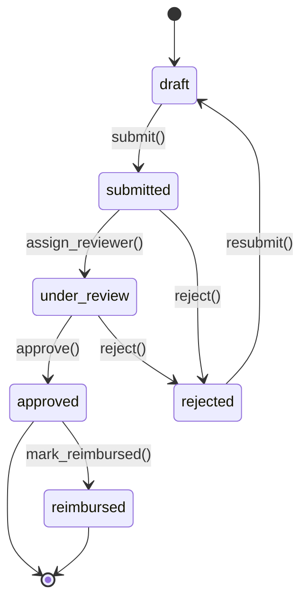
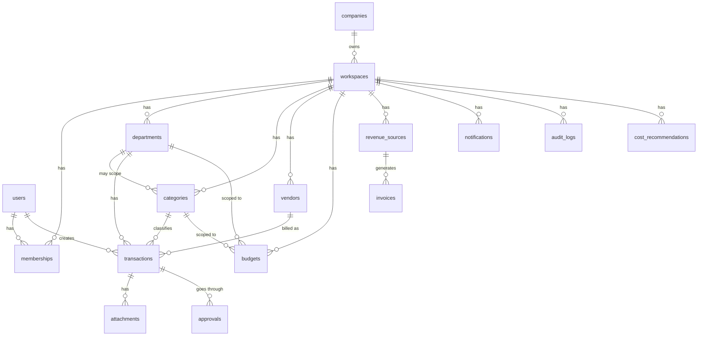
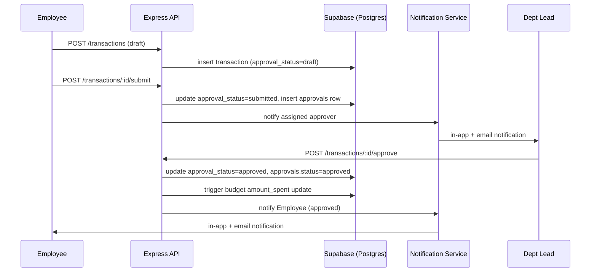

# FinFlow Enterprise — Product Requirements Document

**Status:** Draft v1.0 — Ready for Engineering Review
**Owner:** Product / Platform Engineering
**Last Updated:** July 8, 2026
**Audience:** Backend Engineers, Frontend Engineers, DevOps, Security, QA

---

## 0. Document Purpose

This PRD specifies a production-grade, multi-tenant B2B finance operating platform for startup companies (internally called **FinFlow Enterprise**). It is written to be directly implementable — every module includes data model, API surface, RBAC rules, and business logic sufficient to build against without further product clarification. Where a decision is genuinely open, it is flagged explicitly in **Section 17 — Open Decisions**, not left ambiguous inside a spec section.

This is **not** a personal finance app. It replaces the single-tenant FinFlow schema (one `user_id` per row) with a multi-tenant model scoped by `company_id` / `workspace_id`, with role-based access, approval workflows, and a rule-based cost-optimization engine.

---

## 1. Problem Statement

Early-stage and growth-stage IT startups accumulate financial complexity faster than their tooling matures:

- Spend is scattered across a founder's personal cards, company cards, reimbursed employee expenses, and 20–100+ SaaS/cloud subscriptions with no single ledger.
- Nobody has a real-time view of **burn rate** or **cash runway** without manually pulling numbers into a spreadsheet.
- Recurring SaaS and cloud costs silently grow (unused seats, duplicate tools, forgotten trials-turned-paid) with no systematic detection.
- Expense approval is informal (Slack DMs, email), with no audit trail — a compliance and fundraising-diligence risk.
- Department leads have no visibility into their own budget utilization until finance flags an overrun after the fact.

**Goal:** Give founders, finance/ops, department leads, and employees a single system of record for company money — expenses, budgets, vendors, subscriptions, revenue — with automated approval workflows and proactive cost-optimization recommendations ("Cost Revamp").

---

## 2. Scope

### 2.1 In Scope — v1 (this PRD)
- Multi-tenant workspace/company model with RBAC
- Departments, expense categories (default + custom)
- Transactions (expenses + revenue) with receipts/attachments
- Budgets (department + category, monthly/quarterly/yearly) with alerts
- Vendor and subscription tracking with renewal reminders
- Expense approval workflow with configurable approval chains
- Dashboard: burn rate, runway, spend breakdowns, trends
- Analytics: comparisons, forecasts, cash flow
- Notifications: in-app, email, Slack, Teams
- Cost Revamp rule engine (v1 rule set, not ML-based)
- Full audit logging
- Migration plan from existing single-tenant FinFlow schema

### 2.2 Out of Scope — v1 (candidates for v2+)
- Payroll processing (integration hooks only, not native payroll)
- Native invoicing/billing to customers (revenue is tracked, not generated)
- Direct bank/card feed integrations (Plaid/Stripe Treasury) — v1 uses manual + CSV import
- ML-based anomaly detection (v1 Cost Revamp is rule-based; ML is a v2 upgrade path)
- Multi-currency consolidation (v1 assumes single reporting currency per workspace)
- Mobile native apps (responsive web only)

---

## 3. Target Users & Roles

| Role | Description | Scope of visibility |
|---|---|---|
| **Founder / Admin** | Workspace owner(s), full control | All departments, all data |
| **Finance / Operations** | Manages books day-to-day | All departments, all financial data; cannot transfer workspace ownership |
| **Department Lead** | Manages one department's spend | Own department only |
| **Employee** | Submits expenses/reimbursements | Own submissions only |

A user can hold different roles in different workspaces (e.g., Admin in their own startup, Employee in a client workspace they were invited to), so role is a property of **membership**, not of the user account itself.

---

## 4. RBAC Matrix

Permissions are evaluated as **(role, resource, action)** triples, enforced at both the Express middleware layer and via Postgres RLS as defense-in-depth (Section 10).

| Resource | Action | Admin | Finance/Ops | Dept Lead | Employee |
|---|---|:---:|:---:|:---:|:---:|
| Workspace settings | Read | ✅ | ✅ | ❌ | ❌ |
| Workspace settings | Update | ✅ | ❌ | ❌ | ❌ |
| Workspace ownership | Transfer | ✅ | ❌ | ❌ | ❌ |
| Team invitations | Create/Revoke | ✅ | ✅ | ❌ | ❌ |
| Departments | Create/Edit/Delete | ✅ | ✅ | ❌ | ❌ |
| Departments | Read (own) | ✅ | ✅ | ✅ | ✅ |
| Departments | Read (others) | ✅ | ✅ | ❌ | ❌ |
| Categories (default) | Read | ✅ | ✅ | ✅ | ✅ |
| Categories (custom) | Create/Edit/Delete | ✅ | ✅ | ✅ (own dept) | ❌ |
| Transactions | Create | ✅ | ✅ | ✅ (own dept) | ✅ (own, reimbursement only) |
| Transactions | Read (own dept) | ✅ | ✅ | ✅ | ✅ (own only) |
| Transactions | Read (all depts) | ✅ | ✅ | ❌ | ❌ |
| Transactions | Edit/Delete | ✅ | ✅ | ✅ (own, pre-approval only) | ✅ (own, pre-approval only) |
| Budgets | Create/Edit | ✅ | ✅ | Request only | ❌ |
| Budgets | Read (own dept) | ✅ | ✅ | ✅ | ❌ |
| Budgets | Read (all) | ✅ | ✅ | ❌ | ❌ |
| Vendors/Subscriptions | Create/Edit/Delete | ✅ | ✅ | ❌ | ❌ |
| Vendors/Subscriptions | Read | ✅ | ✅ | ✅ (used by own dept) | ❌ |
| Approvals | Approve/Reject | ✅ | ✅ | ✅ (within assigned limit, own dept) | ❌ |
| Approvals | Submit for approval | ✅ | ✅ | ✅ | ✅ |
| Revenue | Create/Edit/Read | ✅ | ✅ | ❌ | ❌ |
| Dashboard (company-wide) | Read | ✅ | ✅ | ❌ | ❌ |
| Dashboard (own dept) | Read | ✅ | ✅ | ✅ | ❌ |
| Analytics/Cost Revamp | Read | ✅ | ✅ | ❌ | ❌ |
| Audit logs | Read | ✅ | ✅ (read-only) | ❌ | ❌ |
| Notifications settings | Manage own | ✅ | ✅ | ✅ | ✅ |

---

## 5. Core Modules — Functional Requirements

### 5.1 Workspace Management
- A **company** owns one or more **workspaces** (default: 1 workspace per company at v1; multi-workspace scaffolding included for v2 e.g. sandbox vs production, or multi-entity holding companies).
- Workspace creation happens at signup: creating a company auto-creates a default workspace and assigns the creator as Admin.
- **Team invitations**: Admin/Finance generate an invite (email + role + optional department). Invite creates a row in `invitations` with a signed token, expires in 7 days. Accepting creates a `memberships` row.
- **Workspace switching**: a user with memberships in multiple workspaces sees a workspace switcher; all API requests are scoped by an `X-Workspace-Id` header (or JWT claim) validated against `memberships` server-side — never trust a client-supplied workspace id without membership verification.

### 5.2 Departments
Default departments seeded per new workspace (mirrors the FinFlow default-category trigger pattern): Engineering, Marketing, Sales, Finance, Operations, HR, Legal, Customer Success, General. Admin/Finance can rename, add, deactivate (soft-delete via `is_active`, never hard-delete departments with transaction history).

### 5.3 Expense Categories
Default categories seeded per workspace, grouped:
- **Cloud Infrastructure**: AWS, Azure, GCP
- **Software**: SaaS Subscriptions
- **People**: Payroll
- **Growth**: Marketing
- **Operations**: Travel, Office, Equipment, Internet
- **Compliance**: Legal, Compliance, Taxes
- **Other**: Subscriptions (non-cloud), Misc

Custom categories: any role with category-create permission can add a category scoped to their department (or company-wide if Admin/Finance). Category name uniqueness is enforced per `(workspace_id, department_id, name, type)`.

### 5.4 Transactions
- Fields: amount, currency, type (`expense`/`revenue`), category_id, department_id, vendor_id (nullable), description, transaction_date, is_recurring, recurrence_rule, receipt/attachment refs, approval_status, created_by, approved_by.
- **Recurring transactions**: store a `recurrence_rule` (RFC 5545 RRULE subset — daily/weekly/monthly/yearly with interval) on a template row; a background cron job materializes concrete transaction rows on schedule (Section 8).
- **Receipts/attachments**: uploaded to Supabase Storage under `receipts/{workspace_id}/{transaction_id}/`, referenced by row in `attachments` table; virus/type scanning at upload (Section 12.6).
- **Audit history**: every state-changing action on a transaction (create, edit, delete, status change) writes an immutable row to `audit_logs` — never mutate or delete audit rows.
- Editing/deleting is blocked once a transaction is `approved` or `reimbursed` — must be reversed via a correcting entry instead, preserving audit integrity.

### 5.5 Budgets
- Scoped to `(department_id OR category_id, period_type, period_start)` where `period_type` ∈ {monthly, quarterly, yearly}.
- `amount_limit`, `amount_spent` (denormalized, updated via trigger on transaction approval — see Section 9 for trigger logic), `alert_threshold_pct` (default 80%).
- **Overspend alerts**: a Postgres trigger fires a notification job when `amount_spent / amount_limit >= alert_threshold_pct`, and again at 100%+.
- **Forecast**: linear projection based on days elapsed in period vs. spend-to-date, surfaced on the dashboard (not stored — computed at query time).

### 5.6 Revenue
- `revenue_sources` (client name, contract type), `invoices` (amount, status, due_date, source_id), monthly aggregation views for **MRR**, **ARR** (derived from active recurring `revenue_sources`, not just invoiced amounts — flag one-time revenue separately so it doesn't inflate MRR).
- **Net cash flow** = revenue inflow (invoices marked `paid` within period) − approved/reimbursed expense outflow within period.

### 5.7 Vendor Management
- Vendor record: name, category, owner (user_id — who "owns" the relationship), billing_cycle, contract_start/end, license_count, license_used (manually entered or synced later), contract/invoice attachment refs.
- Renewal reminders generated from `contract_end` / `next_billing_date` (Section 8 cron).

### 5.8 Subscription Management
- Subscriptions are a specialized `vendors` sub-type (`vendors.is_subscription = true`) with `billing_cycle` (monthly/annual), `auto_renew`, `last_used_at` (manually logged or left null if unknown).
- **Unused detection**: `last_used_at` older than 60 days (configurable) flags the subscription for Cost Revamp review (Section 6).
- **Duplicate detection**: vendors sharing the same `category_id` and overlapping functional tag (e.g., two project-management tools) flagged for manual review — v1 uses a maintained tag list, not NLP similarity.

### 5.9 Expense Approval Workflow
State machine: `draft → submitted → under_review → approved → reimbursed`, with `rejected` as a terminal branch from `submitted` or `under_review`.



- **Approval chain**: determined by amount thresholds configured per workspace, e.g. Dept Lead can approve up to $X, above that escalates to Finance/Admin automatically (`approvals` table tracks each step with `approver_role_required`, `approved_by`, `approved_at`).
- **Escalation**: if a submitted expense sits in `under_review` beyond an SLA (configurable, default 72h), an escalation notification fires to the next approver tier.

### 5.10 Dashboard
Single company-overview screen (Admin/Finance) and a department-scoped variant (Dept Lead) showing: burn rate (trailing 30/90-day average net outflow), cash runway (`current_balance / burn_rate`), revenue vs. expense, budget utilization per department/category, top expenses, approval queue, recent activity feed. All widgets are queries against materialized/aggregated views (Section 7.9), not raw table scans, for performance.

### 5.11 Analytics
Department/category/vendor comparisons, monthly/quarterly trend lines, cash flow charts, and a simple linear budget-prediction (extrapolate current period's daily burn to period end). Rendered via Recharts on the frontend from pre-aggregated API responses — no client-side aggregation of raw transaction sets.

### 5.12 Notifications
Channels: in-app (always), email (always for critical: approvals, overspend), Slack/Teams (opt-in per workspace via incoming webhook URL stored encrypted in `workspace_integrations`). Triggers: budget threshold crossed, subscription renewal upcoming (7/30 day reminders), approval request assigned, expense approved/rejected, spend spike detected (Cost Revamp).

---

## 6. Cost Revamp Engine (Rule-Based, v1)

A scheduled job (nightly, Section 8) evaluates every workspace against the rule set below and writes results to `cost_recommendations`. Each rule outputs a structured recommendation, not a silent action — nothing is auto-cancelled; humans act on recommendations.

| Rule | Logic | Severity | Recommendation | Est. Savings | Priority | False-Positive Guard |
|---|---|---|---|---|---|---|
| Unused subscription | `is_subscription = true` AND `last_used_at < now() - 60 days` AND `auto_renew = true` | High | Review usage or cancel before next renewal | `annual_cost` | P1 | Skip if `last_used_at` is null (unknown ≠ unused) — surface as "usage unknown" instead |
| Duplicate SaaS tool | ≥2 active vendors share `category_id` + overlapping functional tag | Medium | Consolidate to one vendor | Cost of the lower-value tool | P2 | Require both vendors active >30 days to avoid flagging a mid-migration |
| Cloud cost spike | Category = Cloud Infra AND month-over-month spend increase > 30% | High | Investigate resource usage / review scaling config | Delta vs. prior month | P1 | Exclude first month of a new service (no baseline) |
| Recurring cost anomaly | Recurring transaction amount deviates >20% from its own trailing 3-month average | Medium | Confirm vendor pricing change is expected | Delta vs. average | P2 | Require ≥3 prior occurrences before computing baseline |
| Budget overrun | `amount_spent > amount_limit` for current period | High | Reallocate budget or curb spend | N/A (control, not savings) | P1 | None — deterministic |
| Category overspend trend | Category exceeded budget in ≥2 of last 3 periods | Medium | Revisit budget sizing or spend policy | N/A | P2 | Requires 3 periods of history to fire |
| Vendor consolidation opportunity | ≥3 vendors in same category with combined spend > $X/mo | Low | Negotiate bundled/enterprise pricing | 10–20% of combined spend (heuristic) | P3 | Configurable threshold per workspace |
| Idle infrastructure / unused resources | Manually-logged cloud resource tags marked `idle` for >30 days (v1: manual flag; v2: cloud API integration) | Medium | Decommission or downsize | Resource's monthly cost | P2 | v1 relies on manual tagging — false positives possible until cloud integration ships |
| Rising SaaS cost trend | Vendor's monthly cost has increased in 3 consecutive months | Low | Review plan tier / renegotiate | Delta over 3 months | P3 | Requires 3 consecutive increases, not just volatility |
| Low license utilization | `license_used / license_count < 50%` (where tracked) | Medium | Downgrade seat count at next renewal | `(license_count - license_used) * per_seat_cost` | P2 | Skip if `license_used` not tracked for that vendor |

Each recommendation row includes: `rule_id`, `workspace_id`, `subject_type` (vendor/category/budget), `subject_id`, `severity`, `estimated_savings`, `status` (`open`/`dismissed`/`actioned`), `detected_at`. Dismissing a recommendation records `dismissed_by` + optional reason, feeding future tuning of thresholds (manual, not ML, in v1).

---

## 7. Database Design (PostgreSQL / Supabase)

### 7.1 Entity Relationship Overview



### 7.2 Table: `companies`
| Column | Type | Constraints |
|---|---|---|
| id | uuid | PK, default gen_random_uuid() |
| name | text | not null |
| owner_user_id | uuid | FK → users.id, not null |
| created_at | timestamptz | default now() |

### 7.3 Table: `workspaces`
| Column | Type | Constraints |
|---|---|---|
| id | uuid | PK |
| company_id | uuid | FK → companies.id, not null, on delete cascade |
| name | text | not null |
| base_currency | text | not null, default 'INR' |
| settings | jsonb | default '{}' — approval thresholds, alert defaults |
| created_at | timestamptz | default now() |

Index: `idx_workspaces_company_id (company_id)`

### 7.4 Table: `users`
Managed by Supabase Auth (`auth.users`). A mirrored `public.users` (or `profiles`) row is maintained via trigger (same pattern as the existing FinFlow `handle_new_user` trigger):
| Column | Type | Constraints |
|---|---|---|
| id | uuid | PK, FK → auth.users.id |
| email | text | not null, unique |
| full_name | text | |
| created_at | timestamptz | default now() |

### 7.5 Table: `memberships`
| Column | Type | Constraints |
|---|---|---|
| id | uuid | PK |
| workspace_id | uuid | FK → workspaces.id, not null, on delete cascade |
| user_id | uuid | FK → users.id, not null, on delete cascade |
| role | text | not null, check in ('admin','finance_ops','dept_lead','employee') |
| department_id | uuid | FK → departments.id, nullable (required for dept_lead/employee) |
| approval_limit | numeric(14,2) | nullable — used for dept_lead escalation logic |
| status | text | default 'active', check in ('active','invited','suspended') |
| created_at | timestamptz | default now() |

Constraint: `unique (workspace_id, user_id)`
Index: `idx_memberships_workspace_user (workspace_id, user_id)`, `idx_memberships_department (department_id)`

### 7.6 Table: `departments`
| Column | Type | Constraints |
|---|---|---|
| id | uuid | PK |
| workspace_id | uuid | FK → workspaces.id, not null, on delete cascade |
| name | text | not null |
| is_active | boolean | default true |
| created_at | timestamptz | default now() |

Constraint: `unique (workspace_id, name)`

### 7.7 Table: `categories`
| Column | Type | Constraints |
|---|---|---|
| id | uuid | PK |
| workspace_id | uuid | FK → workspaces.id, not null, on delete cascade |
| department_id | uuid | FK → departments.id, nullable (null = company-wide) |
| name | text | not null |
| type | text | not null, check in ('expense','revenue') |
| icon | text | |
| color | text | |
| is_custom | boolean | default false |
| created_at | timestamptz | default now() |

Constraint: `unique (workspace_id, department_id, name, type)`

### 7.8 Table: `vendors`
| Column | Type | Constraints |
|---|---|---|
| id | uuid | PK |
| workspace_id | uuid | FK → workspaces.id, not null, on delete cascade |
| category_id | uuid | FK → categories.id, nullable |
| owner_user_id | uuid | FK → users.id, nullable |
| name | text | not null |
| is_subscription | boolean | default false |
| billing_cycle | text | check in ('monthly','annual','one_time'), nullable |
| auto_renew | boolean | default false |
| license_count | int | nullable |
| license_used | int | nullable |
| last_used_at | timestamptz | nullable |
| contract_start | date | nullable |
| contract_end | date | nullable |
| next_billing_date | date | nullable |
| monthly_cost | numeric(14,2) | nullable |
| functional_tag | text | nullable — used for duplicate detection |
| created_at | timestamptz | default now() |

Indexes: `idx_vendors_workspace (workspace_id)`, `idx_vendors_next_billing (next_billing_date)`

### 7.9 Table: `transactions`
| Column | Type | Constraints |
|---|---|---|
| id | uuid | PK |
| workspace_id | uuid | FK → workspaces.id, not null, on delete cascade |
| department_id | uuid | FK → departments.id, not null |
| category_id | uuid | FK → categories.id, not null |
| vendor_id | uuid | FK → vendors.id, nullable |
| type | text | not null, check in ('expense','revenue') |
| amount | numeric(14,2) | not null, check (amount > 0) |
| currency | text | not null, default workspace base_currency |
| description | text | |
| transaction_date | date | not null |
| is_recurring | boolean | default false |
| recurrence_rule | text | nullable — RRULE string |
| parent_recurring_id | uuid | FK → transactions.id, nullable — links generated instances to template |
| approval_status | text | not null, default 'draft', check in ('draft','submitted','under_review','approved','rejected','reimbursed') |
| created_by | uuid | FK → users.id, not null |
| approved_by | uuid | FK → users.id, nullable |
| approved_at | timestamptz | nullable |
| created_at | timestamptz | default now() |

Indexes: `idx_transactions_workspace_date (workspace_id, transaction_date)`, `idx_transactions_dept (department_id)`, `idx_transactions_category (category_id)`, `idx_transactions_status (approval_status)`

Trigger `trg_update_budget_spent`: on `UPDATE` of `transactions.approval_status` to `approved` or `reimbursed`, upsert `budgets.amount_spent` for the matching department/category/period.

### 7.10 Table: `attachments`
| Column | Type | Constraints |
|---|---|---|
| id | uuid | PK |
| transaction_id | uuid | FK → transactions.id, not null, on delete cascade |
| storage_path | text | not null — Supabase Storage object path |
| file_name | text | not null |
| mime_type | text | not null |
| file_size_bytes | int | not null |
| uploaded_by | uuid | FK → users.id, not null |
| created_at | timestamptz | default now() |

### 7.11 Table: `approvals`
| Column | Type | Constraints |
|---|---|---|
| id | uuid | PK |
| transaction_id | uuid | FK → transactions.id, not null, on delete cascade |
| step_order | int | not null |
| approver_role_required | text | not null |
| assigned_to | uuid | FK → users.id, nullable |
| status | text | not null, default 'pending', check in ('pending','approved','rejected','escalated') |
| acted_at | timestamptz | nullable |
| comment | text | nullable |
| created_at | timestamptz | default now() |

Index: `idx_approvals_transaction (transaction_id)`

### 7.12 Table: `budgets`
| Column | Type | Constraints |
|---|---|---|
| id | uuid | PK |
| workspace_id | uuid | FK → workspaces.id, not null, on delete cascade |
| department_id | uuid | FK → departments.id, nullable |
| category_id | uuid | FK → categories.id, nullable |
| period_type | text | not null, check in ('monthly','quarterly','yearly') |
| period_start | date | not null |
| amount_limit | numeric(14,2) | not null |
| amount_spent | numeric(14,2) | default 0 |
| alert_threshold_pct | numeric(5,2) | default 80.0 |
| created_at | timestamptz | default now() |

Constraint: `unique (workspace_id, department_id, category_id, period_type, period_start)` (with `department_id`/`category_id` nullable, use a partial-unique or coalesce-based expression index in practice)
Check: at least one of `department_id`, `category_id` must be non-null.

### 7.13 Table: `revenue_sources`
| Column | Type | Constraints |
|---|---|---|
| id | uuid | PK |
| workspace_id | uuid | FK → workspaces.id, not null |
| client_name | text | not null |
| contract_type | text | check in ('recurring','one_time') |
| monthly_value | numeric(14,2) | nullable — used for MRR/ARR calc |
| is_active | boolean | default true |
| created_at | timestamptz | default now() |

### 7.14 Table: `invoices`
| Column | Type | Constraints |
|---|---|---|
| id | uuid | PK |
| revenue_source_id | uuid | FK → revenue_sources.id, not null, on delete cascade |
| amount | numeric(14,2) | not null |
| status | text | check in ('draft','sent','paid','overdue'), default 'draft' |
| due_date | date | not null |
| paid_at | timestamptz | nullable |
| created_at | timestamptz | default now() |

### 7.15 Table: `notifications`
| Column | Type | Constraints |
|---|---|---|
| id | uuid | PK |
| workspace_id | uuid | FK → workspaces.id, not null |
| user_id | uuid | FK → users.id, not null — recipient |
| type | text | not null — e.g. 'budget_alert','renewal','approval_request' |
| payload | jsonb | not null |
| channel | text | check in ('in_app','email','slack','teams') |
| read_at | timestamptz | nullable |
| created_at | timestamptz | default now() |

Index: `idx_notifications_user_unread (user_id) where read_at is null`

### 7.16 Table: `workspace_integrations`
| Column | Type | Constraints |
|---|---|---|
| id | uuid | PK |
| workspace_id | uuid | FK → workspaces.id, not null |
| type | text | check in ('slack','teams','email') |
| config | jsonb | not null — encrypted webhook URL / credentials |
| is_active | boolean | default true |

### 7.17 Table: `cost_recommendations`
| Column | Type | Constraints |
|---|---|---|
| id | uuid | PK |
| workspace_id | uuid | FK → workspaces.id, not null |
| rule_id | text | not null |
| subject_type | text | not null — 'vendor'/'category'/'budget' |
| subject_id | uuid | not null |
| severity | text | check in ('low','medium','high') |
| estimated_savings | numeric(14,2) | nullable |
| status | text | default 'open', check in ('open','dismissed','actioned') |
| dismissed_by | uuid | FK → users.id, nullable |
| dismiss_reason | text | nullable |
| detected_at | timestamptz | default now() |

### 7.18 Table: `audit_logs`
| Column | Type | Constraints |
|---|---|---|
| id | uuid | PK |
| workspace_id | uuid | FK → workspaces.id, not null |
| actor_user_id | uuid | FK → users.id, not null |
| action | text | not null — e.g. 'transaction.approved' |
| resource_type | text | not null |
| resource_id | uuid | not null |
| before_state | jsonb | nullable |
| after_state | jsonb | nullable |
| created_at | timestamptz | default now() |

Immutable — no UPDATE/DELETE grants for any application role; append-only.

---

## 8. Row Level Security (Supabase RLS)

RLS is **defense-in-depth**, not the primary authorization layer — Express middleware (Section 10.3) is the primary enforcement point since it also handles role-scoped business logic (e.g. department-level restrictions on Dept Leads). RLS guarantees that even a compromised backend credential (anon key) or direct Supabase client call cannot cross tenant boundaries.

Core pattern — every tenant-scoped table has:

```sql
alter table transactions enable row level security;

create policy tenant_isolation_select on transactions
for select
using (
  workspace_id in (
    select workspace_id from memberships
    where user_id = auth.uid() and status = 'active'
  )
);

create policy tenant_isolation_insert on transactions
for insert
with check (
  workspace_id in (
    select workspace_id from memberships
    where user_id = auth.uid() and status = 'active'
  )
);
```

This pattern (parameterized per table) is applied to: `workspaces`, `memberships`, `departments`, `categories`, `vendors`, `transactions`, `attachments`, `approvals`, `budgets`, `revenue_sources`, `invoices`, `notifications`, `workspace_integrations`, `cost_recommendations`, `audit_logs`.

**Department-scoped policy example** (Dept Lead / Employee restriction, layered on top of tenant isolation):

```sql
create policy department_scope_select on transactions
for select
using (
  exists (
    select 1 from memberships m
    where m.user_id = auth.uid()
      and m.workspace_id = transactions.workspace_id
      and m.status = 'active'
      and (
        m.role in ('admin','finance_ops')
        or (m.role in ('dept_lead','employee') and m.department_id = transactions.department_id)
      )
  )
);
```

**Audit logs**: `insert`-only policy for the backend service role; no `update`/`delete` policy exists for any role (including RLS bypass via service key is restricted at the application layer by never issuing `UPDATE`/`DELETE` SQL against this table).

The Express backend uses the **service role key** for most writes (so it can enforce complex business rules like approval-chain checks before persisting), but every query still passes an explicit `workspace_id`/`user_id` filter matching the authenticated request — RLS is the backstop if that filter is ever omitted by a bug.

---

## 9. API Design

All routes are prefixed `/api/v1`. Every request requires `Authorization: Bearer <supabase_jwt>` and (except for `/workspaces` list/create) an `X-Workspace-Id` header, validated server-side against `memberships`.

### 9.1 Auth & Workspace
| Method | Route | Auth | Description |
|---|---|---|---|
| POST | /auth/register | Public | Proxies Supabase signUp (or client calls Supabase directly, per current architecture) |
| GET | /workspaces | User | List workspaces the user belongs to |
| POST | /workspaces | User | Create a company + default workspace |
| GET | /workspaces/:id | Member | Get workspace settings |
| PATCH | /workspaces/:id | Admin | Update workspace settings |
| POST | /workspaces/:id/invitations | Admin, Finance | Invite a user by email + role + department |
| POST | /invitations/:token/accept | Public (token) | Accept invite, create membership |

### 9.2 Departments
| Method | Route | Auth | Description |
|---|---|---|---|
| GET | /departments | Member | List departments (scoped by role) |
| POST | /departments | Admin, Finance | Create department |
| PATCH | /departments/:id | Admin, Finance | Update / deactivate |

### 9.3 Categories
| Method | Route | Auth | Description |
|---|---|---|---|
| GET | /categories | Member | List categories (default + custom, scoped) |
| POST | /categories | Admin, Finance, Dept Lead | Create custom category |
| PATCH | /categories/:id | Owner role | Update |
| DELETE | /categories/:id | Owner role | Soft-delete (block if in use) |

### 9.4 Transactions
| Method | Route | Auth | Description |
|---|---|---|---|
| GET | /transactions | Member (scoped) | List with filters: department, category, status, date range |
| POST | /transactions | Member (scoped) | Create (draft) |
| GET | /transactions/:id | Member (scoped) | Get one |
| PATCH | /transactions/:id | Owner/Finance, pre-approval only | Edit |
| DELETE | /transactions/:id | Owner/Finance, pre-approval only | Delete |
| POST | /transactions/:id/submit | Owner | draft → submitted |
| POST | /transactions/:id/approve | Approver role | Approve current step |
| POST | /transactions/:id/reject | Approver role | Reject with comment |
| POST | /transactions/:id/attachments | Owner | Upload receipt |

**Example — POST /transactions**
```json
Request:
{
  "department_id": "uuid",
  "category_id": "uuid",
  "vendor_id": null,
  "type": "expense",
  "amount": 4200.00,
  "currency": "INR",
  "description": "AWS bill - June",
  "transaction_date": "2026-07-01",
  "is_recurring": true,
  "recurrence_rule": "FREQ=MONTHLY;INTERVAL=1"
}

Response (201):
{
  "id": "uuid",
  "approval_status": "draft",
  "created_by": "uuid",
  "created_at": "2026-07-08T10:00:00Z"
}

Errors:
400 - validation error (amount <= 0, missing category)
403 - department outside caller's scope
```

### 9.5 Budgets
| Method | Route | Auth | Description |
|---|---|---|---|
| GET | /budgets | Member (scoped) | List with utilization % |
| POST | /budgets | Admin, Finance | Create |
| PATCH | /budgets/:id | Admin, Finance | Update limit |

### 9.6 Vendors & Subscriptions
| Method | Route | Auth | Description |
|---|---|---|---|
| GET | /vendors | Admin, Finance, Dept Lead (own) | List |
| POST | /vendors | Admin, Finance | Create |
| PATCH | /vendors/:id | Admin, Finance | Update (incl. last_used_at, license_used) |
| DELETE | /vendors/:id | Admin, Finance | Soft-delete |

### 9.7 Revenue
| Method | Route | Auth | Description |
|---|---|---|---|
| GET | /revenue-sources | Admin, Finance | List |
| POST | /revenue-sources | Admin, Finance | Create |
| GET | /invoices | Admin, Finance | List |
| POST | /invoices | Admin, Finance | Create |
| PATCH | /invoices/:id | Admin, Finance | Mark paid/overdue |

### 9.8 Dashboard & Analytics
| Method | Route | Auth | Description |
|---|---|---|---|
| GET | /dashboard/overview | Admin, Finance | Burn rate, runway, revenue vs expense |
| GET | /dashboard/department/:id | Dept Lead (own), Admin, Finance | Department-scoped view |
| GET | /analytics/trends | Admin, Finance | Monthly/quarterly trend series |
| GET | /analytics/comparisons | Admin, Finance | Department/category/vendor comparisons |
| GET | /analytics/forecast | Admin, Finance | Budget prediction |

**Example — GET /dashboard/overview response**
```json
{
  "burn_rate_30d": 812000.00,
  "cash_runway_months": 8.4,
  "revenue_mtd": 1450000.00,
  "expense_mtd": 980000.00,
  "budget_utilization": [
    { "department": "Engineering", "spent": 320000, "limit": 400000 }
  ],
  "top_expenses": [
    { "vendor": "AWS", "amount": 210000, "category": "Cloud Infrastructure" }
  ]
}
```

### 9.9 Cost Revamp
| Method | Route | Auth | Description |
|---|---|---|---|
| GET | /cost-recommendations | Admin, Finance | List open recommendations |
| POST | /cost-recommendations/:id/dismiss | Admin, Finance | Dismiss with reason |
| POST | /cost-recommendations/:id/action | Admin, Finance | Mark actioned |

### 9.10 Notifications
| Method | Route | Auth | Description |
|---|---|---|---|
| GET | /notifications | Member | List own, unread first |
| PATCH | /notifications/:id/read | Member | Mark read |
| PATCH | /workspaces/:id/integrations | Admin | Configure Slack/Teams webhook |

---

## 10. Backend Architecture

### 10.1 Layering
```
Route → Middleware (auth, workspace scope, RBAC) → Controller → Service → Repository → Supabase
```
- **Controllers**: parse/validate request, call service, shape response. No business logic.
- **Services**: business logic (approval chain resolution, budget recalculation triggers, Cost Revamp rule evaluation). Framework-agnostic, testable in isolation.
- **Repositories**: thin data-access layer wrapping Supabase client calls — isolates services from Supabase-specific query syntax, eases future DB migration if ever needed.

### 10.2 Middleware
- `authenticate` — verifies Supabase JWT, attaches `req.user`.
- `resolveWorkspace` — reads `X-Workspace-Id`, verifies active membership, attaches `req.membership` (role, department_id, approval_limit).
- `authorize(resource, action)` — RBAC check against the matrix in Section 4.
- `validate(schema)` — request body/query validation (Zod or Joi).
- `errorHandler` — centralized, maps known errors to HTTP codes, logs unexpected errors with correlation id.

### 10.3 Validation & Error Handling
All input validated via schema (reject unknown fields). Errors follow a consistent envelope:
```json
{ "success": false, "error": { "code": "BUDGET_EXCEEDED", "message": "..." } }
```

### 10.4 Logging
Structured JSON logs (pino/winston), correlation id per request, no PII/financial amounts in log messages beyond IDs — full detail lives in `audit_logs`, not application logs.

### 10.5 Caching
Dashboard aggregates cached per workspace (Redis, 5-minute TTL) since they're read-heavy and tolerate slight staleness; invalidated on transaction approval/budget update events.

### 10.6 Background Jobs / Cron
| Job | Schedule | Purpose |
|---|---|---|
| Recurring transaction materializer | Daily 00:00 | Generate concrete transaction rows from recurring templates |
| Renewal reminder scan | Daily 06:00 | Notify on vendors with `next_billing_date` in 7/30 days |
| Cost Revamp rule evaluation | Nightly | Run rule set (Section 6), write `cost_recommendations` |
| Approval SLA escalation | Hourly | Escalate `under_review` items past SLA |
| Budget alert check | On transaction approval (event-driven) + nightly sweep | Fire threshold alerts |

### 10.7 File Uploads
Receipts uploaded directly to Supabase Storage from the client via signed upload URL (backend issues the signed URL after validating transaction ownership); backend never proxies file bytes. MIME type allowlist enforced both client-side and via Storage bucket policy (Section 12.6).

---

## 11. Frontend Architecture

```
src/
  pages/
    dashboard/
    transactions/
    budgets/
    vendors/
    approvals/
    analytics/
    cost-revamp/
    settings/
  components/
    ui/            # shared design-system primitives
    charts/         # Recharts wrappers
    forms/
  hooks/
    useWorkspace.ts
    usePermissions.ts
    useTransactions.ts
  context/
    WorkspaceContext.tsx
    AuthContext.tsx
  services/
    api/            # typed API client per module
  state/
    (React Query for server state; Context/useReducer for local UI state — no global client-state store needed given API-driven data)
  layouts/
    AppLayout.tsx     # sidebar + workspace switcher
    AuthLayout.tsx
  routes/
    ProtectedRoute.tsx  # wraps role/permission checks from usePermissions
```

`ProtectedRoute` reads `usePermissions()` (derived from the current membership's role) to hide/block routes client-side — purely UX, since the backend is the actual enforcement point.

---

## 12. Security

12.1 **RBAC** — enforced server-side per Section 4/10.2; never trust client-supplied role claims.
12.2 **JWT** — Supabase-issued, short-lived access token + refresh token rotation; backend verifies signature and expiry on every request.
12.3 **Rate limiting** — per-user + per-workspace, sliding window (e.g. 100 req/min), stricter on auth and file-upload endpoints.
12.4 **Audit logs** — immutable, append-only (Section 7.18), covering all approval/financial state changes.
12.5 **Encryption** — TLS in transit everywhere; `workspace_integrations.config` (webhook URLs/secrets) encrypted at rest (application-level encryption, not just relying on disk encryption).
12.6 **File upload security** — MIME allowlist (PDF, PNG, JPG only for receipts), max file size (10MB), Storage bucket policies restrict read access to workspace members, filenames sanitized/UUID-renamed on storage (never trust original filename for paths).
12.7 **Financial data protection** — amounts and financial aggregates never exposed to roles without dashboard/analytics permission, enforced at query layer (not just UI hiding).

---

## 13. Non-Functional Requirements

| Category | Requirement |
|---|---|
| Performance | Dashboard endpoints p95 < 500ms (cached); transaction writes p95 < 300ms |
| Scalability | Support 500 workspaces × 10k transactions/year each at v1 without schema redesign |
| Availability | 99.9% uptime target for API |
| Monitoring | APM (e.g. Sentry/Datadog) on backend; error rate + latency dashboards per route |
| Logging | Structured logs retained 30 days; audit logs retained indefinitely |
| Backups | Supabase automated daily backups + point-in-time recovery enabled |
| Recovery | RTO 4 hours, RPO 1 hour |
| Accessibility | WCAG 2.1 AA for core flows (forms, dashboard, approvals) |
| Testing | Unit tests on services (business logic), integration tests on API routes, RLS policy tests run against a seeded multi-tenant fixture to assert cross-tenant isolation |
| CI/CD | PR-triggered test suite + lint; staging deploy on merge to `main`; manual promote to production |

---

## 14. Migration Plan (Single-Tenant → Multi-Tenant)

The existing FinFlow schema is single-user (`user_id` directly on `categories`/`transactions`, no company/workspace concept). Migration path:

1. **Schema migration**: introduce `companies`, `workspaces`, `memberships`, `departments` tables. For each existing FinFlow user, auto-create a company + workspace + Admin membership (1:1 mapping preserves existing single-user behavior as "workspace of one").
2. **Data migration**: add `workspace_id`/`department_id` columns to `categories`, `transactions`, `budgets` (nullable initially); backfill `workspace_id` from the new mapping; assign all existing transactions to a default "General" department; then set columns `not null` and add FKs.
3. **API changes**: introduce `X-Workspace-Id` requirement; existing endpoints gain workspace scoping; old single-user endpoints deprecated behind a version flag during transition, removed after frontend cutover.
4. **Authentication**: unchanged — still Supabase Auth; `memberships` layer added without altering `auth.users`.
5. **Existing users**: on first login post-migration, redirected through a one-time "Set up your company" flow if their auto-created workspace needs a real company name (defaults to email-derived placeholder).
6. **Rollout**: migrate in a maintenance window; run backfill scripts (same pattern as the existing default-category backfill) with verification queries before/after; feature-flag the new multi-tenant UI to allow rollback to single-tenant read-only mode if migration issues surface.

---

## 15. Success Metrics (Engineering & Product)

| Metric | Target |
|---|---|
| Expense approval time (submit → approved) | Median < 24h |
| Budget adherence (% periods within limit) | > 85% of department-periods |
| Waste reduction | ≥ 10% of flagged Cost Revamp savings actioned within 90 days |
| Subscription savings realized | Tracked $ amount from actioned `cost_recommendations` |
| Runway estimate accuracy | Within 10% of actual, validated monthly against real cash position |
| Dashboard engagement | ≥ 70% of Admin/Finance users view dashboard weekly |
| API reliability | p95 latency and error-rate targets from Section 13 met monthly |
| RLS isolation | Zero cross-tenant data exposure incidents (tested via automated fixture suite each release) |

---

## 16. Sequence Diagram — Expense Submission & Approval



---

## 17. Open Decisions (Require Product Sign-off Before Build)

1. **Single vs. multi-workspace per company at v1** — spec assumes 1:1 at launch with schema ready for more; confirm before building the workspace switcher UI.
2. **Multi-currency** — v1 assumes single reporting currency per workspace; confirm whether early customers need multi-currency from day one.
3. **Bank/card feed integration timing** — manual entry + CSV import at v1; confirm if this blocks early customer adoption enough to pull forward.
4. **Approval limit configuration** — per-membership (`approval_limit`) vs. per-department policy; spec uses per-membership for flexibility, confirm this matches how startups actually delegate authority.
5. **Cost Revamp thresholds** (60-day unused, 30% cloud spike, etc.) — defaults proposed above; confirm these are reasonable starting points vs. needing to be workspace-configurable from v1.

---

*End of document.*
