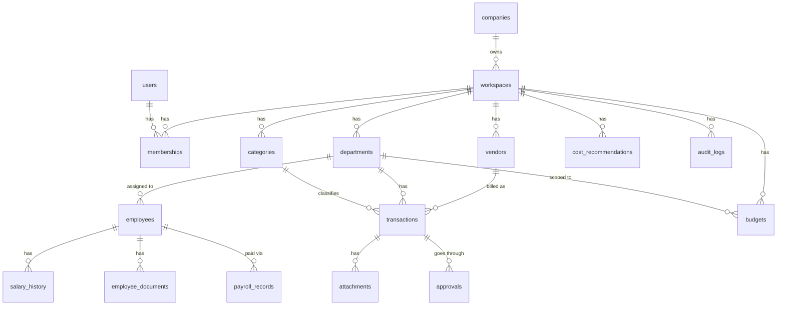
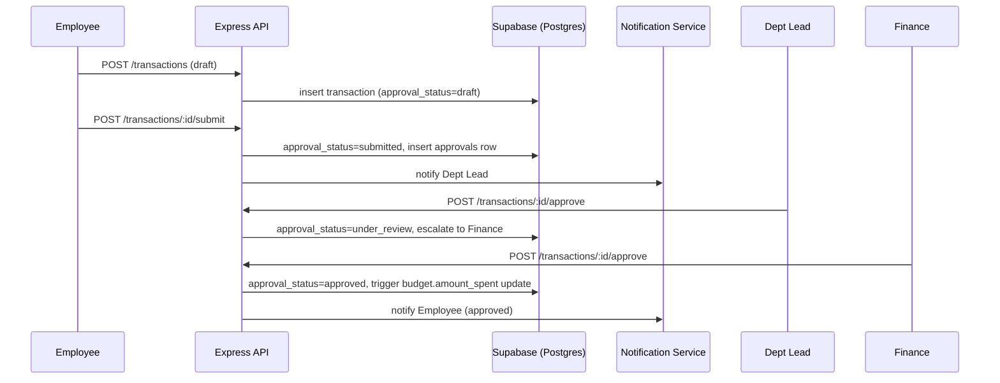

# FinFlow — Product Requirements Document

**Status:** Draft v2.1 — Product & Engineering Review Complete
**Owner:** Product / Platform Engineering
**Last Updated:** July 15, 2026
**Supersedes:** v2.0 (Business Ops Platform restructure) — v1.0 (Finance-only platform)
**Audience:** Founders, Product, Engineering, Finance, HR, Operations, Investors/Diligence Readers

---

## 0. Version History & What Changed in v2.1

v2.0 restructured FinFlow from a finance tool into a multi-module Business Operations Platform and correctly scoped Employee Management, Payroll Records, and Vendor Management as new modules. It was engineering-complete but under-argued as a *product*: it didn't say why a company would choose this over the incumbents, didn't connect modules to business outcomes, and left KPIs implicit inside dashboard widget lists rather than defined as a first-class asset.

v2.1 does not change scope, architecture, or module boundaries. It adds the product and business layer on top of the same technical foundation:

- **Product Positioning** — reframed as an Internal Operating System, with explicit differentiation from SAP, Oracle, Zoho, Freshworks, Darwinbox, Keka, Rippling, Notion, and spreadsheets
- **Business Objective / Problem / Outcome / KPIs** added to every module spec
- **Decision Intelligence** section — what decision each dashboard enables, per role
- **Executive KPI Dictionary** — 15 KPIs with formulas and owners
- **Business Intelligence** module added (rules-based recommendations/alerts/insights layer — distinct from, and sitting above, both Analytics and AI Insights)
- **Assumptions** and **Constraints** made explicit rather than implied
- **Risks** expanded across seven categories
- **Success Metrics** split into Business / Technical / Product / Operational
- **Roadmap** rewritten as Completed / In Progress / Upcoming / Future / Stretch
- **MVP Definition** — explicit v1.0 line
- **Product Differentiators** vs. Excel, Notion, Zoho, FreshBooks, generic HRMS, expense trackers

Everything from v2.0 that was already correct — the full database design, API inventory, RBAC matrix, architecture, workflows, and the phased implementation sequencing tied to actual shipped code — is preserved unchanged. This is an addition and reframing pass, not a rewrite.

---

## 1. Product Positioning

**FinFlow is an Internal Operating System for IT Startups** — not a finance tool, not an HRMS, not a spend-management app. It is the layer that sits above whatever point tools a startup already uses and answers the questions that require pulling from more than one of them at once: *is our burn sustainable given current headcount, which departments are actually over budget once payroll is included, which vendors are we paying for that nobody uses.*

### Why a company adopts this instead of doing nothing
Between roughly 20 and 500 employees, a tech company is too large for one founder to hold the whole operational picture in their head, and too small to justify running a full HRIS + FP&A + spend-management stack with the headcount to administer it. That gap is currently filled with spreadsheets, Slack threads, and whoever happens to remember a contract renewal date. FinFlow is sized for exactly that gap.

### Why not the obvious alternatives

| Alternative | Why it's not a fit for this segment |
|---|---|
| **SAP / Oracle** | Built for enterprises with dedicated finance/IT operations teams to configure and run them. Multi-year implementation timelines and cost structures are a mismatch for a 20–500 person company. |
| **Zoho / Freshworks suites** | Broad horizontal suites that require assembling and licensing multiple separate products (Books, People, Expense) to approximate what FinFlow does natively as one workspace with one data model. |
| **Darwinbox / Keka** | Strong HRMS/payroll depth but finance-blind — no budgets, vendor spend, or cost optimization. A company adopting one of these still needs a separate finance stack. |
| **Rippling** | Closest philosophical match (unified employee + IT + finance data), but priced and packaged for a US-centric, compliance-heavy payroll-processing model. FinFlow deliberately does not process payroll — it is lighter-weight and cheaper for a startup that already has a payroll vendor and just needs visibility. |
| **Notion** | Infinitely flexible, which is the problem — it has no real data model, no RBAC enforcement, no computed budgets/burn/runway. What Notion calls a "finance tracker" is a set of manually-updated tables with no guarantees. |
| **Spreadsheets** | No access control, no audit trail, no automatic computation, breaks silently at scale, and is the status quo FinFlow is explicitly built to replace. |

**The positioning in one line:** FinFlow doesn't compete with payroll processors, ATS platforms, or accounting software — it is the operational visibility layer above them, purpose-built for companies too big for spreadsheets and too small for an enterprise suite.

---

## 2. Vision

Give founders and functional leads at a growing tech company one workspace that answers *who works here, what are we paying them, what are we spending on, is it under control, and what needs a decision this week* — without stitching together spreadsheets, Slack threads, and five disconnected SaaS tools to get there.

---

## 3. Problem Statement

Early- and growth-stage IT startups (20–500 people) accumulate operational complexity faster than their tooling matures:

- Headcount, org structure, and reporting lines live in spreadsheets or in someone's head; there's no single source of truth for "who works here and for whom."
- Payroll numbers exist in the payroll processor, but nobody outside Finance can see payroll trends, cost-per-department, or how compensation is growing relative to revenue.
- Spend is scattered across a founder's personal cards, company cards, reimbursed employee expenses, and 20–100+ SaaS/cloud subscriptions with no single ledger.
- Vendor relationships, contracts, and renewal dates live with whoever originally signed up — no visibility when that person leaves.
- Department leads have no visibility into their own budget or headcount cost until someone flags an overrun after the fact.
- Founders assemble a "state of the company" view manually before every board meeting or investor update.

**Goal:** Give founders, HR, Finance, Operations, and Department Heads a single workspace for the operational side of running the company — org structure, people, payroll records, spend, vendors, and budgets — with role-appropriate dashboards and proactive recommendations, without trying to become a full ERP.

---

## 4. Business Objectives

1. Become the default "company OS" a technical founder sets up in their first 20–50 employees, before they can justify a dedicated HRIS + FP&A stack.
2. Reduce time-to-answer for common leadership questions (burn, runway, headcount cost, budget status) from "ask three people and wait" to "open the dashboard."
3. Surface avoidable recurring cost (unused SaaS, duplicate tools, budget overruns) proactively rather than reactively.
4. Give department leads self-service visibility into their own spend and headcount cost, reducing Finance's role to exception-handling rather than being the only source of truth.
5. Keep the product achievable by a small engineering team — depth in a bounded set of modules beats shallow breadth across a full ERP surface.
6. Preserve everything already built; every phase of new work extends existing schema/RBAC rather than replacing it.

Each business objective maps to specific module-level objectives and KPIs — see Section 15 (Module Specifications) and Section 17 (Executive KPI Dictionary).

---

## 5. Target Users, Personas & Target Companies

### 5.1 Primary Users
| Role | Description |
|---|---|
| **Founder / CEO** | Company-wide visibility, final financial/organizational authority |
| **Finance Team** | Owns budgets, transactions, vendor payments, financial reporting |
| **HR Team** | Owns employee records, org structure, payroll record-keeping |
| **Operations Team** | Owns vendor relationships, SaaS subscriptions, cost optimization |
| **Department Heads** | Own their department's people, budget, and spend |
| **Employees** | Self-service: profile, payslips, expense submission |

### 5.2 Target Companies
IT startups, SaaS companies, software agencies, AI startups, and technology consulting firms — 20 to 500 employees, single legal entity, past the "spreadsheet is fine" stage but not yet large enough to run a dedicated HRIS + FP&A stack.

### 5.3 Personas

**Aditi — Founder/CEO, 45-person SaaS company.** Wants a five-minute answer to "how are we doing" before every investor call: burn, runway, headcount growth, any budget fires. Doesn't want to learn a new tool's full surface — wants the executive dashboard to just work.

**Rohan — Head of Finance, 45-person company.** Owns budgets and vendor payments. Currently reconstructs monthly reports from bank exports and a shared sheet. Wants transaction-level detail with department attribution and an approval trail he can point to in due diligence.

**Meera — HR Lead, joined at 30 people.** Owns the employee directory and comp history, which currently live in Google Sheets with version-control problems. Wants a system of record for who's employed, their designation/reporting line, and salary history — without owning payroll processing itself.

**Karan — Engineering Department Lead.** Wants to know, without asking Finance, how much his department has spent this quarter against budget and how many open headcount requests he has.

**Priya — Software Engineer, individual contributor.** Wants to see her own payslips, submit an expense for a conference ticket, and check her department's remaining budget before asking for a new laptop.

---

## 6. User Stories

**Founder**
- As a founder, I want a single dashboard showing burn, runway, and department spend so I don't have to assemble it manually before board meetings.
- As a founder, I want to see upcoming SaaS renewals and flagged wasteful spend so I can act before money is wasted.

**HR**
- As HR, I want an employee directory with designation, department, and reporting manager so org structure is queryable, not tribal knowledge.
- As HR, I want to record salary history and CTC components per employee so revisions are auditable over time.
- As HR, I want a payroll records view (not processing) so I can report on payroll trends without re-entering data from the payroll processor.

**Finance**
- As Finance, I want to approve or reject submitted expenses with a visible audit trail so spend is governed and defensible in diligence.
- As Finance, I want department-level budgets with overspend alerts so I'm not the last to know about an overrun.

**Operations**
- As Operations, I want a vendor directory with renewal dates and owners so nothing auto-renews unnoticed when the original owner leaves.
- As Operations, I want the system to flag unused subscriptions and duplicate tools so I have a concrete list to act on monthly.

**Department Lead**
- As a department lead, I want to see my department's budget utilization and pending approvals so I know my numbers without asking Finance.

**Employee**
- As an employee, I want to see my payslips and salary history so I don't have to email HR for basic records.
- As an employee, I want to submit an expense and track its approval status so I know when I'll be reimbursed.

---

## 7. Product Differentiators

| Instead of... | A company using this for ops ends up with... | FinFlow gives them... |
|---|---|---|
| **Excel / Google Sheets** | No access control, no audit trail, manual formula errors, breaks at scale, single point of failure if the owner leaves | RBAC-enforced access, immutable audit trail, computed budgets/burn/runway, survives personnel turnover |
| **Notion** | Flexible tables masquerading as a system of record — no real data model, no computation, no enforcement | A real relational data model with workspace isolation, RLS, and role-scoped permissions |
| **Zoho (Books + People + Expense)** | Three separately licensed products with three separate data models that don't share department/employee context | One workspace, one department/employee model shared across finance, HR, and vendor data |
| **FreshBooks / generic expense tracker** | Solves expense tracking only — no headcount, no payroll records, no vendor management, no org structure | Expense tracking is one of fourteen modules sharing the same organizational data |
| **Generic HRMS (Darwinbox, Keka)** | Strong on people data, blind to spend — a separate finance tool is still required | Employee and financial data live in the same workspace; department budget already reflects headcount cost |

---

## 8. MVP Definition (v1.0 Line)

**Must exist before v1.0 ships (non-negotiable):**
- Workspace & Organization (shipped)
- Finance — corrected schema (transactions/budgets/categories properly workspace/department-scoped; this is the current blocking bug, not new scope)
- Employee Management (directory, salary history, timeline)
- Expense Approval workflow end-to-end
- Executive Dashboard (Founder view) and Finance Dashboard

**Optional for v1.0, acceptable to ship without:**
- Payroll Records (companies can continue using their existing payroll processor's own reports in the interim)
- Vendor Management / SaaS Subscription tracking
- HR Dashboard, Employee Portal
- Reporting exports (CSV/PDF) beyond what's needed for the Executive Dashboard

**Explicitly deferred to v2.0+ (do not build for v1.0):**
- Cost Optimization rule engine
- Business Intelligence module (Section 18)
- AI Insights (monthly summary / explain endpoints)
- Any integration beyond CSV import (Section 26)

This line exists so that scope discussions during Phase 2.2–4 have a clear answer to "does this need to be in v1.0" — see Section 21 for how it maps onto the phased roadmap.

---

## 9. Functional Requirements Overview

Functional requirements are organized by module; each is specified in full technical and business depth in Section 15.

| # | Module | Scope |
|---|---|---|
| 1 | Workspace & Organization | Companies, workspaces, departments, teams, directory, RBAC, membership |
| 2 | Employee Management | Profiles, designation, reporting lines, salary history, documents, timeline |
| 3 | Payroll Records | Store and report monthly payroll, payslips, history/analytics — **not** processing |
| 4 | Finance | Expense/income tracking, budgets, transactions, categories, cost centers, reports |
| 5 | Expense Approval | Submit → dept lead review → finance approve → reimburse → history |
| 6 | Vendor Management | Vendor directory, contracts, renewals, payment schedule |
| 7 | SaaS Subscription Management | Cost, renewal date, owner, department, usage status tracking |
| 8 | Cost Optimization | Rule-based detection of waste, overspend, and spend anomalies |
| 9 | Executive Dashboard | Founder-level view: burn, runway, spend, payroll, renewals, approvals |
| 10 | HR Dashboard | Headcount, department distribution, payroll summary, pending reviews |
| 11 | Finance Dashboard | Pending approvals, budget status, cash flow, vendor payments |
| 12 | Employee Portal | Self-service profile, payslips, expenses, department budget visibility |
| 13 | Reporting | Department/vendor/payroll/budget/expense reports; CSV/PDF export |
| 14 | AI Insights | Narrow, explanation-focused assistance — not a chatbot |
| 15 | Business Intelligence *(new)* | Rules-based recommendations, alerts, trend detection, executive summaries |

Out of scope (unchanged): native payroll *processing*, customer invoicing/billing beyond internal revenue tracking, direct bank/card feed integrations, ML-based anomaly detection, multi-currency consolidation, native mobile apps.

---

## 10. Non-Functional Requirements

| Category | Requirement |
|---|---|
| Security | RBAC enforced server-side + Postgres RLS as defense-in-depth; workspace isolation on every table; audit logs on all state-changing financial and HR actions |
| Performance | Dashboard endpoints p95 < 500ms (cached/aggregated views); writes p95 < 300ms |
| Scalability | Support 500 workspaces × 500 employees × 10k transactions/year without schema redesign |
| Availability | 99.9% uptime target for API |
| Data sensitivity | Salary/CTC data is the most sensitive class in the system — access restricted beyond standard RBAC (Section 13.3) |
| Monitoring | APM (Sentry/Datadog) on backend; error rate + latency dashboards per route |
| Backups | Supabase automated daily backups + point-in-time recovery |
| Recovery | RTO 4 hours, RPO 1 hour |
| Accessibility | WCAG 2.1 AA for core flows (forms, dashboards, approvals, employee portal) |
| Testing | Unit tests on services, integration tests on API routes, RLS isolation tests against seeded multi-tenant fixtures |
| API standards | REST, JSON, versioned under `/api/v1`, consistent error envelope |

---

## 11. Database Design

*(Unchanged from v2.0 — preserved in full; not a section that needed product/business improvement.)*

### 11.1 Entity Relationship Overview

### 11.2 Existing Tables (shipped — Phase 1 & 2.1, unchanged)
`companies`, `workspaces`, `memberships`, `departments`, `permissions`, `roles`, `role_permissions`.

### 11.3 Existing Tables Requiring Migration (legacy → workspace/department-scoped)

| Table | Current state | Required change |
|---|---|---|
| `transactions` | `user_id`-scoped only | Add `workspace_id`, `department_id` (not null after backfill) |
| `budgets` | `user_id`, `category_id`, `monthly_limit`, `month`, `year` — no workspace/department concept | Migrate to `workspace_id`, `department_id`/`category_id`, `period_type`, `period_start`, `amount_limit`, `amount_spent` |
| `categories` | `user_id`-scoped | Add `workspace_id`, optional `department_id` |
| `analytics` (service) | Non-functional in production; reads unscoped tables | Fixed once transactions/budgets/categories are migrated |

**Root cause note (unchanged from v2.0):** the Budgets bug traces to `attachSpendData()` in `budgetController.js` matching spend via a dual-key fallback (`category_id` OR lowercased category name) — a symptom of missing workspace/department scoping, not a bug to patch in isolation.

### 11.4 Deprecated / To Be Removed
`goalController.js`/`Goals.jsx` (personal-finance leftover, out of scope, pending product confirmation), `billService.js` (references nonexistent `bills` table), `AIAssistant.jsx`/`AIInsights.jsx` (frontend stubs with no backend, superseded by Section 18 Business Intelligence and Section 15.14 AI Insights).

### 11.5 New Tables — Employee Management

**`employees`**
| Column | Type | Constraints |
|---|---|---|
| id | uuid | PK |
| workspace_id | uuid | FK → workspaces.id, not null, on delete cascade |
| user_id | uuid | FK → users.id, nullable |
| employee_code | text | unique per workspace |
| full_name | text | not null |
| designation | text | not null |
| department_id | uuid | FK → departments.id, not null |
| reporting_manager_id | uuid | FK → employees.id, nullable |
| employment_status | text | check in ('active','on_leave','terminated'), default 'active' |
| date_of_joining | date | not null |
| date_of_exit | date | nullable |
| created_at | timestamptz | default now() |

**`salary_history`** — append-only; every revision is a new row (`employee_id`, `effective_date`, `ctc_annual`, `base_salary`, `allowances` jsonb, `bonus_amount`, `revision_reason`, `created_by`, `created_at`).

**`employee_documents`** — `employee_id`, `document_type`, `storage_path`, `uploaded_by`, `created_at`.

**`employee_events`** — system-generated timeline (`employee_id`, `event_type`, `description`, `metadata` jsonb, `created_at`), written by triggers on `employees` UPDATE and `salary_history` INSERT.

### 11.6 New Tables — Payroll Records

**`payroll_records`** — `workspace_id`, `employee_id`, `pay_period_month`, `pay_period_year`, `base_salary`, `allowances_total`, `bonus_total`, `tax_deducted`, `other_deductions`, `net_salary`, `payslip_storage_path`, `recorded_by`, `created_at`. Unique per `(employee_id, pay_period_month, pay_period_year)`. Record store only — no tax computation, no statutory logic, no bank integration.

### 11.7 New Tables — Vendor & Subscription Management
Adopt the existing `vendors` schema (`is_subscription`, `billing_cycle`, `auto_renew`, `license_count`/`license_used`, `last_used_at`, `functional_tag`) plus one addition: `owner_department_id` (so ownership survives an employee's exit). SaaS Subscription Management is a filtered view of `vendors` where `is_subscription = true` — not a separate table.

### 11.8 Tables Specified but Not Yet Built (adopt as-is)
`attachments`, `approvals`, `budgets` (target schema per 11.3), `revenue_sources`, `invoices`, `cost_recommendations`, `audit_logs`, `notifications`, `workspace_integrations`.

### 11.9 New Table — Business Intelligence (supports Section 18)

**`bi_signals`**
| Column | Type | Constraints |
|---|---|---|
| id | uuid | PK |
| workspace_id | uuid | FK → workspaces.id, not null |
| signal_type | text | e.g. 'burn_trend','headcount_cost_spike','renewal_risk','budget_risk' |
| severity | text | check in ('info','warning','critical') |
| subject_type | text | 'department'/'vendor'/'employee_cohort'/'workspace' |
| subject_id | uuid | nullable |
| summary | text | not null — plain-language statement of the signal |
| computed_metrics | jsonb | default '{}' — the underlying numbers the summary is derived from |
| status | text | check in ('open','acknowledged','dismissed'), default 'open' |
| detected_at | timestamptz | default now() |

This is deliberately a separate table from `cost_recommendations` (Section 15.8) — Cost Optimization flags *actionable waste* tied to a specific vendor/budget; Business Intelligence surfaces *trend-level* signals (e.g. "payroll has grown 18% faster than revenue over two quarters") that don't map to a single row anywhere else.

---

## 12. API Inventory

*(Unchanged from v2.0.)* Existing shipped routes: `authRoutes`, `companyRoutes`, `workspaceRoutes`, `departmentRoutes`, `roleRoutes`, `profileRoutes`. Requiring rework: `transactionRoutes`, `budgetRoutes`, `categoryRoutes`, `analyticsRoutes`, `dashboardRoutes`. New: Employees, Payroll, Vendors, Approvals, Cost Optimization, role-scoped Dashboards, Reports, AI Insights (as specified in v2.0 §10), plus:

| Route group | Endpoints |
|---|---|
| Business Intelligence | `GET /bi/signals` (role-scoped), `PATCH /bi/signals/:id` (acknowledge/dismiss), `GET /bi/executive-summary` |

---

## 13. RBAC Matrix

*(Unchanged — the v2.0 matrix and salary-access restriction logic were already sound.)*

### 13.1 Roles
Founder/Admin, Finance, HR, Operations, Department Lead, Employee — role is a property of `membership`, not the user account.

### 13.2 Full Permission Matrix

| Resource | Action | Admin | Finance | HR | Operations | Dept Lead | Employee |
|---|---|:---:|:---:|:---:|:---:|:---:|:---:|
| Workspace settings | Read/Update | ✅ | Read | Read | Read | ❌ | ❌ |
| Departments | Manage | ✅ | ❌ | ✅ | ❌ | ❌ | ❌ |
| Employees | Create/Edit | ✅ | ❌ | ✅ | ❌ | ❌ | ❌ |
| Employees | Read (all) | ✅ | ❌ | ✅ | ❌ | ❌ | ❌ |
| Employees | Read (own dept) | ✅ | ❌ | ✅ | ❌ | ✅ | ❌ |
| Salary history | Create/Edit | ✅ | ❌ | ✅ | ❌ | ❌ | ❌ |
| Payroll records | Create/Edit | ✅ | ❌ | ✅ | ❌ | ❌ | ❌ |
| Transactions | Create | ✅ | ✅ | ✅ | ✅ | ✅ (own dept) | ✅ (own, reimbursement only) |
| Budgets | Manage | ✅ | ✅ | ❌ | ❌ | Request only | ❌ |
| Vendors/Subscriptions | Manage | ✅ | ❌ | ❌ | ✅ | ❌ | ❌ |
| Cost recommendations | Read/Action | ✅ | ✅ | ❌ | ✅ | ❌ | ❌ |
| BI Signals | Read | ✅ | ✅ | ✅ (HR-relevant only) | ✅ (ops-relevant only) | ✅ (own dept only) | ❌ |
| Approvals | Approve | ✅ | ✅ | ❌ | ❌ | ✅ (own dept, within limit) | ❌ |
| Executive dashboard | Read | ✅ | ❌ | ❌ | ❌ | ❌ | ❌ |
| Audit logs | Read | ✅ | ✅ (financial only) | ✅ (HR only) | ❌ | ❌ | ❌ |

### 13.3 Salary/CTC Access — Additional Restriction Beyond Standard RBAC
Salary and CTC data requires an explicit, separately-grantable permission (`salary.read_department`) set per-membership by Admin/HR — it is not implied by role. Finance's payroll visibility is aggregate-only. All reads of `salary_history` and individual `payroll_records` rows are audit-logged regardless of role.

---

## 14. System Architecture

*(Unchanged.)* React + Tailwind + Vite → Vercel. Node.js + Express → Railway/Render. PostgreSQL via Supabase, RLS-backed. Supabase Auth (JWT). Supabase Storage. Backend layering: `routes → middleware (resolveWorkspace, authenticate, authorize, validateRequest) → controllers → services → repositories → Supabase`. Employee Management, Payroll Records, Vendor Management, and Business Intelligence each get their own repository/controller/routes triplet following the existing pattern.

---

## 15. Module Specifications

Each module now states its business objective, the problem it solves, the expected outcome, and its KPIs, alongside the existing technical spec.

### 15.1 Workspace & Organization *(shipped)*
**Business Objective:** Give every other module a reliable, isolated foundation of company/workspace/department structure.
**Problem Solved:** Without a shared org model, every module would need its own notion of "who belongs where," duplicating and desynchronizing data.
**Outcome:** Any new module can trust `workspace_id`/`department_id` scoping without re-deriving it.
**KPIs:** Workspace setup time (signup → first department created); RLS isolation incidents (target: zero).

Technical spec unchanged from v2.0 — fully implemented.

### 15.2 Employee Management
**Business Objective:** Make org structure and compensation history a system of record instead of tribal knowledge or spreadsheets.
**Problem Solved:** HR currently cannot answer "who reports to whom" or "what was this person's salary in Q1" without manual reconstruction.
**Outcome:** Any HR or department-lead query about headcount or reporting lines is answerable in the product, with a defensible audit trail for diligence.
**KPIs:** % of employees with complete profiles; time to onboard a new hire in-system; salary revision audit completeness.

Technical spec (schema, append-only salary history, system-generated timeline, document storage) unchanged from v2.0.

### 15.3 Payroll Records
**Business Objective:** Give leadership payroll trend visibility without building or licensing a payroll processor.
**Problem Solved:** Payroll cost is invisible outside Finance/HR, and even they must go to the external payroll processor for basic trend questions.
**Outcome:** Payroll % of burn, headcount cost trend, and department payroll cost are queryable in the same workspace as everything else.
**KPIs:** Payroll % of total burn; headcount cost per department; payroll data freshness (days since last import).

Explicitly record-keeping only — no tax computation, no statutory logic, no bank integration. Unchanged from v2.0.

### 15.4 Finance
**Business Objective:** Replace scattered expense/budget spreadsheets with a governed, auditable ledger.
**Problem Solved:** No single source of truth for spend; budget overruns discovered after the fact.
**Outcome:** Real-time budget utilization per department; audit-ready transaction history.
**KPIs:** Budget adherence rate; days-to-close monthly financials; transaction categorization accuracy.

**Before any new Finance feature work:** complete the schema migration in Section 11.3 — this is the prerequisite for Analytics and the Finance Dashboard to function correctly.

### 15.5 Expense Approval Workflow
**Business Objective:** Replace informal (Slack/email) expense approval with a governed, auditable workflow.
**Problem Solved:** No audit trail on approvals — a compliance and fundraising-diligence risk.
**Outcome:** Every approval decision is attributable, timestamped, and defensible.
**KPIs:** Median approval time; % of expenses approved within SLA; rejection rate (proxy for policy clarity).

State machine unchanged: `draft → submitted → under_review → approved → reimbursed`, with `rejected` as a terminal branch.

### 15.6 Vendor Management
**Business Objective:** Ensure no vendor relationship or renewal is owned only in one person's head.
**Problem Solved:** Contracts auto-renew unnoticed when the owning employee leaves.
**Outcome:** Every vendor has a current owner and a visible renewal date; nothing silently auto-renews.
**KPIs:** % of vendors with an assigned owner; renewal reminders actioned before auto-renewal date; vendor concentration (spend share of top 5 vendors).

### 15.7 SaaS Subscription Management
**Business Objective:** Make recurring software spend visible and attributable by department.
**Problem Solved:** SaaS sprawl accumulates invisibly across 20–100+ tools.
**Outcome:** Every subscription has a known owner, cost, and usage status.
**KPIs:** SaaS spend as % of total opex; unused-subscription count; average subscription utilization.

Filtered view of `vendors` (`is_subscription = true`) — not a separate table.

### 15.8 Cost Optimization
**Business Objective:** Convert scattered SaaS/vendor waste into a concrete, prioritized action list.
**Problem Solved:** Waste (unused seats, duplicate tools, forgotten trials) accumulates because nobody is systematically looking for it.
**Outcome:** Operations has a standing, ranked list of actionable savings opportunities instead of discovering waste during an annual audit.
**KPIs:** $ flagged vs. $ actioned; average time-to-action a P1 recommendation; false-positive dismissal rate (tuning signal).

Rule set unchanged from v2.0/v1.0 §6 (unused subscription, duplicate SaaS, cloud cost spike, budget overrun, vendor concentration, low license utilization, etc.).

### 15.9 Executive Dashboard
**Business Objective:** Let a founder walk into a board meeting with an answer to "how are we doing" without assembling it manually.
**Problem Solved:** State-of-the-company reporting is currently a manual, ad hoc exercise before every investor update.
**Outcome:** Burn, runway, and department spend are always current, not reconstructed monthly.
**KPIs:** Weekly active usage by Founder/Admin role; time-to-board-deck (qualitative, tracked via user interviews).

### 15.10 HR Dashboard
**Business Objective:** Give HR a standing view of headcount, distribution, and payroll trend without pulling from three systems.
**Problem Solved:** Headcount reporting for leadership reviews is manually assembled each cycle.
**Outcome:** Headcount and payroll summary is always current and role-appropriately scoped (aggregate, not row-level salary).
**KPIs:** Headcount growth rate; department distribution balance; time-to-fill for flagged review cycles.

### 15.11 Finance Dashboard
**Business Objective:** Give Finance a single operational queue (approvals, budget status, vendor payments) instead of checking multiple views.
**Problem Solved:** Finance currently reconstructs "what needs my attention today" manually.
**Outcome:** Finance's daily workflow starts and ends in one screen.
**KPIs:** Approval queue age; days sales/payment outstanding equivalent for vendor payments; budget status refresh latency.

### 15.12 Employee Portal
**Business Objective:** Reduce HR's administrative load from repeated "what's my salary history / where's my payslip" requests.
**Problem Solved:** Employees have no self-service access to their own records.
**Outcome:** Employees resolve their own basic HR questions without opening a ticket to HR.
**KPIs:** Employee Portal adoption (% viewing profile/payslip within first month); reduction in HR-directed basic-info requests (qualitative, tracked via HR feedback).

### 15.13 Reporting
**Business Objective:** Give every role a defensible, exportable record for external use (board decks, diligence, audits).
**Problem Solved:** Reporting is currently manual spreadsheet assembly per request.
**Outcome:** Any standard report (department, vendor, payroll, budget, expense) is one click and export-ready.
**KPIs:** Report generation time; export usage frequency by report type.

### 15.14 AI Insights
**Business Objective:** Reduce the interpretive work of turning numbers into a decision-ready explanation — never replace the underlying data views.
**Problem Solved:** Dashboards show *what* happened; leadership still has to manually figure out *why* and *what to do about it*.
**Outcome:** A founder or department lead gets a plain-language explanation attached to any flagged metric, without needing a Finance analyst to translate it.
**KPIs:** % of flagged anomalies with an AI explanation viewed; time-to-understanding (qualitative).

Explicitly not a chatbot. AI's role is bounded to five functions: **explain, summarize, recommend, predict, highlight anomalies, generate reports** — never an open-ended assistant. No conversation state, no memory across requests, no general Q&A input field. Delivered as inline explanation cards attached to the widget they explain (Section 20).

### 15.15 Business Intelligence *(new module)*
**Business Objective:** Convert raw operational data into standing recommendations, alerts, and executive summaries — the layer above both Analytics (raw numbers) and AI Insights (per-widget explanation).
**Problem Solved:** Analytics answers "what are the numbers"; nothing currently answers "what should someone do about them" at the trend level (e.g., payroll growing faster than revenue across two quarters — a signal no single dashboard widget surfaces on its own).
**Outcome:** A standing, workspace-level feed of trend-level signals (risk indicators, cost monitoring, executive summaries) that persist and can be acknowledged or dismissed, distinct from the vendor/budget-specific Cost Optimization recommendations.
**KPIs:** Signals generated per week; % acknowledged vs. ignored; time-to-acknowledgment for `critical` severity signals.

Backed by `bi_signals` (Section 11.9). Initially rule-based (trend thresholds, ratio changes over time — e.g. payroll-to-revenue ratio, department efficiency drift); explicitly designed so rules can later be replaced or augmented by ML without a schema change, but v1.0–v2.1 scope is rules only, consistent with the Cost Optimization engine's approach. Role-scoped: Founder/Admin see all signals, HR see HR-relevant, Operations see ops-relevant, Department Leads see only their own department's.

---

## 16. Decision Intelligence

Every dashboard exists to enable a specific decision, not just to display data. This section states that decision explicitly per role.

| Role | Dashboard | Decision it enables |
|---|---|---|
| **Founder** | Executive Dashboard | "Is our burn sustainable at current runway, and do I need to raise, cut, or hold?" |
| **Founder** | Business Intelligence feed | "Which trend-level risk (payroll growth vs. revenue, vendor concentration) needs my attention this week, not just this quarter?" |
| **Finance** | Finance Dashboard | "What needs my sign-off today, and is any department about to breach budget?" |
| **Finance** | Cost Optimization queue | "Which flagged waste item is worth acting on this month given limited time?" |
| **HR** | HR Dashboard | "Is headcount growth matching hiring plan, and which departments are due for a comp review?" |
| **HR** | Employee timeline / salary history | "Is this compensation revision consistent with policy and prior history?" |
| **Operations** | Vendor/Subscription view | "Which renewal happening in the next 30 days needs a renew/cancel/renegotiate decision?" |
| **Department Lead** | Department budget view | "Can I approve this new spend request, or am I already close to my limit?" |
| **Employee** | Employee Portal | "Has my expense been approved, and when will I be reimbursed?" |

This table is the design source for what gets built on each dashboard — a widget that doesn't map to one of these decisions is a candidate for cutting, not adding, per the MVP discipline in Section 8.

---

## 17. Executive KPI Dictionary

| KPI | Definition | Primary Owner |
|---|---|---|
| Burn Rate | Trailing 30/90-day average net cash outflow | Founder, Finance |
| Runway | Current cash balance ÷ burn rate | Founder |
| Payroll % of Burn | Total payroll cost ÷ total burn, current period | Founder, Finance |
| Revenue per Employee | Total revenue ÷ active headcount | Founder |
| Cost per Employee | Total company cost (payroll + allocated opex) ÷ active headcount | Founder, HR |
| Vendor Concentration | Spend share of top 5 vendors as % of total vendor spend | Operations |
| Cloud Spend | Total spend in Cloud Infrastructure category, trend vs. prior period | Operations, Finance |
| Budget Utilization | `amount_spent / amount_limit` per department/category/period | Finance, Dept Lead |
| Expense Approval Time | Median time from `submitted` to `approved` | Finance |
| Employee Growth Rate | Headcount at period end ÷ headcount at period start, minus 1 | HR, Founder |
| Headcount Cost | Total payroll + benefits cost per department | HR, Dept Lead |
| Department Efficiency | Department output metric (revenue-attributed or qualitative) relative to department cost — deliberately not auto-computed; requires department-specific context | Dept Lead |
| Reimbursement Time | Time from `approved` to `reimbursed` | Finance |
| SaaS Spend | Total spend where `vendors.is_subscription = true`, trend vs. prior period | Operations |
| Renewal Risk | Vendors with `next_billing_date` within 30 days and `status` not yet reviewed | Operations |

Every KPI above is computed from tables already specified in Section 11 — no new data collection is required beyond what the module specs already define.

---

## 18. Workflows

### 18.1 Expense Submission & Approval

### 18.2 Employee Onboarding
Employee created by HR → `employee_events` row (`joined`) written by trigger → optional user account invite → first `salary_history` row recorded at joining CTC → department budget reflects new hire on next Finance Dashboard read.

### 18.3 Salary Revision
HR submits new `salary_history` row with `effective_date` → trigger writes `employee_events` row (`salary_revision`) diffing old vs. new → next `payroll_records` entry should use new figures (validation warning, not a hard block, if entered with stale figures post-revision-date).

---

## 19. UI Guidelines

- Extend the existing component library in `Frontend/src/components/ui/` — no new design system.
- Role-scoped navigation driven by `PermissionContext`/`usePermissions` (already implemented).
- Salary/CTC fields must be visually distinguished and never appear in a default list/table view — require explicit expand/reveal.
- Employee Portal hides navigation to modules the employee lacks permission for, rather than showing disabled items.
- AI Insights and Business Intelligence surfaces render as inline cards attached to the widget/metric they explain, never as a standalone chat panel — reinforcing the "not a chatbot" decision at the UI level.

---

## 20. Product Roadmap

### Completed
- **Phase 1 — Multi-tenant Foundation:** companies, workspaces, memberships, RBAC foundation, RLS, backfill.
- **Phase 2.1 — Departments:** department CRUD, default seeding, soft delete, workspace switcher.

### In Progress / Next Up
- **Phase 2.2 — Finance Schema Migration (blocking):** workspace/department-scope transactions, budgets, categories; fix Analytics; remove dead code (Goals, billService, AI stub pages).

### Upcoming (v1.0 scope, per Section 8 MVP line)
- **Phase 3 — Employee Management & Payroll Records:** employee directory, salary history, timeline, payroll records + CSV import, salary/CTC restricted-access layer.
- **Phase 4 — Vendor Management & Expense Workflow:** vendors, attachments, approvals tables; expense approval state machine; SaaS subscription view.
- **Phase 5 — Dashboards & Reporting:** Executive, HR, Finance dashboards; Employee Portal; reporting extended to payroll/vendor data.

### Future (v2.0+, deferred per MVP line)
- **Phase 6 — Cost Optimization & Business Intelligence:** Cost Revamp rule engine; `bi_signals` and executive summary feed; AI Insights (monthly summary + explain endpoints).
- Integrations (Section 26): Slack, Google Workspace, QuickBooks/Zoho Books, GitHub/Jira.

### Stretch Goals
- ML-augmented Business Intelligence (replacing/supplementing rule thresholds)
- Multi-workspace-per-company support beyond the current 1:1 default
- Configurable department-efficiency KPI (currently deliberately left manual — see Section 17)

---

## 21. Success Metrics

### Business Metrics
- Waste reduction: ≥ 10% of flagged Cost Optimization savings actioned within 90 days
- Budget adherence: > 85% of department-periods within limit
- Payroll % of burn tracked monthly with no more than 5% variance from Finance's independent figure

### Product Metrics
- Executive Dashboard weekly engagement ≥ 70% of Founder/Finance users
- Employee Portal adoption ≥ 80% of employees within first month
- BI signal acknowledgment rate ≥ 60% within 7 days for `critical` severity

### Technical Metrics
- p95 latency and error-rate targets from Section 10 met monthly
- Zero cross-tenant RLS isolation incidents
- Zero unauthorized salary/payroll row reads (audited monthly)

### Operational Metrics
- Median expense approval time < 24h
- Vendor renewal reminders actioned before auto-renewal date ≥ 90% of the time
- Payroll data freshness: no more than 5 business days lag from external payroll processor's pay date

---

## 22. Risks

| Category | Risk | Mitigation |
|---|---|---|
| **Technical** | Finance migration (Phase 2.2) blocks Analytics, Cost Optimization, and both new dashboards downstream | Sequenced explicitly as the next phase; nothing in Phase 3+ depends on unmigrated tables |
| **Business** | Scope creep toward a full HRIS/payroll processor dilutes the "lightweight ops layer" positioning that differentiates FinFlow from Rippling/Darwinbox | Section 1 positioning and Section 8 MVP line explicitly bound scope; any processing feature request routes to an out-of-scope review |
| **Operational** | Single-developer bandwidth vs. 15-module surface | Roadmap phased so each phase ships independently usable value; no phase requires a later phase to be minimally useful |
| **Security** | Salary data breach or over-exposure | Section 13.3 restricted-access layer, mandatory audit logging, UI reveal-gating (Section 19) |
| **Scalability** | Denormalized budget/dashboard aggregates drift from source-of-truth transactions at scale | Trigger-based `amount_spent` updates (Section 11.3) rather than query-time aggregation, per existing pattern |
| **Compliance** | Payroll record-keeping (not processing) could be mistaken by customers for statutory compliance coverage it doesn't provide | Section 3/8/15.3 explicitly state "record-keeping, not processing" in product-facing copy, not just internal docs |
| **Adoption** | A company already committed to Zoho/Rippling has switching costs that outweigh FinFlow's lighter-weight value proposition | Positioning (Section 1) targets the segment *before* that commitment happens — 20–50 employees, pre-HRIS-stack decision |

---

## 23. Assumptions

- Single legal entity per company (multi-entity holding structures are out of scope for v1.0–v2.1)
- Single primary reporting currency per workspace
- Payroll is processed externally; FinFlow only stores records
- Internet connectivity required — no offline mode
- Designed and tested up to 500 employees per workspace; not validated beyond that scale
- Payroll data enters via manual entry or CSV import, not a live processor integration
- Customers already have (or are willing to adopt) a payroll processor, an expense-reimbursement policy, and at least informal department structure — FinFlow organizes existing practice, it doesn't invent it

---

## 24. Constraints

- Engineering capacity: designed to be buildable and maintainable by a single developer or a very small team
- Budget: no paid third-party integrations assumed by default (Slack/Teams webhooks are free-tier compatible; anything requiring a paid API is a v2.0+ integration decision, not a v1.0 assumption)
- AI: deliberately limited to explain/summarize/recommend/predict/highlight/generate-report functions (Section 15.14) — no general-purpose assistant, by design, not by current limitation
- No native payroll processing, ever, per current scope — this is a product boundary, not a temporary gap
- No accounting engine (general ledger, double-entry bookkeeping, tax filing) — FinFlow is operational visibility, not an accounting system of record
- No direct banking/card-feed integrations in this version — manual entry/CSV import only

---

## 25. Future Integrations

| Integration | Purpose |
|---|---|
| Slack / Microsoft Teams | Approval and renewal notifications |
| Google Workspace / Google Calendar | Employee directory sync, review scheduling |
| QuickBooks / Zoho Books | Financial data reconciliation for companies running a parallel accounting system |
| GitHub / Jira | Engineering-specific cost/usage attribution (relevant given the target segment) |
| AWS / Azure Billing | Automated cloud spend ingestion (currently manual-tag based per Section 15.8) |
| CSV / Email | Baseline data import/export, already assumed as the v1.0 mechanism for payroll and vendor data |

None of these are required for v1.0 (Section 8); all are Phase 6+/stretch per the roadmap (Section 20).

---

## 26. Future Enhancements

- Native payroll processing with statutory compliance
- Direct bank/card feed integrations
- ML-based cost anomaly detection and ML-augmented Business Intelligence
- Multi-currency consolidation
- ATS/recruiting pipeline integration into Employee Management
- Native mobile apps

---

## 27. Deployment Strategy

Unchanged: Frontend → Vercel, Backend → Railway/Render, Database → Supabase. New modules ship behind the existing environment/branch promotion flow. Migrations for the Finance schema fix (Section 11.3) run in a maintenance window with pre/post verification queries, following the same backfill pattern used successfully for Phase 1 and Phase 2.1.

---

*End of document.*
